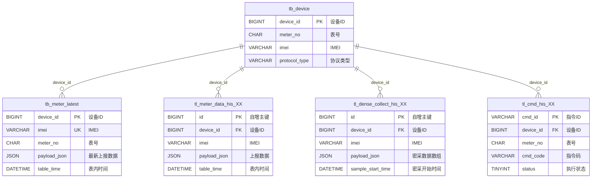
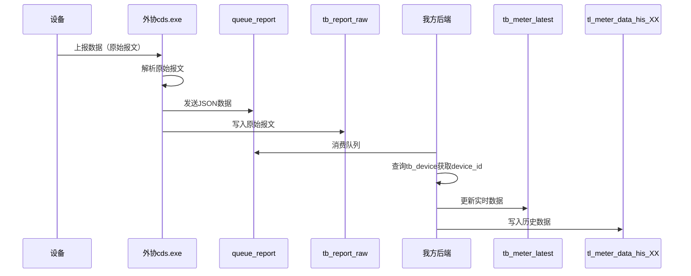
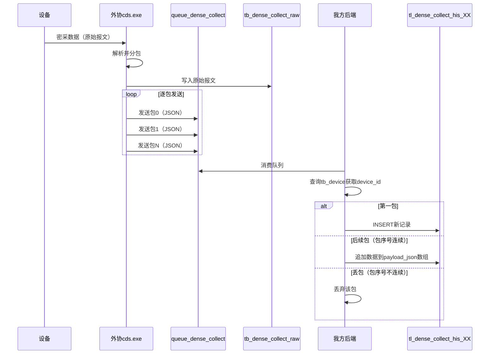
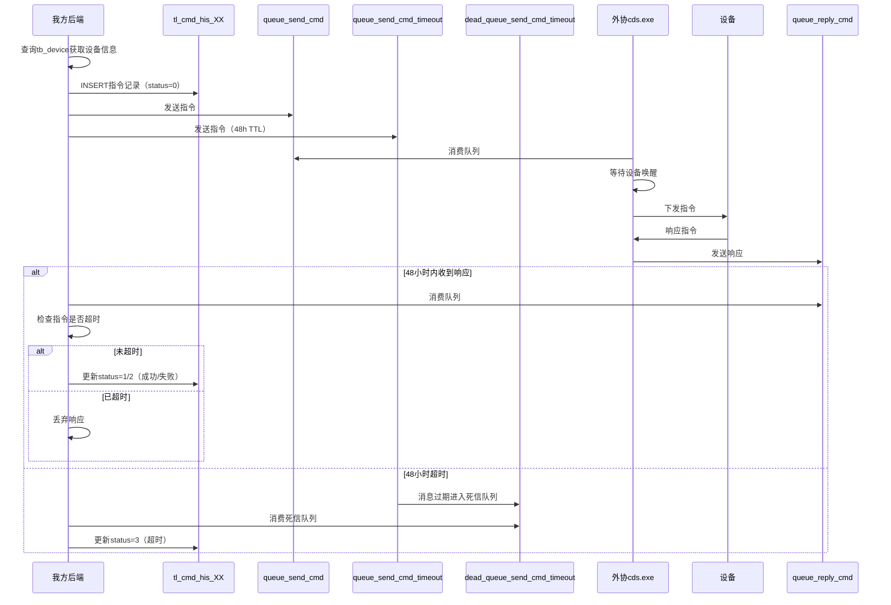

## 文档说明
本文档定义我方后端系统与外协系统之间的数据交互接口规范，明确双方在设备数据采集、指令下发等场景下的职责分工和操作流程。

---

## 1. 交互概述
### 1.1 系统角色
| 角色 | 系统 | 职责 |
| --- | --- | --- |
| 外协方 | cds.exe程序 | 负责设备通信、数据采集、指令下发 |
| 我方 | 后端系统 | 负责业务处理、数据存储、指令管理 |


### 1.2 交互方式
双方通过**消息队列**进行数据交互，不使用HTTP接口。

消息队列分为三类：

+ **外协自有队列**：外协系统内部使用，我方不感知
+ **我方自有队列**：我方系统内部使用，外协不感知
+ **交互队列**：双方数据交换的通道（本文档定义的队列）

### 1.3 交互队列清单
| 队列名称 | 数据流向 | 用途 |
| --- | --- | --- |
| queue_report | 外协 → 我方 | 设备正常上报数据 |
| queue_dense_collect | 外协 → 我方 | 设备密采数据 |
| queue_send_cmd | 我方 → 外协 | 下发指令给设备 |
| queue_reply_cmd | 外协 → 我方 | 指令执行结果回执 |
| queue_send_cmd_timeout | 我方 → 外协 | 指令超时控制（48小时TTL） |


每个队列都有对应的死信队列（dead_queue_*），用于处理消费失败的消息。

### 1.4 基础约定
#### 1.4.1 设备上报时间规则
设备上报时间分为两种模式：

| 模式 | 说明 | 计算方式 |
| --- | --- | --- |
| 带偏移量 | 根据IMEI后四位错峰上报 | 实际上报时间 = 设置时间 + (IMEI后四位 × 10秒) |
| 不带偏移量 | 按设置时间准点上报 | 实际上报时间 = 设置时间 |


**示例**：设置上报时间为00:05:00，IMEI后四位为1234

+ 带偏移量：实际上报时间 = 00:05:00 + 12340秒 = 03:30:40
+ 不带偏移量：实际上报时间 = 00:05:00

#### 1.4.2 设备离线判断规则
+ **判断标准**：连续3天未上报数据，判定为离线
+ **判断单位**：按自然日计算，不使用小时数（如48小时）
+ **判断方**：我方后端负责离线判断，外协不负责
+ **离线期间数据处理**：外协正常上报，我方正常入库，不丢弃
+ **恢复上线后**：设备自动上报积压数据，外协和我方按正常上报流程处理（外协不缓存数据）

#### 1.4.3 可选字段约定
+ JSON中可选字段为空时，**不传该字段**（不传null、不传空字符串）
+ 告警信息字段（alarmInfo）例外：无告警时传**null**

### 1.5 交互流程总览
本节展示三大核心交互流程的全景视图，帮助快速理解系统整体数据流转。

#### 1.5.1 数据流转全景图
```plain
设备（智能水表）
  ↓ 上报数据（SR/恩乐曼/CJT188协议）
┌─────────────────────────────────────────┐
│         外协cds.exe程序                  │
├─────────────────────────────────────────┤
│ 写入原始报文表：                         │
│  ├─→ tb_report_raw（正常上报，15天）     │
│  └─→ tb_dense_collect_raw（密采，15天）  │
│                                          │
│ 发送消息队列：                           │
│  ├─→ queue_report（正常上报）            │
│  └─→ queue_dense_collect（密采数据）     │
└─────────────────────────────────────────┘
         │
         ↓ 消息队列
┌─────────────────────────────────────────┐
│         我方后端系统                     │
├─────────────────────────────────────────┤
│ 消费队列并写入业务表：                   │
│  ├─→ tb_meter_latest（实时数据，永久）   │
│  ├─→ tl_meter_data_his_XX（历史，3年）   │
│  └─→ tl_dense_collect_his_XX（密采，3年）│
│                                          │
│ 下发指令：                               │
│  ├─→ queue_send_cmd（指令队列）          │
│  ├─→ queue_send_cmd_timeout（超时控制）  │
│  └─→ tl_cmd_his_XX（指令历史，3年）      │
└─────────────────────────────────────────┘
         │
         ↓ 指令下发
┌─────────────────────────────────────────┐
│         外协cds.exe程序                  │
├─────────────────────────────────────────┤
│ 等待设备唤醒 → 下发指令 → 接收响应       │
│  └─→ queue_reply_cmd（指令响应）         │
└─────────────────────────────────────────┘
         │
         ↓ 指令响应
我方后端系统
  └─→ 更新tl_cmd_his_XX（指令状态）
```

#### 1.5.2 正常上报数据流程
```plain
┌─────────┐
│  设备   │
└────┬────┘
     │ 上报数据
     ↓
┌─────────────────┐
│  外协cds.exe    │
├─────────────────┤
│ 1. 接收原始报文  │
│ 2. 解析数据      │
│ 3. 发送队列      │────→ queue_report
│ 4. 写入原始表    │────→ tb_report_raw
└─────────────────┘
                         │
                         ↓
                  ┌─────────────────┐
                  │  我方后端        │
                  ├─────────────────┤
                  │ 1. 消费队列      │
                  │ 2. 查询设备信息  │
                  │ 3. 更新实时表    │────→ tb_meter_latest
                  │ 4. 写入历史表    │────→ tl_meter_data_his_XX
                  └─────────────────┘
```

#### 1.5.3 密采数据流程
```plain
┌─────────┐
│  设备   │
└────┬────┘
     │ 密采数据（分包）
     ↓
┌─────────────────┐
│  外协cds.exe    │
├─────────────────┤
│ 1. 接收原始报文  │
│ 2. 解析并分包    │
│ 3. 逐包发送队列  │────→ queue_dense_collect（包0、包1、包2...）
│ 4. 写入原始表    │────→ tb_dense_collect_raw
└─────────────────┘
                         │
                         ↓
                  ┌─────────────────┐
                  │  我方后端        │
                  ├─────────────────┤
                  │ 1. 消费队列      │
                  │ 2. 查询设备信息  │
                  │ 3. 查询历史记录  │
                  │ 4. 合并数据      │────→ tl_dense_collect_his_XX
                  │    - 第一包：INSERT │
                  │    - 后续包：追加   │
                  │    - 丢包：丢弃     │
                  └─────────────────┘
```

#### 1.5.4 指令下发流程
```plain
┌─────────────────┐
│  我方后端        │
├─────────────────┤
│ 1. 创建指令记录  │────→ tl_cmd_his_XX（status=0）
│ 2. 发送指令队列  │────→ queue_send_cmd
│ 3. 发送超时队列  │────→ queue_send_cmd_timeout（48h TTL）
└─────────────────┘
         │
         ↓
┌─────────────────┐
│  外协cds.exe    │
├─────────────────┤
│ 1. 消费队列      │
│ 2. 等待设备唤醒  │
│ 3. 下发指令      │────→ 设备
│ 4. 接收响应      │←──── 设备
│ 5. 发送响应队列  │────→ queue_reply_cmd
└─────────────────┘
         │
         ↓
┌─────────────────┐
│  我方后端        │
├─────────────────┤
│ 1. 消费响应队列  │
│ 2. 检查是否超时  │
│    - 未超时：更新 │────→ tl_cmd_his_XX（status=1/2）
│    - 已超时：丢弃 │
└─────────────────┘

         ┌─────────────────┐
         │  超时处理        │
         ├─────────────────┤
         │ 48小时后         │
         │ 死信队列触发     │←──── dead_queue_send_cmd_timeout
         │ 更新指令状态     │────→ tl_cmd_his_XX（status=3）
         └─────────────────┘
```

### 1.6 数据表总览
本系统涉及**7张核心表**（2张原始报文表 + 5张业务表）：

| 表名 | 类型 | 分表 | 保留期限 | 写入方 | 用途 |
| --- | --- | --- | --- | --- | --- |
| tb_report_raw | 原始报文 | 否 | 15天 | 外协 | 正常上报原始报文溯源 |
| tb_dense_collect_raw | 原始报文 | 否 | 15天 | 外协 | 密采原始报文溯源 |
| tb_meter_latest | 实时数据 | 否 | 永久 | 我方 | 设备最新上报数据 |
| tl_meter_data_his_XX | 历史数据 | 是（16张） | 3年 | 我方 | 正常上报历史数据 |
| tl_dense_collect_his_XX | 历史数据 | 是（16张） | 3年 | 我方 | 密采历史数据 |
| tl_cmd_his_XX | 指令历史 | 是（16张） | 3年 | 我方 | 指令执行历史 |
| tb_device | 设备主档 | 否 | 永久 | 我方 | 设备基础信息（关联表） |


**注**：

+ tb_device表在本文档中被引用但未详细定义，该表存储设备基础信息（device_id、meter_no、imei等字段）
+ 详细表结构见各业务流程章节，建表DDL见附录

### 1.7 表关联关系


**数据流转关系说明**：

+ **正常上报**：设备上报 → tb_report_raw（原始）→ tb_meter_latest（实时）→ tl_meter_data_his_XX（历史）
+ **密采上报**：设备密采 → tb_dense_collect_raw（原始）→ tl_dense_collect_his_XX（历史）
+ **指令下发**：tl_cmd_his_XX（创建）→ 设备执行 → tl_cmd_his_XX（更新状态）

---

## 2. 交互流程一：设备正常上报数据
### 2.1 流程概述


### 2.2 触发条件
+ 设备按配置的上报周期主动上报数据
+ 或设备响应读取指令后上报数据

### 2.3 外协职责
#### 步骤1：接收设备上报数据
外协cds.exe程序通过物联网协议（SR协议/恩乐曼协议/CJT188协议）接收设备上报的原始报文。

#### 步骤2：解析原始报文
将原始报文（十六进制字符串）解析为业务字段。

#### 步骤3：发送到queue_report队列
将解析后的数据按以下JSON格式发送到queue_report队列：

```json
{
    "meterNo": "86010203040506",
    "imei": "860123456789012",
    "manufacturerCode": "0001",
    "payloadJson": {
        "forwardFlow": 12584.326,
        "reverseFlow": 12.581,
        "netFlow": 12571.746,
        "instantFlow": 0.842,
        "alarmInfo": "00",
        "valveStatus": "1",
        "batteryVoltage": 3.62,
        "reportCount": 1523,
        "reportSuccessCount": 1523,
        "signalStrength": -68,
        "signalPower": -72,
        "signalQuality": 12,
        "reportFlag": 1,
        "temperature": 23.5,
        "imsi": "460001234567890",
        "iccid": "89860123456789012345",
        "tableTime": 1743172321000
    },
    "rawData": "0102030405060708090A0B0C0D0E0F",
    "reportTime": 1743172321000
}
```

**字段说明**：

| 字段路径 | 类型 | 必填 | 说明 |
| --- | --- | --- | --- |
| meterNo | STRING | 是 | 表号（产测时写入） |
| imei | STRING | 是 | 设备IMEI号 |
| manufacturerCode | STRING | 否 | 厂商代码（0001: LY0632，0002: HV0551） |
| payloadJson | OBJECT | 是 | 业务数据对象 |
| payloadJson.forwardFlow | DECIMAL | 是 | 正向累积流量（m³，三位小数） |
| payloadJson.reverseFlow | DECIMAL | 否 | 反向累积流量（m³，三位小数），不上报时不传 |
| payloadJson.netFlow | DECIMAL | 否 | 净累积（m³，三位小数），不上报时不传 |
| payloadJson.instantFlow | DECIMAL | 否 | 瞬时流量（m³/h，三位小数），不上报时不传 |
| payloadJson.alarmInfo | STRING | 否 | 告警信息，无告警时传null |
| payloadJson.valveStatus | STRING | 是 | 阀门状态 |
| payloadJson.batteryVoltage | DECIMAL | 是 | 电池电压（V） |
| payloadJson.reportCount | INT | 否 | 上报次数 |
| payloadJson.reportSuccessCount | INT | 否 | 上报成功次数 |
| payloadJson.signalStrength | INT | 是 | 信号强度 |
| payloadJson.signalPower | INT | 否 | 信号接收功率（dBm） |
| payloadJson.signalQuality | INT | 否 | 信号接收质量（dBm） |
| payloadJson.reportFlag | INT | 否 | 上报标志位 |
| payloadJson.temperature | DECIMAL | 否 | 水表环境温度（℃） |
| payloadJson.imsi | STRING | 否 | IMSI号 |
| payloadJson.iccid | STRING | 是 | ICCID号 |
| payloadJson.tableTime | LONG | 是 | 表内时间（13位时间戳，毫秒） |
| rawData | STRING | 是 | 原始报文（十六进制字符串） |
| reportTime | LONG | 是 | 外协接收到数据的时间（13位时间戳，毫秒） |


**告警信息代码**：

| 代码 | 说明 |
| --- | --- |
| 00 | 正常 |
| 01 | 低压 |
| 02 | 高压 |
| 03 | 低流量 |
| 04 | 高流量 |
| 05 | 漏水 |
| 06 | 阀门故障 |
| 07 | 通信故障 |
| 08 | 其他故障 |


#### 步骤4：写入原始报文表
外协将原始报文写入**tb_report_raw**表（我方数据库），用于数据溯源。

**表结构**：

| 字段名 | 类型 | 说明 |
| --- | --- | --- |
| id | BIGINT UNSIGNED | 自增主键 |
| imei | VARCHAR(32) | IMEI |
| manufacturer_code | VARCHAR(32) | 厂商代码 |
| table_time | DATETIME(3) | 表内时间 |
| report_time | DATETIME(3) | 上报时间 |
| payload_json | JSON | 上报数据（payloadJson字段内容） |
| raw_data | TEXT | 原始报文 |
| create_time | DATETIME(3) | 创建时间 |


**索引设计**：

+ 主键索引：id
+ 普通索引：imei, table_time

**注意事项**：

+ 该表仅保留近15天数据，我方后端每天02:00自动清理
+ 外协只负责INSERT，不负责清理
+ 建表DDL详见附录6.7

### 2.4 我方职责
#### 步骤1：消费queue_report队列
我方后端订阅queue_report队列，接收外协发送的数据。

#### 步骤2：查询设备信息
根据meterNo查询tb_device表，获取device_id。

#### 步骤3：更新实时表
查询**tb_meter_latest**表，判断是否需要更新：

+ 如果该设备无记录，直接INSERT
+ 如果有记录，比较tableTime：
    - 如果新数据的tableTime ≤ 现有记录的tableTime，跳过（幂等处理）
    - 如果新数据的tableTime > 现有记录的tableTime，UPDATE

**tb_meter_latest表结构**：

| 字段名 | 类型 | 说明 |
| --- | --- | --- |
| device_id | BIGINT UNSIGNED | 设备id（主键） |
| imei | VARCHAR(32) | IMEI（唯一索引） |
| meter_no | VARCHAR(32) | 表号（纯数字，不做固定长度校验） |
| protocol_type | VARCHAR(32) | 协议类型（PT-01: LY01，PT-02: HVNB） |
| manufacturer_code | VARCHAR(32) | 厂商代码 |
| table_time | DATETIME(3) | 表内时间 |
| payload_json | JSON | 最新上报数据 |
| raw_data | TEXT | 最新上报原始报文 |
| report_time | DATETIME(3) | 最新上报时间 |
| create_time | DATETIME(3) | 创建时间 |
| update_time | DATETIME(3) | 更新时间 |


**索引设计**：

+ 主键索引：device_id
+ 唯一索引：imei
+ 联合唯一索引：device_id, table_time

**注意事项**：

+ 建表DDL详见附录6.7

#### 步骤4：写入历史表
将数据INSERT到**tl_meter_data_his_XX**表（XX为分表号，00~15）。

**分表路由规则**：shard = device_id % 16

**tl_meter_data_his_XX表结构**：

| 字段名 | 类型 | 说明 |
| --- | --- | --- |
| id | BIGINT UNSIGNED | 自增主键 |
| device_id | BIGINT UNSIGNED | 设备id |
| imei | VARCHAR(32) | IMEI |
| protocol_type | VARCHAR(32) | 协议类型 |
| manufacturer_code | VARCHAR(32) | 厂商代码 |
| table_time | DATETIME(3) | 表内时间 |
| report_time | DATETIME(3) | 上报时间 |
| payload_json | JSON | 上报数据 |
| raw_data | TEXT | 原始报文 |
| create_time | DATETIME(3) | 创建时间 |


**索引设计**：

+ 主键索引：id, table_time
+ 联合唯一索引：device_id, table_time

**注意事项**：

+ 历史表按月分区，保留3年数据
+ 我方后端每天02:10自动清理超过36个月的分区
+ 建表DDL详见附录6.7

### 2.5 交互结果
+ 外协：数据发送成功，原始报文已存储
+ 我方：实时表已更新，历史表已写入，可供业务查询

### 2.6 异常处理
#### 2.6.1 设备离线期间的数据
**场景**：设备离线3天后恢复上线

**处理方式**：

+ **设备**：恢复上线后，设备自动上报离线期间积压的数据
+ **外协**：接收设备上报数据，按正常流程解析并发送到queue_report（外协不缓存数据）
+ **我方**：正常消费队列，正常入库，不区分是实时数据还是补发数据
+ **离线判断**：由我方后端负责，外协不负责

#### 2.6.2 消息队列消费失败
**场景**：我方消费queue_report队列失败

**处理方式**：

+ **死信队列**：消费失败的消息自动进入dead_queue_report
+ **人工介入**：我方监控死信队列，人工排查失败原因（如数据格式错误、数据库连接失败等）
+ **重试机制**：修复问题后，从死信队列重新消费

#### 2.6.3 数据重复上报
**场景**：设备因网络原因重复上报同一时刻的数据

**处理方式**：

+ **幂等处理**：我方根据tableTime判断，如果新数据时间 ≤ 现有数据时间，跳过更新
+ **历史表**：允许重复写入（通过唯一索引uk_device_time保证同一设备同一时间只有一条记录）

---

## 3. 交互流程二：设备密采数据上报
### 3.1 流程概述


### 3.2 触发条件
+ 我方下发密采指令后，设备按指定间隔采集数据
+ 设备将密采数据上报给外协

### 3.3 密采数据特点
+ **数据量大**：一次密采可能包含数百条数据点
+ **分包上报**：外协将数据分多个包发送（每包包含部分数据点）
+ **包序号**：从0开始，0表示第一包，1表示第二包，依此类推
+ **合并存储**：我方将多包数据合并到同一条历史记录

### 3.4 外协职责
#### 步骤1：接收设备密采数据
外协cds.exe程序接收设备上报的密采原始报文。

#### 步骤2：解析并分包
将原始报文解析为业务字段，并按包大小分包（建议每包不超过100条数据点）。

#### 步骤3：逐包发送到queue_dense_collect队列
按包序号依次发送到queue_dense_collect队列：

```json
{
    "meterNo": "86010203040506",
    "imei": "860123456789012",
    "packetTotalCount": 48,
    "packetIndex": 0,
    "packetCount": 2,
    "sampleStartTime": 1743172321000,
    "sampleInterval": 5,
    "payloadJson": [
        {
            "forwardFlow": 12584.326,
            "reverseFlow": 12.581,
            "pressure": 1.23,
            "reverseInstantFlow": 0.842,
            "forwardInstantFlow": 0.842
        },
        {
            "forwardFlow": 12584.326,
            "reverseFlow": 12.581,
            "pressure": 1.23,
            "reverseInstantFlow": 0.842,
            "forwardInstantFlow": 0.842
        }
    ],
    "rawData": "0102030405060708090A0B0C0D0E0F",
    "reportTime": 1743172321000
}
```

**字段说明**：

| 字段路径 | 类型 | 必填 | 说明 |
| --- | --- | --- | --- |
| meterNo | STRING | 是 | 表号 |
| imei | STRING | 是 | 设备IMEI号 |
| packetTotalCount | INT | 是 | 本次密采总包数 |
| packetIndex | INT | 是 | 当前包序号（从0开始） |
| packetCount | INT | 是 | 本包包含的数据点个数 |
| sampleStartTime | LONG | 是 | 密采开始时间（13位时间戳，毫秒） |
| sampleInterval | INT | 是 | 密采间隔（分钟） |
| payloadJson | ARRAY | 是 | 数据点数组 |
| payloadJson[].forwardFlow | DECIMAL | 是 | 正向累积流量（m³，三位小数） |
| payloadJson[].reverseFlow | DECIMAL | 否 | 反向累积流量（m³，三位小数），不上报时不传 |
| payloadJson[].pressure | DECIMAL | 否 | 压力值，不上报时不传 |
| payloadJson[].reverseInstantFlow | DECIMAL | 否 | 反向瞬时流量（m³/h，三位小数），不上报时不传 |
| payloadJson[].forwardInstantFlow | DECIMAL | 否 | 正向瞬时流量（m³/h，三位小数），不上报时不传 |
| rawData | STRING | 是 | 原始报文（十六进制字符串） |
| reportTime | LONG | 是 | 外协接收到数据的时间（13位时间戳，毫秒） |


#### 步骤4：写入原始报文表
外协将原始报文写入**tb_dense_collect_raw**表。

**表结构**：

| 字段名 | 类型 | 说明 |
| --- | --- | --- |
| id | BIGINT UNSIGNED | 自增主键 |
| imei | VARCHAR(32) | IMEI |
| manufacturer_code | VARCHAR(32) | 厂商代码 |
| table_time | DATETIME(3) | 表内时间 |
| sample_start_time | DATETIME(3) | 密采开始时间 |
| sample_interval | SMALLINT | 密采间隔（分钟） |
| sample_count | SMALLINT | 密采数据个数 |
| report_time | DATETIME(3) | 上报时间 |
| payload_json | JSON | 上报数据 |
| raw_data | TEXT | 原始报文 |
| create_time | DATETIME(3) | 创建时间 |


**索引设计**：

+ 主键索引：id
+ 普通索引：imei, table_time

**注意事项**：

+ 该表仅保留近15天数据，我方后端每天02:00自动清理
+ 外协只负责INSERT，不负责清理
+ 建表DDL详见附录6.7

### 3.5 我方职责
#### 步骤1：消费queue_dense_collect队列
我方后端订阅queue_dense_collect队列，接收外协发送的分包数据。

#### 步骤2：查询设备信息
根据meterNo查询tb_device表，获取device_id。

#### 步骤3：查询历史记录
根据device_id和sampleStartTime查询**tl_dense_collect_his_XX**表（XX为分表号）。

**分表路由规则**：shard = device_id % 16

#### 步骤4：合并数据
+ **如果历史记录不存在**（第一个包）：
    - INSERT新记录，payload_json存储当前包的数据点数组
    - package_index记录当前包序号
    - raw_data存储当前包的原始报文
+ **如果历史记录存在**（后续包）：
    - 判断packetIndex是否等于package_index + 1：
        * **如果相等**（包序号连续）：
            + 将当前包的payloadJson数组追加到历史记录的payload_json数组
            + 将当前包的rawData追加到历史记录的raw_data字段（以逗号拼接）
            + 更新package_index为当前包序号
        * **如果不相等**（丢包）：
            + 丢弃当前包，不处理（不重传，不等待）

**tl_dense_collect_his_XX表结构**：

| 字段名 | 类型 | 说明 |
| --- | --- | --- |
| id | BIGINT UNSIGNED | 自增主键 |
| device_id | BIGINT UNSIGNED | 设备id |
| imei | VARCHAR(32) | IMEI |
| protocol_type | VARCHAR(32) | 协议类型 |
| manufacturer_code | VARCHAR(32) | 厂商代码 |
| sample_start_time | DATETIME(3) | 密采开始时间 |
| sample_interval | SMALLINT | 密采间隔（分钟） |
| sample_count | SMALLINT | 密采数据个数 |
| package_index | SMALLINT | 最新包序号 |
| report_time | DATETIME(3) | 上报时间 |
| payload_json | JSON | 上报数据（数组，每个元素为一条数据点） |
| raw_data | TEXT | 原始报文（每个包的原始报文以逗号拼接） |
| create_time | DATETIME(3) | 创建时间 |


**索引设计**：

+ 主键索引：id
+ 联合唯一索引：device_id, sample_start_time

**注意事项**：

+ 历史表按月分区，保留3年数据
+ 我方后端每天02:10自动清理超过36个月的分区
+ 同一设备同一时间段只允许一个密采任务（通过uk_device_start_time唯一索引保证）
+ 建表DDL详见附录6.7

### 3.6 交互结果
+ 外协：分包数据发送成功，原始报文已存储
+ 我方：多包数据已合并到历史表，可供业务查询

### 3.7 异常处理
#### 3.7.1 丢包处理
**丢包场景示例**：

+ 外协发送了第0、1、2包，第3包丢失，第4包到达
+ 我方收到第4包时，发现package_index=2，而packetIndex=4，不连续
+ 我方丢弃第4包，不处理

**为什么不重传**：

+ 密采数据用于历史分析，不是实时业务
+ 丢包概率低，重传机制复杂度高
+ 如需完整数据，可通过设备重新发起密采

#### 3.7.2 同一设备多个密采任务冲突
**场景**：同一设备同时发起多个密采任务

**处理方式**：

+ **数据库约束**：通过uk_device_start_time唯一索引保证同一设备同一时间段只有一个密采任务
+ **业务限制**：前端/后端应限制同一设备不能同时发起多个密采

#### 3.7.3 消息队列消费失败
**场景**：我方消费queue_dense_collect队列失败

**处理方式**：

+ **死信队列**：消费失败的消息自动进入dead_queue_dense_collect
+ **人工介入**：我方监控死信队列，人工排查失败原因

---

## 4. 交互流程三：指令下发与响应
### 4.1 流程概述


### 4.2 触发条件
+ 我方业务需要控制设备（如开关阀、写表底、读取数据等）
+ 前端调用后端接口，传入device_id和指令参数

### 4.3 我方职责（指令下发阶段）
#### 步骤1：创建指令记录
1. 根据device_id查询tb_device表，获取设备信息（meterNo、protocolType、manufacturerCode）
2. 生成指令ID（UUID格式）
3. 将指令记录INSERT到**tl_cmd_his_XX**表（XX为分表号，status=0待执行）

**分表路由规则**：shard = device_id % 16

**tl_cmd_his_XX表结构**：

| 字段名 | 类型 | 说明 |
| --- | --- | --- |
| cmd_id | VARCHAR(36) | 指令id（UUID格式，主键） |
| meter_no | VARCHAR(32) | 表号（纯数字，不做固定长度校验） |
| device_id | BIGINT UNSIGNED | 设备id |
| protocol_type | VARCHAR(32) | 协议类型 |
| manufacturer_code | VARCHAR(32) | 厂商代码 |
| cmd_code | VARCHAR(32) | 指令码 |
| cmd_payload_json | JSON | 指令参数 |
| status | TINYINT | 执行状态（0-待执行，1-执行成功，2-执行失败，3-超时） |
| result_msg | VARCHAR(256) | 结果说明 |
| resp_payload_json | JSON | 响应参数 |
| request_raw | TEXT | 下发给设备的原始指令报文 |
| response_raw | TEXT | 设备响应的原始报文 |
| create_time | DATETIME(3) | 创建时间 |
| update_time | DATETIME(3) | 更新时间 |


**索引设计**：

+ 主键索引：cmd_id

**注意事项**：

+ 建表DDL详见附录6.7

#### 步骤2：发送到queue_send_cmd队列
将指令数据发送到queue_send_cmd队列：

```json
{
    "meterNo": "86010203040506",
    "protocolType": "PT-02",
    "manufacturerCode": "0002",
    "cmdCode": "PF-002",
    "cmdId": "123e4567-e89b-12d3-a456-426614174000",
    "cmdPayloadJson": {}
}
```

**字段说明**：

| 字段名 | 类型 | 必填 | 说明 |
| --- | --- | --- | --- |
| meterNo | STRING | 是 | 目标设备表号 |
| protocolType | STRING | 是 | 协议类型（PT-01: LY01，PT-02: HVNB） |
| manufacturerCode | STRING | 是 | 厂商代码（0001: LY0632，0002: HV0551） |
| cmdCode | STRING | 是 | 指令码 |
| cmdId | STRING | 是 | 指令ID（UUID格式） |
| cmdPayloadJson | OBJECT | 否 | 指令参数（JSON对象） |


**指令码定义**：

| 指令码 | 指令名称 | 指令参数 | 说明 |
| --- | --- | --- | --- |
| PF-001 | 设置休眠 | 无参数 | 设置设备进入休眠模式 |
| PF-002 | 读取实时数据 | 无参数 | 读取设备的实时数据 |
| PF-003 | 读密采数据 | startTime: 开始时间（ISO8601格式），intervalMinutes: 间隔分钟数，count: 数据点数量 | 读取设备密采历史数据 |
| PF-004 | 读日冻结 | 无参数 | 读取日冻结数据 |
| PF-005 | 读月冻结 | 无参数 | 读取月冻结数据 |
| PF-006 | 阀门控制-开阀 | 无参数 | 打开阀门 |
| PF-007 | 阀门控制-关阀 | 无参数 | 关闭阀门 |
| PF-008 | 阀门控制-警示关阀 | 无参数 | 警示关阀（先警示后关闭） |
| PF-009 | 写表底数据 | baseValue: 表底值（数值），unit: 单位（字符串，如"m³"） | 设置设备表底初始值 |
| PF-010 | 写地址（表号） | newMeterId: 新表号（字符串） | 修改设备表号 |
| PF-011 | 读上报周期 | 无参数 | 读取设备上报周期配置 |
| PF-012 | 写上报周期 | reportMode: 上报模式（整数），reportPeriod: 上报周期（小时） | 设置设备上报周期 |
| PF-013 | 读密采周期 | 无参数 | 读取密采周期配置 |
| PF-014 | 写密采周期 | densityPeriodMinutes: 密采周期（分钟） | 设置密采周期 |
| PF-015 | 读密采上报模式 | 无参数 | 读取密采上报模式 |
| PF-016 | 写密采上报模式 | reportMode: 上报模式（整数） | 设置密采上报模式 |
| PF-017 | 写结算日 | settlementDay: 结算日（1-31） | 设置月结算日 |
| PF-018 | 写报警量参数 | alarmValue: 报警阈值（数值），alarmMode: 报警模式（整数） | 设置报警量参数 |
| PF-019 | 读报警量参数 | 无参数 | 读取报警量参数 |
| PF-020 | 校时 | timestamp: 时间戳（ISO8601格式） | 校准设备时钟 |
| PF-021 | 写正向持续流量报警 | alarmMode: 报警模式，durationMinutes: 持续时长（分钟），threshold: 阈值（m³/h） | 设置正向持续流量报警 |
| PF-022 | 读正向持续流量报警 | 无参数 | 读取正向持续流量报警配置 |
| PF-023 | 写反向持续流量报警 | alarmMode: 报警模式，durationMinutes: 持续时长（分钟），threshold: 阈值（m³/h） | 设置反向持续流量报警 |
| PF-024 | 读反向持续流量报警 | 无参数 | 读取反向持续流量报警配置 |
| PF-025 | 写最大日用量 | alarmMode: 报警模式，maxDailyUsage: 最大日用量（m³） | 设置最大日用量报警 |
| PF-026 | 读最大日用量 | 无参数 | 读取最大日用量配置 |
| PF-027 | 出厂启用 | 无参数 | 出厂启用设备 |
| PF-028 | 程序升级配置 | flashAddress: Flash地址，programLength: 程序长度，crc16: CRC校验值，programStartAddress: 程序起始地址 | 配置程序升级参数 |
| PF-029 | 程序数据传输 | offsetAddress: 偏移地址，programData: 程序数据（HEX或BASE64） | 传输程序数据 |
| PF-030 | 程序校验 | 无参数 | 校验程序完整性 |
| PF-031 | 程序复位 | 无参数 | 复位程序 |
| PF-032 | 写IP地址/设置服务器地址 | serverIp: 服务器IP，serverPort: 服务器端口 | 设置服务器地址 |
| PF-033 | 读IP地址 | 无参数 | 读取服务器地址配置 |
| PF-034 | 读取时钟 | 无参数 | 读取设备时钟 |
| PF-035 | 间隔数据（增量） | startTime: 开始时间（ISO8601格式），intervalMinutes: 间隔分钟数，count: 数据点数量 | 读取间隔增量数据 |
| PF-036 | 读基站信息 | 无参数 | 读取基站信息 |
| PF-037 | 读IMSI | 无参数 | 读取IMSI号 |
| PF-038 | 读IMEI | 无参数 | 读取IMEI号 |
| PF-039 | 读ICCID及CSQ | 无参数 | 读取ICCID和信号质量 |


**指令示例**：

读取实时数据：

```json
{
    "meterNo": "86010203040506",
    "protocolType": "PT-02",
    "manufacturerCode": "0002",
    "cmdCode": "PF-002",
    "cmdId": "123e4567-e89b-12d3-a456-426614174000",
    "cmdPayloadJson": {}
}
```

写表底：

```json
{
    "meterNo": "86010203040506",
    "protocolType": "PT-02",
    "manufacturerCode": "0002",
    "cmdCode": "PF-009",
    "cmdId": "123e4567-e89b-12d3-a456-426614174000",
    "cmdPayloadJson": {
        "baseValue": 0.00,
        "unit": "m³"
    }
}
```

#### 步骤3：发送到queue_send_cmd_timeout队列
将相同的指令数据发送到queue_send_cmd_timeout队列，设置TTL为48小时。

**超时机制说明**：

+ 该队列的消息在48小时后自动过期
+ 过期消息进入死信队列dead_queue_send_cmd_timeout
+ 我方订阅死信队列，收到消息后将指令状态更新为超时（status=3）

### 4.4 外协职责
#### 步骤1：订阅queue_send_cmd队列
外协cds.exe程序订阅queue_send_cmd队列，接收我方下发的指令。

#### 步骤2：等待设备唤醒
+ 设备按周期唤醒（如每15分钟唤醒一次）
+ 设备唤醒后先上报数据，再接收指令

#### 步骤3：下发指令给设备
+ 将指令参数按协议格式封装为原始报文
+ 通过物联网协议下发给设备

#### 步骤4：接收设备响应
+ 设备执行指令后返回响应报文
+ 外协解析响应报文，判断执行结果

#### 步骤5：发送到queue_reply_cmd队列
将指令执行结果发送到queue_reply_cmd队列：

```json
{
    "cmdId": "123e4567-e89b-12d3-a456-426614174000",
    "meterNo": "86010203040506",
    "requestRaw": "0102030405060708090A0B0C0D0E0F",
    "responseRaw": "0102030405060708090A0B0C0D0E0F",
    "status": 1,
    "resultMsg": "执行成功"
}
```

**字段说明**：

| 字段名 | 类型 | 必填 | 说明 |
| --- | --- | --- | --- |
| cmdId | STRING | 是 | 指令ID（与发送指令时的cmdId对应） |
| meterNo | STRING | 是 | 目标设备表号 |
| status | INT | 是 | 执行状态（1-执行成功，2-执行失败） |
| resultMsg | STRING | 否 | 结果说明（描述执行结果或失败原因） |
| requestRaw | STRING | 是 | 下发给设备的原始指令报文（十六进制字符串） |
| responseRaw | STRING | 否 | 设备响应的原始报文（十六进制字符串） |


**响应示例**：

执行成功：

```json
{
    "cmdId": "123e4567-e89b-12d3-a456-426614174000",
    "meterNo": "86010203040506",
    "requestRaw": "0102030405060708090A0B0C0D0E0F",
    "responseRaw": "0102030405060708090A0B0C0D0E0F",
    "status": 1,
    "resultMsg": "执行成功"
}
```

执行失败：

```json
{
    "cmdId": "123e4567-e89b-12d3-a456-426614174000",
    "meterNo": "86010203040506",
    "requestRaw": "0102030405060708090A0B0C0D0E0F",
    "responseRaw": "0102030405060708090A0B0C0D0E0F",
    "status": 2,
    "resultMsg": "表底值超出范围"
}
```

### 4.5 我方职责（指令响应阶段）
#### 步骤1：订阅queue_reply_cmd队列
我方后端订阅queue_reply_cmd队列，接收外协返回的指令执行结果。

#### 步骤2：检查指令是否超时
根据cmdId查询tl_cmd_his_XX表，检查status字段：

+ **如果status=3（已超时）**：
    - 丢弃该响应，不处理
    - 原因：指令已超时，设备响应已失去时效性
+ **如果status=0（待执行）**：
    - 继续处理响应

#### 步骤3：更新指令状态
更新tl_cmd_his_XX表：

+ 如果响应status=1（执行成功）：
    - 更新指令status=1
    - 更新result_msg、request_raw、response_raw
+ 如果响应status=2（执行失败）：
    - 更新指令status=2
    - 更新result_msg、request_raw、response_raw

### 4.6 我方职责（超时处理）
#### 步骤1：订阅dead_queue_send_cmd_timeout死信队列
我方后端订阅queue_send_cmd_timeout的死信队列。

#### 步骤2：更新指令状态为超时
收到死信队列消息后：

1. 根据cmdId查询tl_cmd_his_XX表
2. 将指令status更新为3（超时）

### 4.7 交互结果
+ **正常情况**：
    - 外协：指令下发成功，设备响应已返回
    - 我方：指令状态已更新为成功或失败
+ **超时情况**：
    - 外协：指令下发成功，但设备48小时内未响应
    - 我方：指令状态已更新为超时
+ **超时后设备再响应**：
    - 外协：设备响应后仍发送到queue_reply_cmd
    - 我方：检测到指令已超时，丢弃响应

### 4.8 异常处理
#### 4.8.1 指令超时后设备再响应
**场景**：

+ 我方下发指令，48小时后未收到响应，指令标记为超时（status=3）
+ 第50小时，设备响应了，外协将响应发送到queue_reply_cmd

**处理逻辑**：

+ 我方收到响应后，查询指令状态，发现status=3（已超时）
+ 直接丢弃该响应，不更新指令状态
+ 原因：指令已超时，设备响应已失去时效性，业务上不再需要该响应

#### 4.8.2 设备离线无法下发指令
**场景**：设备离线，外协无法下发指令

**处理方式**：

+ **外协**：等待设备唤醒，设备唤醒后再下发指令
+ **超时控制**：48小时内设备未唤醒，指令自动超时
+ **业务提示**：前端应提示用户设备离线，指令可能延迟执行

#### 4.8.3 消息队列消费失败
**场景**：外协消费queue_send_cmd队列失败，或我方消费queue_reply_cmd队列失败

**处理方式**：

+ **死信队列**：消费失败的消息自动进入对应的死信队列
+ **人工介入**：监控死信队列，人工排查失败原因

---

## 5. 数据维护
### 5.1 数据清理规则
| 表名 | 保留期限 | 清理时间 | 清理方 | 说明 |
| --- | --- | --- | --- | --- |
| tb_report_raw | 15天 | 每天02:00 | 我方 | 正常上报原始报文表 |
| tb_dense_collect_raw | 15天 | 每天02:00 | 我方 | 密采原始报文表 |
| tl_meter_data_his_XX | 3年 | 每天02:10 | 我方 | 正常上报历史数据表（按月分区） |
| tl_dense_collect_his_XX | 3年 | 每天02:10 | 我方 | 密采历史数据表（按月分区） |
| tl_cmd_his_XX | 3年 | 每天02:10 | 我方 | 指令历史数据表（按月分区） |


### 5.2 清理注意事项
+ 原始报文表（tb_report_raw、tb_dense_collect_raw）按天清理，删除超过15天的数据
+ 历史数据表按月分区，清理时删除超过36个月的分区
+ 清理任务由我方后端执行，外协不负责清理
+ 清理任务与数据同步任务错峰执行，避免资源竞争

---

## 6. 附录
### 6.1 队列汇总
#### 6.1.1 交互队列
| 队列名称 | 数据流向 | 用途 | TTL |
| --- | --- | --- | --- |
| queue_report | 外协 → 我方 | 设备正常上报数据 | 无 |
| queue_dense_collect | 外协 → 我方 | 设备密采数据 | 无 |
| queue_send_cmd | 我方 → 外协 | 下发指令给设备 | 无 |
| queue_reply_cmd | 外协 → 我方 | 指令执行结果回执 | 无 |
| queue_send_cmd_timeout | 我方 → 外协 | 指令超时控制 | 48小时 |


#### 6.1.2 死信队列
| 死信队列名称 | 对应主队列 | 用途 |
| --- | --- | --- |
| dead_queue_report | queue_report | 正常上报数据消费失败 |
| dead_queue_dense_collect | queue_dense_collect | 密采数据消费失败 |
| dead_queue_send_cmd | queue_send_cmd | 指令下发消费失败 |
| dead_queue_reply_cmd | queue_reply_cmd | 指令响应消费失败 |
| dead_queue_send_cmd_timeout | queue_send_cmd_timeout | 指令超时触发 |


### 6.2 数据表汇总
#### 6.2.1 外协负责写入的表
| 表名 | 说明 | 分表 | 保留期限 |
| --- | --- | --- | --- |
| tb_report_raw | 正常上报原始报文表 | 否 | 15天 |
| tb_dense_collect_raw | 密采原始报文表 | 否 | 15天 |


#### 6.2.2 我方负责写入的表
| 表名 | 说明 | 分表 | 保留期限 |
| --- | --- | --- | --- |
| tb_meter_latest | 正常上报实时数据表 | 否 | 永久 |
| tl_meter_data_his_XX | 正常上报历史数据表 | 是（16张） | 3年 |
| tl_dense_collect_his_XX | 密采历史数据表 | 是（16张） | 3年 |
| tl_cmd_his_XX | 指令历史数据表 | 是（16张） | 3年 |


### 6.3 分表路由规则
+ **分表类型**：tl_meter_data_his_XX、tl_dense_collect_his_XX、tl_cmd_his_XX
+ **分表数量**：16张分表（XX取值00~15）
+ **路由计算公式**：shard = device_id % 16

### 6.4 状态码说明
#### 6.4.1 告警状态码
| 代码 | 说明 |
| --- | --- |
| 00 | 正常 |
| 01 | 低压 |
| 02 | 高压 |
| 03 | 低流量 |
| 04 | 高流量 |
| 05 | 漏水 |
| 06 | 阀门故障 |
| 07 | 通信故障 |
| 08 | 其他故障 |


#### 6.4.2 指令状态码
| 状态码 | 说明 |
| --- | --- |
| 0 | 待执行 |
| 1 | 执行成功 |
| 2 | 执行失败 |
| 3 | 超时 |


### 6.5 协议类型说明
| 协议类型 | 说明 |
| --- | --- |
| PT-01 | LY01协议（SR协议，Cat1） |
| PT-02 | HVNB协议（恩乐曼协议，NB-IoT） |


### 6.6 厂商代码说明
| 厂商代码 | 厂商名称 |
| --- | --- |
| 0001 | LY0632 |
| 0002 | HV0551 |


### 6.7 建表DDL
本节提供所有数据表的建表SQL语句，供DBA参考。

#### 6.7.1 tb_report_raw（正常上报原始报文表）
```sql
CREATE TABLE IF NOT EXISTS tb_report_raw (
    id BIGINT UNSIGNED NOT NULL AUTO_INCREMENT COMMENT '自增主键',
    imei VARCHAR(32) NOT NULL COMMENT 'IMEI',
    manufacturer_code VARCHAR(32) NOT NULL COMMENT '厂商代码 0001: LY0632，0002: HV0551',
    table_time DATETIME(3) NOT NULL COMMENT '表内时间',
    report_time DATETIME(3) NOT NULL COMMENT '上报时间',
    payload_json JSON NOT NULL COMMENT '上报数据(json格式，只有payloadJson字段)',
    raw_data TEXT NOT NULL COMMENT '上报原始报文',
    create_time DATETIME(3) NOT NULL DEFAULT CURRENT_TIMESTAMP COMMENT '创建时间',
    PRIMARY KEY (id),
    KEY idx_imei_table_time (imei, table_time)
) ENGINE=InnoDB DEFAULT CHARSET=utf8mb4 COLLATE=utf8mb4_general_ci COMMENT='正常上报原始报文表';
```

#### 6.7.2 tb_meter_latest（正常上报实时数据表）
```sql
CREATE TABLE IF NOT EXISTS tb_meter_latest (
    device_id BIGINT UNSIGNED NOT NULL COMMENT '设备id',
    imei VARCHAR(32) NOT NULL COMMENT 'IMEI',
    meter_no VARCHAR(32) NOT NULL COMMENT '表号（纯数字，不做固定长度校验）',
    protocol_type VARCHAR(32) NOT NULL COMMENT '协议类型 PT-01：LY01，PT-02：HVNB',
    manufacturer_code VARCHAR(32) NOT NULL COMMENT '厂商代码 0001: LY0632，0002: HV0551',
    payload_json JSON NOT NULL COMMENT '最新上报数据(json格式，只有payloadJson字段)',
    table_time DATETIME(3) NOT NULL COMMENT '表内时间',
    raw_data TEXT NOT NULL COMMENT '最新上报原始报文',
    report_time DATETIME(3) NOT NULL COMMENT '最新上报时间',
    create_time DATETIME(3) NOT NULL DEFAULT CURRENT_TIMESTAMP COMMENT '创建时间',
    update_time DATETIME(3) NOT NULL DEFAULT CURRENT_TIMESTAMP ON UPDATE CURRENT_TIMESTAMP COMMENT '更新时间',
    PRIMARY KEY (device_id),
    UNIQUE KEY uk_imei (imei),
    UNIQUE KEY uk_device_time (device_id, table_time)
) ENGINE=InnoDB DEFAULT CHARSET=utf8mb4 COLLATE=utf8mb4_general_ci COMMENT='正常上报实时数据表';
```

#### 6.7.3 tl_meter_data_his_XX（正常上报历史数据表）
```sql
CREATE TABLE IF NOT EXISTS tl_meter_data_his_xx (
    id BIGINT UNSIGNED NOT NULL AUTO_INCREMENT COMMENT '自增主键',
    device_id BIGINT UNSIGNED NOT NULL COMMENT '设备id',
    imei VARCHAR(32) NOT NULL COMMENT 'IMEI',
    protocol_type VARCHAR(32) NOT NULL COMMENT '协议类型 PT-01：LY01，PT-02：HVNB',
    manufacturer_code VARCHAR(32) NOT NULL COMMENT '厂商代码 0001: LY0632，0002: HV0551',
    table_time DATETIME(3) NOT NULL COMMENT '表内时间',
    report_time DATETIME(3) NOT NULL COMMENT '上报时间',
    payload_json JSON NOT NULL COMMENT '上报数据(json格式，只有payloadJson字段)',
    raw_data TEXT NOT NULL COMMENT '上报原始报文',
    create_time DATETIME(3) NOT NULL DEFAULT CURRENT_TIMESTAMP COMMENT '创建时间',
    PRIMARY KEY (id, table_time),
    UNIQUE KEY uk_device_time (device_id, table_time)
) ENGINE=InnoDB DEFAULT CHARSET=utf8mb4 COLLATE=utf8mb4_general_ci COMMENT='正常上报历史数据表（XX为00~15，共16张分表）'
PARTITION BY RANGE (TO_DAYS(table_time)) (
    PARTITION p202603 VALUES LESS THAN (TO_DAYS('2026-04-01')),
    PARTITION p_future VALUES LESS THAN MAXVALUE
);
```

**分区策略说明**：

+ **按需创建**：初始只创建当前月分区 + 未来分区（避免前期空转）
+ **滚动维护**：每月1日创建下个月分区，同时删除超过36个月的分区
+ **分区字段**：使用table_time字段
+ **保留期限**：3年（36个月）

**分区维护SQL**：

```sql
-- 每月1日执行：创建下个月分区 + 删除超过36个月的分区
-- 示例：2026年4月1日执行

-- 1. 创建2026年5月分区
ALTER TABLE tl_meter_data_his_xx REORGANIZE PARTITION p_future INTO (
    PARTITION p202605 VALUES LESS THAN (TO_DAYS('2026-06-01')),
    PARTITION p_future VALUES LESS THAN MAXVALUE
);

-- 2. 删除2023年4月分区（如果存在）
ALTER TABLE tl_meter_data_his_xx DROP PARTITION IF EXISTS p202304;
```

**分区创建时间表**：

| 执行时间 | 创建分区 | 删除分区 | 说明 |
| --- | --- | --- | --- |
| 2026-04-01 | p202605 | - | 初期无需删除 |
| 2026-05-01 | p202606 | - | 初期无需删除 |
| ... | ... | ... | ... |
| 2029-03-01 | p202904 | - | 初期无需删除 |
| 2029-04-01 | p202905 | p202604 | 开始删除3年前数据 |
| 2029-05-01 | p202906 | p202605 | 滚动删除 |


#### 6.7.4 tb_dense_collect_raw（密采原始报文表）
```sql
CREATE TABLE IF NOT EXISTS tb_dense_collect_raw (
    id BIGINT UNSIGNED NOT NULL AUTO_INCREMENT COMMENT '自增主键',
    imei VARCHAR(32) NOT NULL COMMENT 'IMEI',
    manufacturer_code VARCHAR(32) NOT NULL COMMENT '厂商代码 0001: LY0632，0002: HV0551',
    table_time DATETIME(3) NOT NULL COMMENT '表内时间',
    sample_start_time DATETIME(3) NOT NULL COMMENT '密采开始时间',
    sample_interval SMALLINT NOT NULL COMMENT '密采间隔（单位分钟）',
    sample_count SMALLINT NOT NULL COMMENT '密采数据个数',
    report_time DATETIME(3) NOT NULL COMMENT '上报时间',
    payload_json JSON NOT NULL COMMENT '上报数据(json格式，只有payloadJson字段)',
    raw_data TEXT NOT NULL COMMENT '上报原始报文',
    create_time DATETIME(3) NOT NULL DEFAULT CURRENT_TIMESTAMP COMMENT '创建时间',
    PRIMARY KEY (id),
    KEY idx_imei_table_time (imei, table_time)
) ENGINE=InnoDB DEFAULT CHARSET=utf8mb4 COLLATE=utf8mb4_general_ci COMMENT='密采原始报文表';
```

#### 6.7.5 tl_dense_collect_his_XX（密采历史数据表）
```sql
CREATE TABLE IF NOT EXISTS tl_dense_collect_his_xx (
    id BIGINT UNSIGNED NOT NULL AUTO_INCREMENT COMMENT '自增主键',
    device_id BIGINT UNSIGNED NOT NULL COMMENT '设备id',
    imei VARCHAR(32) NOT NULL COMMENT 'IMEI',
    protocol_type VARCHAR(32) NOT NULL COMMENT '协议类型 PT-01：LY01，PT-02：HVNB',
    manufacturer_code VARCHAR(32) NOT NULL COMMENT '厂商代码 0001: LY0632，0002: HV0551',
    sample_start_time DATETIME(3) NOT NULL COMMENT '密采开始时间',
    sample_interval SMALLINT NOT NULL COMMENT '密采间隔（单位分钟）',
    sample_count SMALLINT NOT NULL COMMENT '密采数据个数',
    package_index SMALLINT NOT NULL COMMENT '最新包序号',
    report_time DATETIME(3) NOT NULL COMMENT '上报时间',
    payload_json JSON NOT NULL COMMENT '上报数据(json格式，数组，每个元素为一条数据)',
    raw_data TEXT NOT NULL COMMENT '上报原始报文,每个包一个原始报文逗号拼接',
    create_time DATETIME(3) NOT NULL DEFAULT CURRENT_TIMESTAMP COMMENT '创建时间',
    PRIMARY KEY (id, sample_start_time),
    UNIQUE KEY uk_device_start_time (device_id, sample_start_time)
) ENGINE=InnoDB DEFAULT CHARSET=utf8mb4 COLLATE=utf8mb4_general_ci COMMENT='密采历史数据表（XX为00~15，共16张分表）'
PARTITION BY RANGE (TO_DAYS(sample_start_time)) (
    PARTITION p202603 VALUES LESS THAN (TO_DAYS('2026-04-01')),
    PARTITION p_future VALUES LESS THAN MAXVALUE
);
```

**分区策略说明**：

+ **按需创建**：初始只创建当前月分区 + 未来分区
+ **滚动维护**：每月1日创建下个月分区，同时删除超过36个月的分区
+ **分区字段**：使用sample_start_time字段
+ **保留期限**：3年（36个月）

**分区维护SQL**：

```sql
-- 每月1日执行：创建下个月分区 + 删除超过36个月的分区
-- 示例：2026年4月1日执行

-- 1. 创建2026年5月分区
ALTER TABLE tl_dense_collect_his_xx REORGANIZE PARTITION p_future INTO (
    PARTITION p202605 VALUES LESS THAN (TO_DAYS('2026-06-01')),
    PARTITION p_future VALUES LESS THAN MAXVALUE
);

-- 2. 删除2023年4月分区（如果存在）
ALTER TABLE tl_dense_collect_his_xx DROP PARTITION IF EXISTS p202304;
```

#### 6.7.6 tl_cmd_his_XX（指令历史数据表）
```sql
CREATE TABLE IF NOT EXISTS tl_cmd_his_xx (
    cmd_id VARCHAR(36) NOT NULL COMMENT '指令id uuid',
    meter_no VARCHAR(32) NOT NULL COMMENT '表号（纯数字，不做固定长度校验）',
    device_id BIGINT UNSIGNED NOT NULL COMMENT '设备id',
    protocol_type VARCHAR(32) NOT NULL COMMENT '协议类型 PT-01：LY01，PT-02：HVNB',
    manufacturer_code VARCHAR(32) NOT NULL COMMENT '厂商代码 0001: LY0632，0002: HV0551',
    cmd_code VARCHAR(32) NOT NULL COMMENT '指令码',
    cmd_payload_json JSON NOT NULL COMMENT '指令参数',
    status TINYINT NOT NULL DEFAULT 0 COMMENT '状态 0: 待执行, 1: 执行成功, 2: 执行失败, 3: 超时',
    result_msg VARCHAR(256) DEFAULT NULL COMMENT '结果说明',
    resp_payload_json JSON DEFAULT NULL COMMENT '响应参数',
    request_raw TEXT DEFAULT NULL COMMENT '下发给设备的原始指令报文（十六进制字符串）',
    response_raw TEXT DEFAULT NULL COMMENT '设备响应的原始报文（十六进制字符串）',
    create_time DATETIME(3) NOT NULL DEFAULT CURRENT_TIMESTAMP COMMENT '创建时间',
    update_time DATETIME(3) NOT NULL DEFAULT CURRENT_TIMESTAMP ON UPDATE CURRENT_TIMESTAMP COMMENT '更新时间',
    PRIMARY KEY (cmd_id, create_time)
) ENGINE=InnoDB DEFAULT CHARSET=utf8mb4 COLLATE=utf8mb4_general_ci COMMENT='指令历史数据表（XX为00~15，共16张分表）'
PARTITION BY RANGE (TO_DAYS(create_time)) (
    PARTITION p202603 VALUES LESS THAN (TO_DAYS('2026-04-01')),
    PARTITION p_future VALUES LESS THAN MAXVALUE
);
```

**分区策略说明**：

+ **按需创建**：初始只创建当前月分区 + 未来分区
+ **滚动维护**：每月1日创建下个月分区，同时删除超过36个月的分区
+ **分区字段**：使用create_time字段
+ **保留期限**：3年（36个月）

**分区维护SQL**：

```sql
-- 每月1日执行：创建下个月分区 + 删除超过36个月的分区
-- 示例：2026年4月1日执行

-- 1. 创建2026年5月分区
ALTER TABLE tl_cmd_his_xx REORGANIZE PARTITION p_future INTO (
    PARTITION p202605 VALUES LESS THAN (TO_DAYS('2026-06-01')),
    PARTITION p_future VALUES LESS THAN MAXVALUE
);

-- 2. 删除2023年4月分区（如果存在）
ALTER TABLE tl_cmd_his_xx DROP PARTITION IF EXISTS p202304;
```

### 6.8 数据清理维护
#### 6.8.1 执行方式说明
数据清理和分区维护有三种执行方式，推荐使用**方案一（应用程序定时任务）**：

**方案一：应用程序定时任务（推荐）**

使用Spring Boot的`@Scheduled`注解实现定时任务。

优点：

+ ✅ 易于管理和监控（可通过日志、告警等方式监控）
+ ✅ 可以灵活控制执行逻辑（如分批删除、失败重试）
+ ✅ 与业务代码集成，便于维护
+ ✅ 支持分布式锁，避免多实例重复执行

缺点：

+ ❌ 依赖应用程序运行状态

示例代码：

```java
@Component
@Slf4j
public class DataCleanupScheduler {

    @Autowired
    private DataCleanupService dataCleanupService;

    /**
     * 每天02:00执行：清理原始报文表
     */
    @Scheduled(cron = "0 0 2 * * ?")
    public void cleanupRawTables() {
        log.info("开始清理原始报文表...");
        try {
            dataCleanupService.cleanupReportRaw();
            dataCleanupService.cleanupDenseCollectRaw();
            log.info("原始报文表清理完成");
        } catch (Exception e) {
            log.error("原始报文表清理失败", e);
            // 发送告警
        }
    }

    /**
     * 每月1日00:30执行：分区维护
     */
    @Scheduled(cron = "0 30 0 1 * ?")
    public void maintainPartitions() {
        log.info("开始分区维护...");
        try {
            dataCleanupService.createNextMonthPartitions();
            dataCleanupService.dropExpiredPartitions();
            log.info("分区维护完成");
        } catch (Exception e) {
            log.error("分区维护失败", e);
            // 发送告警
        }
    }
}
```

**方案二：MySQL事件调度器**

使用MySQL的`EVENT`功能实现定时任务。

优点：

+ ✅ 不依赖应用程序运行状态
+ ✅ 数据库层面执行，性能较好

缺点：

+ ❌ 监控和告警不便
+ ❌ 调试困难
+ ❌ 需要开启MySQL事件调度器（默认关闭）

示例代码：

```sql
-- 开启事件调度器
SET GLOBAL event_scheduler = ON;

-- 创建清理原始报文表的事件
CREATE EVENT IF NOT EXISTS cleanup_report_raw
ON SCHEDULE EVERY 1 DAY STARTS '2026-03-30 02:00:00'
DO
BEGIN
    DELETE FROM tb_report_raw
    WHERE create_time < DATE_SUB(NOW(), INTERVAL 15 DAY)
    LIMIT 10000;
END;

-- 创建分区维护事件
CREATE EVENT IF NOT EXISTS maintain_partitions
ON SCHEDULE EVERY 1 MONTH STARTS '2026-04-01 00:30:00'
DO
BEGIN
    -- 创建下个月分区
    SET @sql = CONCAT('ALTER TABLE tl_meter_data_his_00 REORGANIZE PARTITION p_future INTO (',
        'PARTITION p', DATE_FORMAT(DATE_ADD(NOW(), INTERVAL 2 MONTH), '%Y%m'),
        ' VALUES LESS THAN (TO_DAYS(''', DATE_FORMAT(DATE_ADD(NOW(), INTERVAL 3 MONTH), '%Y-%m-01'), ''')),',
        'PARTITION p_future VALUES LESS THAN MAXVALUE)');
    PREPARE stmt FROM @sql;
    EXECUTE stmt;
    DEALLOCATE PREPARE stmt;

    -- 删除超过36个月的分区
    SET @sql = CONCAT('ALTER TABLE tl_meter_data_his_00 DROP PARTITION IF EXISTS p',
        DATE_FORMAT(DATE_SUB(NOW(), INTERVAL 36 MONTH), '%Y%m'));
    PREPARE stmt FROM @sql;
    EXECUTE stmt;
    DEALLOCATE PREPARE stmt;
END;
```

**方案三：操作系统定时任务（crontab）**

使用Linux的`crontab`调用SQL脚本。

优点：

+ ✅ 不依赖应用程序运行状态
+ ✅ 灵活性高

缺点：

+ ❌ 需要维护SQL脚本文件
+ ❌ 监控和告警需要额外配置
+ ❌ 跨平台兼容性差（Windows需要使用任务计划程序）

示例配置：

```bash
# 编辑crontab
crontab -e

# 每天02:00执行清理脚本
0 2 * * * /usr/bin/mysql -u root -p'password' dbname < /path/to/cleanup_raw.sql >> /var/log/cleanup.log 2>&1

# 每月1日00:30执行分区维护脚本
30 0 1 * * /usr/bin/mysql -u root -p'password' dbname < /path/to/maintain_partitions.sql >> /var/log/partition.log 2>&1
```

**推荐方案**：

+ **生产环境**：使用方案一（应用程序定时任务），便于监控和告警
+ **备用方案**：配置方案二（MySQL事件调度器）作为兜底，防止应用程序故障导致数据清理失败

#### 6.8.2 原始报文表清理（15天保留）
```sql
-- 每天02:00执行：清理tb_report_raw超过15天的数据
DELETE FROM tb_report_raw
WHERE create_time < DATE_SUB(NOW(), INTERVAL 15 DAY)
LIMIT 10000;

-- 每天02:00执行：清理tb_dense_collect_raw超过15天的数据
DELETE FROM tb_dense_collect_raw
WHERE create_time < DATE_SUB(NOW(), INTERVAL 15 DAY)
LIMIT 10000;
```

**说明**：

+ 使用LIMIT分批删除，避免长时间锁表
+ 如果删除行数达到LIMIT，需要循环执行直到删除完成

#### 6.8.3 历史表分区维护（每月1日执行）
**分区创建和删除策略**：

+ **按需创建**：每月1日创建下个月分区
+ **滚动删除**：同时删除超过36个月的分区（如果存在）
+ **避免空转**：初始只创建当前月分区，不预先创建36个月分区

```sql
-- 每月1日执行：创建下个月分区 + 删除超过36个月的分区
-- 示例：2026年4月1日执行

-- 正常上报历史表（16张分表）
ALTER TABLE tl_meter_data_his_00 REORGANIZE PARTITION p_future INTO (
    PARTITION p202605 VALUES LESS THAN (TO_DAYS('2026-06-01')),
    PARTITION p_future VALUES LESS THAN MAXVALUE
);
ALTER TABLE tl_meter_data_his_00 DROP PARTITION IF EXISTS p202304;
-- ... 依次执行tl_meter_data_his_01 ~ tl_meter_data_his_15

-- 密采历史表（16张分表）
ALTER TABLE tl_dense_collect_his_00 REORGANIZE PARTITION p_future INTO (
    PARTITION p202605 VALUES LESS THAN (TO_DAYS('2026-06-01')),
    PARTITION p_future VALUES LESS THAN MAXVALUE
);
ALTER TABLE tl_dense_collect_his_00 DROP PARTITION IF EXISTS p202304;
-- ... 依次执行tl_dense_collect_his_01 ~ tl_dense_collect_his_15

-- 指令历史表（16张分表）
ALTER TABLE tl_cmd_his_00 REORGANIZE PARTITION p_future INTO (
    PARTITION p202605 VALUES LESS THAN (TO_DAYS('2026-06-01')),
    PARTITION p_future VALUES LESS THAN MAXVALUE
);
ALTER TABLE tl_cmd_his_00 DROP PARTITION IF EXISTS p202304;
-- ... 依次执行tl_cmd_his_01 ~ tl_cmd_his_15
```

**执行时间表**：

| 执行时间 | 创建分区 | 删除分区 | 说明 |
| --- | --- | --- | --- |
| 2026-04-01 | p202605 | - | 初期无分区可删除 |
| 2026-05-01 | p202606 | - | 初期无分区可删除 |
| ... | ... | ... | 持续36个月 |
| 2029-03-01 | p202904 | - | 最后一个月不删除 |
| 2029-04-01 | p202905 | p202604 | 开始删除3年前数据 |
| 2029-05-01 | p202906 | p202605 | 滚动删除 |


**说明**：

+ 删除分区是DDL操作，速度快，不会产生大量binlog
+ 使用IF EXISTS避免分区不存在时报错（前36个月不存在可删除的分区）
+ REORGANIZE操作会锁表，建议在业务低峰期执行
+ 每张分表需要单独执行，共48张表（16×3类）

#### 6.8.4 分批删除实现示例
**原始报文表分批删除**（Java实现）：

```java
@Service
@Slf4j
public class DataCleanupService {

    @Autowired
    private JdbcTemplate jdbcTemplate;

    /**
     * 清理tb_report_raw超过15天的数据
     */
    public void cleanupReportRaw() {
        String sql = "DELETE FROM tb_report_raw WHERE create_time < DATE_SUB(NOW(), INTERVAL 15 DAY) LIMIT ?";
        int batchSize = 10000;
        int totalDeleted = 0;

        while (true) {
            int deleted = jdbcTemplate.update(sql, batchSize);
            totalDeleted += deleted;
            log.info("tb_report_raw清理进度：本批删除{}条，累计删除{}条", deleted, totalDeleted);

            if (deleted < batchSize) {
                // 删除行数小于LIMIT，说明已清理完成
                break;
            }

            // 短暂休眠，避免持续占用数据库资源
            try {
                Thread.sleep(100);
            } catch (InterruptedException e) {
                Thread.currentThread().interrupt();
                break;
            }
        }

        log.info("tb_report_raw清理完成，共删除{}条", totalDeleted);
    }

    /**
     * 清理tb_dense_collect_raw超过15天的数据
     */
    public void cleanupDenseCollectRaw() {
        String sql = "DELETE FROM tb_dense_collect_raw WHERE create_time < DATE_SUB(NOW(), INTERVAL 15 DAY) LIMIT ?";
        int batchSize = 10000;
        int totalDeleted = 0;

        while (true) {
            int deleted = jdbcTemplate.update(sql, batchSize);
            totalDeleted += deleted;
            log.info("tb_dense_collect_raw清理进度：本批删除{}条，累计删除{}条", deleted, totalDeleted);

            if (deleted < batchSize) {
                break;
            }

            try {
                Thread.sleep(100);
            } catch (InterruptedException e) {
                Thread.currentThread().interrupt();
                break;
            }
        }

        log.info("tb_dense_collect_raw清理完成，共删除{}条", totalDeleted);
    }
}
```

**分区维护实现示例**（Java实现）：

```java
@Service
@Slf4j
public class PartitionMaintenanceService {

    @Autowired
    private JdbcTemplate jdbcTemplate;

    /**
     * 创建下个月分区
     */
    public void createNextMonthPartitions() {
        LocalDate now = LocalDate.now();
        LocalDate nextMonth = now.plusMonths(2);
        LocalDate nextNextMonth = nextMonth.plusMonths(1);

        String partitionName = "p" + nextMonth.format(DateTimeFormatter.ofPattern("yyyyMM"));
        String partitionDate = nextNextMonth.format(DateTimeFormatter.ofPattern("yyyy-MM-dd"));

        // 正常上报历史表（16张分表）
        for (int i = 0; i < 16; i++) {
            String tableName = String.format("tl_meter_data_his_%02d", i);
            createPartition(tableName, partitionName, partitionDate);
        }

        // 密采历史表（16张分表）
        for (int i = 0; i < 16; i++) {
            String tableName = String.format("tl_dense_collect_his_%02d", i);
            createPartition(tableName, partitionName, partitionDate);
        }

        // 指令历史表（16张分表）
        for (int i = 0; i < 16; i++) {
            String tableName = String.format("tl_cmd_his_%02d", i);
            createPartition(tableName, partitionName, partitionDate);
        }

        log.info("分区创建完成：{}", partitionName);
    }

    /**
     * 删除超过36个月的分区
     */
    public void dropExpiredPartitions() {
        LocalDate now = LocalDate.now();
        LocalDate expiredMonth = now.minusMonths(36);

        String partitionName = "p" + expiredMonth.format(DateTimeFormatter.ofPattern("yyyyMM"));

        // 正常上报历史表（16张分表）
        for (int i = 0; i < 16; i++) {
            String tableName = String.format("tl_meter_data_his_%02d", i);
            dropPartition(tableName, partitionName);
        }

        // 密采历史表（16张分表）
        for (int i = 0; i < 16; i++) {
            String tableName = String.format("tl_dense_collect_his_%02d", i);
            dropPartition(tableName, partitionName);
        }

        // 指令历史表（16张分表）
        for (int i = 0; i < 16; i++) {
            String tableName = String.format("tl_cmd_his_%02d", i);
            dropPartition(tableName, partitionName);
        }

        log.info("过期分区删除完成：{}", partitionName);
    }

    /**
     * 创建分区
     */
    private void createPartition(String tableName, String partitionName, String partitionDate) {
        String sql = String.format(
            "ALTER TABLE %s REORGANIZE PARTITION p_future INTO (" +
            "PARTITION %s VALUES LESS THAN (TO_DAYS('%s')), " +
            "PARTITION p_future VALUES LESS THAN MAXVALUE)",
            tableName, partitionName, partitionDate
        );

        try {
            jdbcTemplate.execute(sql);
            log.info("创建分区成功：{}.{}", tableName, partitionName);
        } catch (Exception e) {
            log.error("创建分区失败：{}.{}", tableName, partitionName, e);
            throw e;
        }
    }

    /**
     * 删除分区
     */
    private void dropPartition(String tableName, String partitionName) {
        String sql = String.format("ALTER TABLE %s DROP PARTITION IF EXISTS %s", tableName, partitionName);

        try {
            jdbcTemplate.execute(sql);
            log.info("删除分区成功：{}.{}", tableName, partitionName);
        } catch (Exception e) {
            log.error("删除分区失败：{}.{}", tableName, partitionName, e);
            // 分区不存在时不抛出异常
            if (!e.getMessage().contains("doesn't exist")) {
                throw e;
            }
        }
    }
}
```

#### 6.8.5 监控与告警
**关键监控指标**：

| 指标名称 | 说明 | 告警阈值 | 处理建议 |
| --- | --- | --- | --- |
| raw_table_size | 原始报文表大小 | > 50GB | 检查清理任务是否正常执行 |
| oldest_raw_data_age | 最旧原始数据的天数 | > 16天 | 立即执行清理任务 |
| partition_count | 历史表分区数量 | > 40个 | 检查分区删除任务是否正常执行 |
| cleanup_task_status | 清理任务执行状态 | 失败 | 查看日志，排查失败原因 |
| partition_task_status | 分区维护任务执行状态 | 失败 | 查看日志，排查失败原因 |
| cleanup_duration | 清理任务执行时长 | > 30分钟 | 优化批次大小或增加休眠时间 |


**告警通知方式**：

+ 邮件告警：发送给运维团队
+ 短信告警：严重故障时发送
+ 日志记录：所有清理操作记录到日志文件

**监控实现示例**：

```java
@Component
@Slf4j
public class DataCleanupMonitor {

    @Autowired
    private JdbcTemplate jdbcTemplate;

    @Autowired
    private AlertService alertService;

    /**
     * 检查原始报文表大小
     */
    @Scheduled(cron = "0 0 3 * * ?")
    public void checkRawTableSize() {
        String sql = "SELECT " +
            "ROUND(SUM(data_length + index_length) / 1024 / 1024 / 1024, 2) AS size_gb " +
            "FROM information_schema.tables " +
            "WHERE table_schema = DATABASE() " +
            "AND table_name IN ('tb_report_raw', 'tb_dense_collect_raw')";

        Double sizeGb = jdbcTemplate.queryForObject(sql, Double.class);

        if (sizeGb != null && sizeGb > 50) {
            String message = String.format("原始报文表大小超过阈值：%.2f GB", sizeGb);
            log.warn(message);
            alertService.sendAlert("数据清理告警", message);
        }
    }

    /**
     * 检查最旧原始数据的天数
     */
    @Scheduled(cron = "0 0 3 * * ?")
    public void checkOldestRawDataAge() {
        String sql = "SELECT DATEDIFF(NOW(), MIN(create_time)) AS age_days " +
            "FROM tb_report_raw";

        Integer ageDays = jdbcTemplate.queryForObject(sql, Integer.class);

        if (ageDays != null && ageDays > 16) {
            String message = String.format("原始报文表最旧数据已保留%d天，超过15天阈值", ageDays);
            log.warn(message);
            alertService.sendAlert("数据清理告警", message);
        }
    }

    /**
     * 检查历史表分区数量
     */
    @Scheduled(cron = "0 0 1 1 * ?")
    public void checkPartitionCount() {
        String sql = "SELECT COUNT(*) FROM information_schema.partitions " +
            "WHERE table_schema = DATABASE() " +
            "AND table_name LIKE 'tl_%_his_%' " +
            "AND partition_name IS NOT NULL " +
            "AND partition_name != 'p_future'";

        Integer partitionCount = jdbcTemplate.queryForObject(sql, Integer.class);

        if (partitionCount != null && partitionCount > 40) {
            String message = String.format("历史表分区数量过多：%d个，建议检查分区删除任务", partitionCount);
            log.warn(message);
            alertService.sendAlert("分区维护告警", message);
        }
    }
}
```

#### 6.8.6 故障恢复
**场景1：清理任务长时间未执行**

**问题表现**：

+ 原始报文表大小持续增长
+ 最旧数据超过15天

**恢复步骤**：

1. 检查定时任务是否正常运行
2. 检查数据库连接是否正常
3. 手动执行清理SQL，分批删除过期数据
4. 修复定时任务配置或代码问题
5. 验证清理任务恢复正常

**场景2：分区维护任务失败**

**问题表现**：

+ 分区数量超过预期
+ 新月份分区未创建

**恢复步骤**：

1. 检查分区维护任务日志，确认失败原因
2. 手动执行分区创建SQL
3. 手动执行分区删除SQL
4. 验证分区结构正确
5. 修复定时任务问题

**场景3：分批删除中断**

**问题表现**：

+ 清理任务执行到一半中断
+ 部分数据已删除，部分数据未删除

**恢复步骤**：

1. 重新执行清理任务（SQL是幂等的，可以重复执行）
2. 监控清理进度，确保完成
3. 检查中断原因（如数据库连接超时、应用重启等）
4. 优化批次大小或增加超时时间

**场景4：误删分区**

**问题表现**：

+ 历史数据丢失
+ 查询历史数据时报错

**恢复步骤**：

1. 立即停止分区删除任务
2. 从数据库备份恢复误删分区数据
3. 如无备份，从外协公共表重新同步数据（如果公共表还保留）
4. 修复分区删除逻辑，避免误删
5. 加强分区删除前的检查机制

---

## 7. 常见问题
### 7.1 可选字段为空时如何传输？
+ **规则**：可选字段为空时，JSON中不传该字段
+ **例外**：告警信息字段（alarmInfo）无告警时传null

### 7.2 外协需要维护设备在线状态吗？
+ **不需要**：设备离线判断由我方后端负责
+ **外协职责**：只负责数据上报，不负责离线判断

### 7.3 同一设备可以同时发起多个密采任务吗？
+ **不可以**：同一设备同一时间段只允许一个密采任务
+ **保证**：通过tl_dense_collect_his_XX表的uk_device_start_time唯一索引保证

**注**：设备离线、丢包、指令超时等异常处理，详见各业务流程章节的"异常处理"小节。

---

## 8. 版本历史
| 版本 | 日期 | 修改内容 | 修改人 |
| --- | --- | --- | --- |
| v1.0 | 2026-03-29 | 初始版本 | - |

