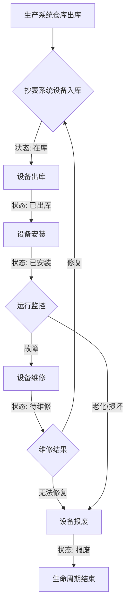

水务系统（生产管理与抄表运维）的需求，结合提供的工艺流程图、50万支水表规模、每天2次上报频率以及检测台数据关联等核心要素，以下是为您整合的全栈架构设计方案。

## 一、 业务逻辑与系统定位

系统采用“生产-运维”双轮驱动模式，全生命周期以 [表号 + IMEI + ICCID] 三位一体作为唯一身份标识。

生产系统 (PMS)：管控从基表组装、检测台校验、平台上报测试到包装出库的全过程。核心目标是质量追溯与人工判定结果管理。
抄表系统 (AMR)：管控设备出库后的安装、实时监控、高频数据采集与用水行为分析。核心目标是资产管理与数据价值。  
交接点：设备在生产系统完成“包装出库/仓库出库”后，以出库单/同步事件方式流转至抄表系统；该动作在抄表系统侧表现为“设备入库（接收入库）”，入库完成后进入“待安装库”。

## 二、 系统整体架构图

为了便于从整体视角理解系统组成，平台架构分为基础支撑域、生产业务域、数据采集域、指令控制域以及抄表运维应用域。其中，抄表运维域属于上层业务应用域，用于承接安装、监控、控制与审计能力；前述“四个域”仍然是系统核心数据域划分。

SYNC

```
P2 --> SYNC
P4 --> SYNC
P9 --> SYNC
SYNC --> A1

D1 --> A2
D2 --> A2

A3 --> C1
C1 --> A4

SM1 -.统一账号体系.-> A1
SM2 -.统一授权体系.-> A2
SM2 -.统一授权体系.-> A3
SM3 -.统一通知体系.-> A4 -->
```

## 三、 数据域划分方案

为了支持系统按职责拆分、便于后续扩展以及权限隔离，平台数据模型划分为以下四个核心域：

#### 系统管理域（System Management Domain）

职责：提供统一的账号、角色、权限和公告管理能力，是整个平台的基础支撑域。

包含对象：用户表、角色表、权限表、公告表。

用户分为两类：  
1）企业管理员：面向水务公司，负责企业级用户管理、角色授权、公告查看及业务使用。  
2）生产管理员：面向表厂公司，负责生产侧档案维护、批次管理、检测业务和包装业务操作。

#### 生产业务域（Production Business Domain）

职责：承载水表生产过程中的档案、备货、批次、检测、配置和包装等核心业务，是生产管理与质量追溯的核心数据域。

包含对象：  
表具档案表、设备档案表、备货单号表、批次表、批次历史快照主表、批次历史快照明细表、批次设备明细表、批次当前结果表、检验台数据表、配置参数表、包装任务主表、包装箱表、包装箱设备关联表。

#### 数据采集域（Data Collection Domain）

职责：承载设备运行过程中的实时与历史采集数据，用于监控、查询和后续数据分析。

包含对象：设备实时数据表、设备历史数据表。

#### 指令控制域（Command Control Domain）

职责：承载平台对设备下发控制指令及执行过程留痕，为远程控制、异常追踪和运维审计提供支撑。

包含对象：指令日志表。

#### 分库分表策略（补充）

结合 50 万支水表规模、每天 2 次上报、生产检测数据关联以及后续扩容诉求，建议采用“按业务域分库、按数据量与访问特征分表/分区、按设备维度统一路由”的策略。这样既能保证生产追溯链路完整，也能避免把高频采集数据与管理类数据混放在同一库中。


| 域     | 分库策略               | 分表/分区策略                                                   | 建议路由键                   | 说明                                                                                                                                                                                                                     |
| ----- | ------------------ | --------------------------------------------------------- | ----------------------- | ---------------------------------------------------------------------------------------------------------------------------------------------------------------------------------------------------------------------- |
| 系统管理域 | 独立 `water_dev` 单库  | 不分表                                                       | `tenant_id`             | 账号、角色、权限、公告数据量小，优先保证事务一致性与维护简单性。                                                                                                                                                                                       |
| 生产业务域 | 独立 `db_production` | 主档/配置类单表；明细/检测类按 `device_id` 或 `meter_no` Hash 分 16 表     | `device_id`             | `tb_meter`、`tb_device`、`tl_stock_prep`、`tl_batch`、`tl_batch_snapshot`、`tl_package`、`tl_package_box`、`tl_config_param` 保持单表；`tr_batch_detail_device`、`tr_batch_detail_result`、`tr_batch_detail_history`、`tr_batch_detail_test`、`tr_package_box_device`、`tl_test_data` 作为增长快的大表分表。 |
| 数据采集域 | 采集接入表与业务明细/归档表逻辑分离 | `pub_data_raw` 按天分区；实时结果表按 `device_id` Hash 分表；历史/归档表按月分表 | `device_id + recv_time` | 该域写入量最高，但当前仅使用 MySQL；通过接入缓冲、结果明细、历史归档分层控制写入与查询压力。                                                                                                                                                                      |
| 指令控制域 | 指令业务表与采集接入表逻辑隔离    | `cmd_command` 按 `device_id` Hash 分 32 表；`cmd_log` 按月分区    | `device_id`、`cmd_uuid`  | 指令状态查询和回溯频繁，分表后可降低热点；日志按时间归档便于清理。                                                                                                                                                                                      |


补充说明：  
1）生产业务域建议使用 `device_id` 作为主分片键，路由规则可统一为 `device_id % 16`，保证同一设备的档案、检测、批次明细尽量落在同一分片，降低跨片关联成本。  
2）指令控制域建议使用 `device_id % 32` 路由 `cmd_command`，`cmd_uuid` 作为全局唯一查询号，用于第三方回调和平台侧状态追踪。  
3）系统全生命周期仍以 `[表号 + IMEI + ICCID]` 作为业务唯一身份标识；查询时优先通过设备档案定位 `device_id`，再路由到对应分片执行。  
4）跨域数据流转不建议采用跨库强事务，仍以“生产系统包装出库/仓库出库后，通过事件/消息同步至抄表系统完成接收入库并进入待安装库”的方式实现，保证分库后系统解耦和可扩展性。  
5）部署上可先采用“逻辑分库、物理同实例”的方式落地，待生产明细、指令日志或采集接入量继续增长后，再平滑扩展到多实例分库，应用层路由规则保持不变。

四、 系统管理域 ER 图设计（按 BladeX 修正）

为保证后续直接基于 BladeX 框架开发，系统管理域不再重复设计旧版自定义账号权限表，而是直接复用 BladeX 已有租户、用户、角色、菜单、数据权限模型；水务系统仅补充 BladeX 原生字段不足的扩展表。

修正原则：

1. 框架层租户隔离统一使用 `tenant_id VARCHAR(12)`；业务层企业归属统一使用 `enterprise_id`，不再把企业直接等同于租户。
2. 审计字段优先使用 `create_user`、`create_time`、`update_user`、`update_time`、`status`、`is_deleted`；仅在确实存在部门维度时再补 `create_dept`。
3. 用户与角色关系直接复用 `blade_user.role_id`，该字段为角色 ID 串，不再新增用户角色中间表。
4. 角色功能权限直接复用 `blade_menu + blade_role_menu`；数据权限与接口权限直接复用 `blade_role_scope + blade_scope_data + blade_scope_api`。
5. 企业管理表保留“初始密码”字段用于开户记录，建议加密存储；实际登录认证仍以 `blade_user.password` 为准。
6. 后续业务自定义表如果需要走 BladeX 通用封装，优先继承 `TenantEntity`/`BaseEntity` 的字段口径。

## 系统管理域（单库）- BladeX 对齐版

```plain
┌─────────────────────────────────────────────────────────────────────────────┐
│                        系统管理域 (System Management Domain)                 │
│                              数据库: water_dev                               │
│                    策略：直接复用 BladeX 租户 + RBAC + 公告模型               │
└─────────────────────────────────────────────────────────────────────────────┘

                              ┌─────────────────┐
                              │   blade_tenant  │
                              │   (租户主表)     │
                              ├─────────────────┤
                              │ PK id           │
                              │ UK tenant_id    │◄── BladeX租户编码
                              │    tenant_name  │
                              │    linkman      │
                              │ contact_number  │
                              │    address      │
                              │ account_number  │
                              │  expire_time    │
                              │    status       │
                              └────────┬────────┘
                                       │1:N
                                       ▼
                              ┌────────────────────┐
                              │   biz_enterprise   │
                              │   (企业管理表)      │
                              ├────────────────────┤
                              │ PK enterprise_id   │
                              │ FK tenant_id       │◄── 所有企业归属同一租户
                              │ enterprise_name    │
                              │ enterprise_code    │
                              │   admin_name       │
                              │  login_account     │
                              │  init_password     │
                              │ enterprise_type    │◄── 1-水务公司 2-水表厂
                              │  create_time       │
                              │    status          │
                              └────────────────────┘

                                       │1:N
                                       ▼
                              ┌─────────────────┐
                              │   blade_user    │
                              │   (用户主表)     │
                              ├─────────────────┤
                              │ PK id           │
                              │ FK tenant_id    │
                              │    account      │◄── 登录账号
                              │    password     │◄── 加密存储
                              │    name         │
                              │    real_name    │
                              │    phone/email  │
                              │    role_id      │◄── 角色ID串
                              │    dept_id      │
                              │    post_id      │
                              │    status       │
                              └───────┬─────────┘
                                      │1:1
                                      ▼
                              ┌────────────────────┐
                              │ biz_user_enterprise│
                              │ (用户企业关联表)    │
                              ├────────────────────┤
                              │ PK id              │
                              │ FK user_id         │
                              │ FK enterprise_id   │
                              │    is_admin        │◄── 是否企业管理员
                              │    create_time     │
                              │    status          │
                              └────────────────────┘

            ┌──────────────────────────┬──────────────────────────┐
            ▼                          ▼                          ▼
   ┌─────────────────┐       ┌─────────────────┐        ┌─────────────────┐
   │   blade_dept    │       │   blade_role    │        │  blade_notice   │
   │   (机构表)       │       │   (角色表)       │        │   (公告主表)     │
   └────────┬────────┘       ├─────────────────┤        ├─────────────────┤
            │                │ PK id           │        │ PK id           │
            │                │ FK tenant_id    │        │ FK tenant_id    │
            │                │    parent_id    │        │    title        │
            │                │    role_name    │        │    category     │
            │                │    role_alias   │        │  release_time   │
            │                │    sort/status  │        │    content      │
            │                └────────┬────────┘        └────────┬────────┘
            │                         │                           │1:1 / 1:N
            ▼                         │                           ▼
   ┌─────────────────┐               │                  ┌────────────────────┐
   │ blade_user_dept │               │                  │ biz_notice_profile │
   │ (用户机构关联表) │               │                  │  biz_notice_read   │
   └─────────────────┘               │                  └────────────────────┘
                                      │
                   ┌──────────────────┴──────────────────┐
                   ▼                                     ▼
          ┌─────────────────┐                  ┌─────────────────┐
          │ blade_role_menu │                  │ blade_role_scope│
          │ (角色菜单关联表) │                  │ (角色权限关联表) │
          └────────┬────────┘                  └────────┬────────┘
                   │                                     │
                   ▼                                     ▼
          ┌─────────────────┐            ┌──────────────────────────────┐
          │   blade_menu    │            │ blade_scope_data / scope_api │
          │ (菜单/按钮权限表)│            │   (数据权限 / 接口权限表)      │
          └─────────────────┘            └──────────────────────────────┘
```

## 核心表设计（修正后）

### 1. 直接复用 BladeX 官方表

以下表直接沿用 [bladex.mysql.all.create.sql](E:\waterTest\bladex-boot\doc\sql\bladex\bladex.mysql.all.create.sql) 或 BladeX 现有实体，不再在本项目中重新造一套同义表：


| 分类   | 表名                 | 用途                  | 关键字段                                                                                                            |
| ---- | ------------------ | ------------------- | --------------------------------------------------------------------------------------------------------------- |
| 租户   | `blade_tenant`     | BladeX平台租户主表，保持原表不动 | `id`、`tenant_id`、`tenant_name`、`linkman`、`contact_number`、`address`、`account_number`、`expire_time`、`status`     |
| 用户   | `blade_user`       | 登录账号、手机号、邮箱、角色归属    | `id`、`tenant_id`、`account`、`password`、`name`、`real_name`、`phone`、`email`、`role_id`、`dept_id`、`post_id`、`status` |
| 机构   | `blade_dept`       | 部门树                 | `id`、`tenant_id`、`parent_id`、`dept_name`、`full_name`、`ancestors`、`status`                                       |
| 岗位   | `blade_post`       | 岗位表                 | `id`、`tenant_id`、`post_code`、`post_name`、`category`、`sort`、`status`                                             |
| 用户机构 | `blade_user_dept`  | 用户与机构关联             | `id`、`user_id`、`dept_id`、`status`、`is_deleted`                                                                  |
| 角色   | `blade_role`       | 角色定义                | `id`、`tenant_id`、`parent_id`、`role_name`、`role_alias`、`sort`、`status`                                           |
| 菜单权限 | `blade_menu`       | 菜单、按钮、接口入口定义        | `id`、`parent_id`、`code`、`name`、`alias`、`path`、`source`、`component`、`category`、`action`、`sort`                   |
| 角色菜单 | `blade_role_menu`  | 角色功能权限关系            | `id`、`role_id`、`menu_id`                                                                                        |
| 角色范围 | `blade_role_scope` | 角色数据/接口权限关系         | `id`、`scope_category`、`scope_id`、`role_id`                                                                      |
| 数据权限 | `blade_scope_data` | 数据权限定义              | `id`、`menu_id`、`resource_code`、`scope_name`、`scope_column`、`scope_type`、`scope_value`                           |
| 接口权限 | `blade_scope_api`  | 接口权限定义              | `id`、`menu_id`、`resource_code`、`scope_name`、`scope_path`、`scope_type`                                           |
| 公告   | `blade_notice`     | 公告主表                | `id`、`tenant_id`、`title`、`category`、`release_time`、`content`、`status`                                           |


落地说明：

- `blade_tenant` 保持 BladeX 原表不动，只承担平台租户能力，不作为企业管理页主表。
- 企业管理页主表改为 `biz_enterprise`，承接企业名称、企业编码、管理员姓名、登录账号、初始密码、创建时间、状态、企业类型。
- 所有企业记录统一挂在同一个 `tenant_id` 下；用户、角色、菜单、权限仍保持 BladeX 原链路不变。
- 企业开通时需要同步创建或更新企业主管理员 `blade_user` 账号：`enterprise_type=1` 创建水务公司的主管理员，`enterprise_type=2` 创建水表厂 / 水厂的主管理员；并保证 `biz_enterprise.login_account` 与 `blade_user.account` 口径一致。
- 由于一个租户下允许存在多家企业，而 `blade_user` 原表没有 `enterprise_id` 字段，所以必须新增 `biz_user_enterprise` 维护用户与企业的归属关系。
- 人员管理页主表直接使用 `blade_user`。
- 角色管理页主表直接使用 `blade_role`。
- 菜单/按钮权限直接来自 `blade_menu`。
- 角色授权动作直接对应 BladeX 的 `/role/grant` 与 `/user/grant` 逻辑。
- `blade_dept`、`blade_post`、`blade_user_dept` 作为 BladeX 兼容能力保留，不在业务界面展示“部门/岗位”字段。
- 后端为每个租户自动维护隐藏默认部门、隐藏默认岗位；用户新增、编辑、审批时自动回填 `dept_id`、`post_id` 和 `blade_user_dept`，前端不暴露这些字段。

### 2. 水务系统扩展表（仅保存 BladeX 原生模型缺失字段）

补齐规则（参考 BladeX 实际表设计）：

- 主业务表优先补齐：`tenant_id`、`create_user`、`create_time`、`update_user`、`update_time`、`status`、`is_deleted`；仅在有部门概念时补 `create_dept`。
- 纯关联表参考 `blade_user_dept`、`blade_role_menu` 一类表型，至少保留主键、关联外键、必要状态位，不强制补齐所有审计字段。
- 已有明确业务状态字段的表，如 `stock_status`、`test_status`、`cmd_status`，本版不再重复增加第二个语义重叠的通用 `status`，避免冲突。
- 业务层企业归属使用 `enterprise_id`；框架层租户隔离仍补 `tenant_id`。

#### 2.1 企业管理表 `biz_enterprise`

```sql
CREATE TABLE `biz_enterprise` (
    `enterprise_id` BIGINT NOT NULL COMMENT '主键',
    `tenant_id` VARCHAR(12) NOT NULL COMMENT '所属租户ID，所有企业固定归属同一租户',
    `enterprise_name` VARCHAR(100) NOT NULL COMMENT '企业名称',
    `enterprise_code` VARCHAR(32) NOT NULL COMMENT '企业编码',
    `admin_name` VARCHAR(50) NOT NULL COMMENT '管理员姓名',
    `login_account` VARCHAR(50) NOT NULL COMMENT '登录账号',
    `init_password` VARCHAR(100) NOT NULL COMMENT '初始密码，建议加密存储',
    `enterprise_type` TINYINT NOT NULL COMMENT '企业类型：1-水务公司 2-水表厂',
    `create_user` BIGINT DEFAULT NULL COMMENT '创建人',
    `create_time` DATETIME NOT NULL DEFAULT CURRENT_TIMESTAMP COMMENT '创建时间',
    `update_user` BIGINT DEFAULT NULL COMMENT '修改人',
    `update_time` DATETIME DEFAULT NULL COMMENT '修改时间',
    `status` INT NOT NULL DEFAULT 1 COMMENT '状态：0-禁用 1-正常',
    `is_deleted` INT NOT NULL DEFAULT 0 COMMENT '是否已删除',
    PRIMARY KEY (`enterprise_id`),
    UNIQUE KEY `uk_enterprise_code` (`enterprise_code`),
    UNIQUE KEY `uk_login_account` (`login_account`),
    KEY `idx_tenant_id` (`tenant_id`),
    KEY `idx_enterprise_type` (`enterprise_type`)
) ENGINE=InnoDB DEFAULT CHARSET=utf8mb4 COMMENT='企业管理表';
```

#### 2.2 用户企业关联表 `biz_user_enterprise`

```sql
CREATE TABLE `biz_user_enterprise` (
    `id` BIGINT NOT NULL COMMENT '主键',
    `tenant_id` VARCHAR(12) NOT NULL COMMENT '租户ID',
    `user_id` BIGINT NOT NULL COMMENT '用户ID，关联 blade_user.id',
    `enterprise_id` BIGINT NOT NULL COMMENT '企业ID，关联 biz_enterprise.enterprise_id',
    `is_admin` TINYINT NOT NULL DEFAULT 0 COMMENT '是否企业管理员：0-否 1-是',
    `create_user` BIGINT DEFAULT NULL COMMENT '创建人',
    `create_time` DATETIME NOT NULL DEFAULT CURRENT_TIMESTAMP COMMENT '创建时间',
    `update_user` BIGINT DEFAULT NULL COMMENT '修改人',
    `update_time` DATETIME DEFAULT NULL COMMENT '修改时间',
    `status` INT NOT NULL DEFAULT 1 COMMENT '状态：0-禁用 1-正常',
    `is_deleted` INT NOT NULL DEFAULT 0 COMMENT '是否已删除',
    PRIMARY KEY (`id`),
    UNIQUE KEY `uk_user_enterprise` (`user_id`, `enterprise_id`),
    KEY `idx_tenant_id` (`tenant_id`),
    KEY `idx_enterprise_id` (`enterprise_id`)
) ENGINE=InnoDB DEFAULT CHARSET=utf8mb4 COMMENT='用户企业关联表';
```

#### 2.3 公告扩展表 `biz_notice_profile`

```sql
CREATE TABLE `biz_notice_profile` (
    `id` BIGINT NOT NULL COMMENT '主键',
    `notice_id` BIGINT NOT NULL COMMENT '公告ID，关联 blade_notice.id',
    `priority` TINYINT NOT NULL DEFAULT 2 COMMENT '优先级：1-高 2-中 3-低',
    `summary` VARCHAR(255) DEFAULT NULL COMMENT '内容摘要',
    `scope_type` TINYINT DEFAULT 1 COMMENT '1-全部租户 2-按租户类型 3-指定租户',
    `scope_tenant_type` TINYINT DEFAULT NULL COMMENT '1-水务公司 2-水表厂',
    `expire_time` DATETIME DEFAULT NULL COMMENT '过期时间',
    `create_user` BIGINT DEFAULT NULL COMMENT '创建人',
    `create_dept` BIGINT DEFAULT NULL COMMENT '创建部门',
    `create_time` DATETIME DEFAULT NULL COMMENT '创建时间',
    `update_user` BIGINT DEFAULT NULL COMMENT '修改人',
    `update_time` DATETIME DEFAULT NULL COMMENT '修改时间',
    `status` INT DEFAULT 1 COMMENT '状态',
    `is_deleted` INT DEFAULT 0 COMMENT '是否已删除',
    PRIMARY KEY (`id`),
    UNIQUE KEY `uk_notice_id` (`notice_id`)
) ENGINE=InnoDB DEFAULT CHARSET=utf8mb4 COMMENT='公告扩展信息表';
```

#### 2.4 公告已读表 `biz_notice_read`

```sql
CREATE TABLE `biz_notice_read` (
    `id` BIGINT NOT NULL COMMENT '主键',
    `notice_id` BIGINT NOT NULL COMMENT '公告ID，关联 blade_notice.id',
    `user_id` BIGINT NOT NULL COMMENT '用户ID，关联 blade_user.id',
    `tenant_id` VARCHAR(12) NOT NULL COMMENT '租户ID',
    `read_time` DATETIME NOT NULL DEFAULT CURRENT_TIMESTAMP COMMENT '阅读时间',
    `status` INT NOT NULL DEFAULT 1 COMMENT '状态：0-禁用 1-正常',
    `is_deleted` INT NOT NULL DEFAULT 0 COMMENT '是否已删除',
    PRIMARY KEY (`id`),
    UNIQUE KEY `uk_notice_user` (`notice_id`, `user_id`)
) ENGINE=InnoDB DEFAULT CHARSET=utf8mb4 COMMENT='公告阅读记录表';
```

## 表清单（系统管理域）


| 序号  | 表名                    | 类型       | 说明           |
| --- | --------------------- | -------- | ------------ |
| 1   | `blade_tenant`        | BladeX内置 | 平台租户主表，保持不动  |
| 2   | `biz_enterprise`      | 水务扩展     | 企业管理表        |
| 3   | `blade_user`          | BladeX内置 | 用户主表         |
| 4   | `biz_user_enterprise` | 水务扩展     | 用户企业关联表      |
| 5   | `blade_dept`          | BladeX内置 | 机构表          |
| 6   | `blade_post`          | BladeX内置 | 岗位表          |
| 7   | `blade_user_dept`     | BladeX内置 | 用户机构关联表      |
| 8   | `blade_role`          | BladeX内置 | 角色主表         |
| 9   | `blade_menu`          | BladeX内置 | 菜单/按钮权限表     |
| 10  | `blade_role_menu`     | BladeX内置 | 角色功能权限关联表    |
| 11  | `blade_role_scope`    | BladeX内置 | 角色数据/接口权限关联表 |
| 12  | `blade_scope_data`    | BladeX内置 | 数据权限表        |
| 13  | `blade_scope_api`     | BladeX内置 | 接口权限表        |
| 14  | `blade_notice`        | BladeX内置 | 公告主表         |
| 15  | `biz_notice_profile`  | 水务扩展     | 公告扩展字段       |
| 16  | `biz_notice_read`     | 水务扩展     | 公告阅读记录       |


收到，生产业务域 ER 图按摘要展示；详细字段以本节后续“生产业务域核心表字段设计”与附录A/B为准。修正后的 ER 图：

```plain
┌─────────────────────────────────────────────────────────────────────────────┐
│                        生产业务域 (Production Domain)                        │
│                         数据库: db_production                                │
└─────────────────────────────────────────────────────────────────────────────┘

                              ┌─────────────────┐
                              │  tb_meter     │
                              │   (表具档案表)   │
                              └────────┬────────┘
                                       │
                                       │ 1:N
                                       ▼
                              ┌─────────────────┐
                              │  tb_device    │
                              │   (设备档案表)   │
                              ├─────────────────┤
                              │ PK device_id    │
                              │ FK meter_id     │
                              │    meter_no     │
                              │    imei         │
                              │    iccid        │
                              │    ...          │
                              │ FK prep_id      │◄── 关联备货单
                              │ FK batch_id     │◄── 关联批次
                              │ FK detail_id    │◄── 关联批次明细
                              │ FK package_id   │◄── 关联包装
                              └─────────────────┘
                                       ▲
                                       │
                                       │
       ┌───────────────────────────────┼───────────────────────────────┐
       │                               │                               │
       ▼                               │                               ▼
┌─────────────────┐                    │                    ┌─────────────────┐
│ tl_test_data  │                    │                    │tl_config_param│
│  (检验台数据表)  │                    │                    │  (配置参数表)    │
└─────────────────┘                    │                    └─────────────────┘
                                       │
                                       │
┌─────────────────┐                    │                    
│ tl_stock_prep │◄───────────────────┼───────────────────────────────────┐
│   (备货单号表)   │                    │                                   │
├─────────────────┤                    │                                   │
│ PK prep_id      │                    │                                   │
│    prep_no      │                    │                                   │
│ FK meter_id     │                    │                                   │
│    tenant_id    │                    │                                   │
│    remark       │                    │                                   │
│    status       │                    │                                   │
└────────┬────────┘                    │                                   │
         │                             │                                   │
         │ 1:N                         │                                   │
         │                             │                                   │
         ├────────────────────────┐    │         ┌───────────────────────┐ │
         │                        │    │         │                       │ │
         ▼                        │    │         ▼                       │ │
┌─────────────────┐               │    │   ┌─────────────────┐            │ │
│   tl_batch    │               │    │   │  tl_package   │            │ │
│    (批次表)      │               │   │    │  (包装任务主表)  │            │ │
├─────────────────┤               │    │   ├─────────────────┤            │ │
│ PK batch_id     │               │    │   │ PK package_id   │            │ │
│ FK prep_id      │◄──────────────┘    │   │ FK prep_id      │◄── 选择备货单◄──
│    batch_no     │    【批次关联备货单】  │  │    package_no   │
│    tenant_id    │                      │  │     box_prefix   │◄── 箱号前缀（如：PKG20240323001
│    tenant_id   │                      │  │     box_qty      │◄── 本次包装箱数  
│                 │                           │    device_qty   │◄── 本次包装设备数      │
└────────┬────────┘                      │  └────────┬────────┘
         │                               │           │ 详细箱体结构见 tl_package_box / tr_package_box_device
         │ 1:N                           │          ┌─────────────────┐
         │                               │          │  tb_device    │
         │                               │               (设备档案表)
         │                               │          │    box_no       │◄── 箱号（前缀+序号）
         │                               │          │    box_seq      │◄── 箱内序号
         │                               │          └─────────────────┘
         │                               │ 
         ▼  这里的合格状态只读取人工判定结果，不关联配置表
┌─────────────────┐                      │
│tr_batch_detail│                      │
│    _device      │                      │
│ (批次明细设备表) │                      │
├─────────────────┤                      │
│ PK device_ref_id│                      │
│ FK detail_id    │                      │
│ FK device_id    │◄─────────────────────┘
│    meter_no     │
│    batch_no     │
│    prep_no      │
└────────┬────────┘
        
┌─────────────────┐
│tr_batch_detail│
│    _history     │
│(批次历史快照明细表)│
├─────────────────┤
│ PK history_id   │
│ FK detail_id    │
│    meter_no     │
│    batch_no     │
│    prep_no      │
│    operation    │
│    old_status   │
│    new_status   │
└─────────────────┘ │
         │ 1:N
         ▼
┌─────────────────┐
│tr_batch_detail│
│    _test        │
│(批次明细检验台表)│
├─────────────────┤
│ PK test_id      │
│ FK detail_id    │
│    meter_no     │
│    batch_no     │
│    prep_no      │
│    test_type    │
│    test_result  │
└────────┬────────┘
       
```

**修正说明**：生产业务域已按附录字段口径同步修正。除 `tl_batch` 关联 `prep_id` 外，`tb_meter`、`tb_device`、`tl_package`、`tl_package_box`、`tr_package_box_device`、`tl_config_param`、`tl_test_data`、`tr_batch_detail_`* 等表的字段均以下方“核心表字段设计”与附录A/B为准；同一批次允许多次保存历史，因此新增 `tl_batch_snapshot` 作为历史快照主表。  
- 包装链路以 `tl_package -> tl_package_box -> tr_package_box_device` 为准；`tb_device.package_id / box_id / box_no / box_seq` 仅保留当前结果冗余，方便快速查询。

## 生产业务域核心表字段设计（按页面字段校正）

以下内容用于替代前文生产业务域 ER 图中的省略字段，作为开发与数据库设计的正文依据。

### 1. 表具档案表 `tb_meter`

关键字段：

- `meter_id`：主键
- `tenant_id`：租户ID
- `meter_name`：表具名称
- `meter_model`：表具型号
- `meter_caliber`：表具口径
- `remark`：备注
- `create_user`
- `status`：状态
- `create_time`
- `update_user`
- `update_time`
- `is_deleted`

对应页面：

- 表具档案页
- 仓库管理页（关联带出）
- 批量测试页（关联带出）
- 包装管理页（关联带出）

### 2. 设备档案表 `tb_device`

关键字段：

- `device_id`：主键
- `tenant_id`：租户ID
- `enterprise_id`：所属企业ID
- `meter_id`：关联 `tb_meter`
- `meter_no`：水表表号（新增阶段允许为空，写号后唯一）
- `imei`
- `iccid`
- `sim_no`：通讯卡号
- `protocol_type`：通讯协议
- `carrier`：运营商
- `vendor_code`：厂商代码
- `prep_id`：关联备货单
- `batch_id`：当前批次
- `detail_id`：当前批次明细
- `package_id`：关联包装任务主表
- `box_id`：关联包装箱表
- `box_no`：装箱号
- `box_seq`：箱内序号
- `stock_status`：库存状态
- `test_status`：测试状态
- `inbound_time`：入库时间
- `outbound_time`：出库时间
- `outbound_operator_id`：出库操作人员
- `remark`
- `last_write_time`
- `create_user`
- `create_time`
- `update_user`
- `update_time`
- `is_deleted`

说明：

- 仓库页的静态字段以本表为主；
- 上报的数据从实时表去获取，电压、信号、主副 IP、流量、阀门状态等动态字段来自 `data_realtime_*`；
- 当前登录用户名用于批量测试操作记录，存于 `cmd_command.operator_id`，并通过 `blade_user.account` / `blade_user.real_name` 展示。
- 仓库页新增/编辑弹窗不再暴露“所属水务公司”“所属水厂”；表具档案下拉复用 `GET /blade-wms/meter-archive/list`，备货单下拉复用 `GET /blade-wms/batch-management/prep/select-list`。

### 3. 备货单表 `tl_stock_prep`

关键字段：

- `prep_id`
- `prep_no`
- `meter_id`
- `tenant_id`
- `enterprise_id`
- `create_user`
- `status`
- `remark`
- `create_time`
- `update_user`
- `update_time`
- `is_deleted`

### 4. 批次表 `tl_batch`

关键字段：

- `batch_id`
- `prep_id`
- `batch_no`
- `tenant_id`
- `enterprise_id`
- `remark`
- `create_user`
- `create_time`
- `update_user`
- `update_time`
- `status`
- `is_deleted`

说明：

- `batch_no` 为测试批号；
- 一个 `batch_id` 可对应多条历史快照记录。

### 5. 批次历史快照主表 `tl_batch_snapshot`

关键字段：

- `snapshot_id`
- `tenant_id`
- `enterprise_id`
- `batch_id`
- `prep_id`
- `batch_no`
- `batch_summary`
- `task_no`
- `remark`
- `device_total`
- `pass_count`
- `fail_count`
- `pending_count`
- `pass_rate`
- `operator_id`
- `snapshot_time`
- `create_time`
- `status`
- `is_deleted`

说明：

- 每次点击“保存历史”写入一条主记录；
- 历史列表页直接查询本表；
- 同一批次可保存多次历史，每次保存生成一条独立快照主记录。

### 6. 批次设备明细表 `tr_batch_detail_device`

关键字段：

- `device_ref_id`
- `tenant_id`
- `enterprise_id`
- `detail_id`
- `batch_id`
- `prep_id`
- `device_id`
- `meter_no`
- `batch_no`
- `prep_no`
- `preset_base_value`
- `create_time`
- `status`
- `is_deleted`

说明：

- 表示“当前批次下有哪些设备”；
- 属于批次实时工作表，不是历史快照表。

### 6.1 批次当前结果表 `tr_batch_detail_result`

关键字段：

- `result_id`
- `tenant_id`
- `enterprise_id`
- `detail_id`
- `batch_id`
- `prep_id`
- `device_id`
- `meter_no`
- `batch_no`
- `prep_no`
- `report_time`
- `test_status`
- `pass_status`
- `forward_total_flow`
- `reverse_total_flow`
- `valve_status`
- `battery_voltage`
- `magnetic_strength`
- `main_ip`
- `backup_ip`
- `temperature`
- `pressure`
- `csq`
- `rsrp`
- `rsrq`
- `report_success_count`
- `report_total_count`
- `manual_pass_flag`
- `manual_pass_by`
- `manual_pass_time`
- `write_meter_time`
- `operator_id`
- `remark`
- `create_time`
- `update_time`
- `status`
- `is_deleted`

说明：

- 一条 `detail_id` 对应一条“当前批次实时结果”记录；
- 本表只承接批量测试页当前工作态结果，不承接检验台 3 个流量点明细；
- 设备加入批次时立即初始化本表记录，默认 `test_status = 0-待测`、`pass_status = NULL`；
- 每次“数据上报 / 写表号 / 写表底 / 写 IP / 开关阀 / 写表时间 / 批量合格”等动作成功后，立即更新本表；
- 用户从 A 批次切到 B 再切回 A 时，页面应按 `batch_id` 重新查询 `tr_batch_detail_device + tr_batch_detail_result` 回显，不依赖前端内存；
- 用户点击“保存历史”时，本表是历史冻结的主来源之一。

### 7. 批次历史快照明细表 `tr_batch_detail_history`

关键字段：

- `history_id`
- `tenant_id`
- `enterprise_id`
- `snapshot_id`
- `detail_id`
- `batch_id`
- `prep_id`
- `device_id`
- `meter_no`
- `batch_no`
- `prep_no`
- `imei`
- `test_result`
- `forward_total_flow`
- `reverse_total_flow`
- `valve_status`
- `battery_voltage`
- `magnetic_strength`
- `main_ip`
- `backup_ip`
- `temperature`
- `pressure`
- `csq`
- `rsrp`
- `rsrq`
- `set_flow`
- `actual_flow`
- `density`
- `standard_value`
- `relative_error`
- `operator_id`
- `snapshot_time`
- `remark`
- `status`
- `is_deleted`

说明：

- 每次保存历史时，将当前批次下每台设备的测试与检验结果冻结到本表；
- 历史详情页直接查询本表，不再回查实时结果表。

### 8. 批次明细检验台表 `tr_batch_detail_test`

关键字段：

- `test_id`
- `tenant_id`
- `enterprise_id`
- `detail_id`
- `batch_id`
- `prep_id`
- `meter_no`
- `batch_no`
- `prep_no`
- `test_type`
- `test_result`
- `test_time`
- `voltage`
- `magnetic_strength`
- `main_ip`
- `backup_ip`
- `reading_precision`
- `valve_status`
- `set_flow`
- `actual_flow`
- `temperature`
- `density`
- `standard_value`
- `relative_error`
- `bench_record_id`
- `status`
- `is_deleted`

说明：

- 本表只承接“当前批次下每只表对应的 3 个检验台流量点明细”；
- 不能再作为批量测试页当前平台测试结果的主表；
- 批量测试页当前列表中的“上报时间 / 合格状态 / 主副 IP / 电池电压 / 信号值”等字段，应以 `tr_batch_detail_result` 为主。

### 9. 配置参数表 `tl_config_param`

关键字段：

- `config_id`
- `tenant_id`
- `enterprise_id`
- `batch_id`
- `prep_id`
- `voltage_min`
- `nb_signal_min`
- `magnetic_min`
- `create_user`
- `create_time`
- `update_user`
- `update_time`
- `status`
- `is_deleted`
- `update_user`
- `update_time`
- `status`
- `is_deleted`

说明：

- 对应批量测试页“测试数据异常判定参数弹窗”。

### 10. 检验台数据表 `tl_test_data`

关键字段：

- `test_data_id`
- `tenant_id`
- `enterprise_id`
- `bench_name`
- `file_name`
- `row_no`
- `meter_no`
- `set_flow`
- `actual_flow`
- `temperature`
- `density`
- `standard_value`
- `relative_error`
- `upload_time`
- `remark`
- `batch_id`
- `prep_id`
- `create_user`
- `create_time`
- `update_user`
- `update_time`
- `status`
- `is_deleted`

说明：

- 对应批量测试历史页中的检验台记录上传、绑定和匹配。

### 11. 包装任务主表 `tl_package`

关键字段：

- `package_id`
- `tenant_id`
- `enterprise_id`
- `prep_id`
- `package_no`
- `box_prefix`
- `box_qty`
- `remark`
- `create_user`
- `create_time`
- `update_user`
- `update_time`
- `status`
- `is_deleted`

说明：

- 一条 `tl_package` 表示同一备货单下一次包装任务主记录，可包含多个箱；
- `box_prefix` 用于生成箱号，`box_qty` 为本次包装任务下的箱数量汇总。

### 12. 包装箱表 `tl_package_box`

关键字段：

- `box_id`
- `tenant_id`
- `enterprise_id`
- `package_id`
- `prep_id`
- `meter_id`
- `box_no`
- `barcode_content`
- `meter_qty`
- `inspector_id`
- `packed_at`
- `remark`
- `create_user`
- `create_time`
- `update_user`
- `update_time`
- `status`
- `is_deleted`

说明：

- 一条 `tl_package_box` 表示一个实际箱号；
- `meter_id` 关联 `tb_meter`，用于表达该箱对应的表具档案口径；
- 同一箱默认只允许同一 `meter_id` 的设备入箱。

### 13. 包装箱设备关联表 `tr_package_box_device`

关键字段：

- `rel_id`
- `tenant_id`
- `enterprise_id`
- `package_id`
- `box_id`
- `prep_id`
- `device_id`
- `meter_no`
- `box_seq`
- `create_time`
- `status`
- `is_deleted`

说明：

- 一条 `tr_package_box_device` 记录表示“某个设备被装入某个箱”；
- 箱内 10 个表号应落在该表的 10 条关联记录中，而不是塞进主表 JSON。

## 生产业务域核心表DDL（按PRD字段匹配）

以下 DDL 作为生产业务域的推荐落库结构示例，字段口径与附录A/B保持一致。

### 1. 表具档案表

```sql
CREATE TABLE `tb_meter` (
    `meter_id` BIGINT UNSIGNED NOT NULL AUTO_INCREMENT COMMENT '表具档案ID',
    `tenant_id` VARCHAR(12) NOT NULL DEFAULT '000000' COMMENT '租户ID',
    `meter_name` VARCHAR(100) NOT NULL COMMENT '表具名称',
    `meter_model` VARCHAR(100) NOT NULL COMMENT '表具型号',
    `meter_caliber` VARCHAR(50) NOT NULL COMMENT '表具口径',
    `remark` VARCHAR(200) DEFAULT NULL COMMENT '备注',
    `create_user` BIGINT UNSIGNED DEFAULT NULL COMMENT '创建人',
    `status` TINYINT NOT NULL DEFAULT 1 COMMENT '状态：0-禁用 1-正常',
    `create_time` DATETIME NOT NULL DEFAULT CURRENT_TIMESTAMP,
    `update_user` BIGINT UNSIGNED DEFAULT NULL COMMENT '修改人',
    `update_time` DATETIME NOT NULL DEFAULT CURRENT_TIMESTAMP ON UPDATE CURRENT_TIMESTAMP,
    `is_deleted` INT NOT NULL DEFAULT 0 COMMENT '是否已删除',
    PRIMARY KEY (`meter_id`),
    UNIQUE KEY `uk_meter_archive` (`meter_name`, `meter_model`, `meter_caliber`)
) ENGINE=InnoDB DEFAULT CHARSET=utf8mb4 COMMENT='表具档案表';
```

### 2. 设备档案表

```sql
CREATE TABLE `tb_device` (
    `device_id` BIGINT UNSIGNED NOT NULL AUTO_INCREMENT COMMENT '设备ID',
    `tenant_id` VARCHAR(12) NOT NULL DEFAULT '000000' COMMENT '租户ID',
    `enterprise_id` BIGINT UNSIGNED DEFAULT NULL COMMENT '所属企业ID',
    `meter_id` BIGINT UNSIGNED NOT NULL COMMENT '表具档案ID',
    `meter_no` VARCHAR(32) DEFAULT NULL COMMENT '水表表号，新增阶段允许为空，写号后唯一',
    `imei` VARCHAR(32) NOT NULL COMMENT 'IMEI',
    `iccid` VARCHAR(32) DEFAULT NULL COMMENT 'ICCID',
    `sim_no` VARCHAR(32) DEFAULT NULL COMMENT '通讯卡号',
    `protocol_type` VARCHAR(20) NOT NULL COMMENT '通讯协议',
    `carrier` VARCHAR(20) DEFAULT NULL COMMENT '运营商',
    `vendor_code` VARCHAR(50) DEFAULT NULL COMMENT '厂商代码',
    `prep_id` BIGINT UNSIGNED DEFAULT NULL COMMENT '备货单ID',
    `batch_id` BIGINT UNSIGNED DEFAULT NULL COMMENT '当前批次ID',
    `detail_id` BIGINT UNSIGNED DEFAULT NULL COMMENT '当前批次明细ID',
    `package_id` BIGINT UNSIGNED DEFAULT NULL COMMENT '包装任务ID',
    `box_id` BIGINT UNSIGNED DEFAULT NULL COMMENT '包装箱ID',
    `box_no` VARCHAR(64) DEFAULT NULL COMMENT '装箱号',
    `box_seq` INT DEFAULT NULL COMMENT '箱内序号',
    `stock_status` TINYINT NOT NULL DEFAULT 0 COMMENT '库存状态：0-在库 1-已出库',
    `test_status` TINYINT NOT NULL DEFAULT 0 COMMENT '测试状态：0-待测 1-合格 2-不合格',
    `inbound_time` DATETIME NOT NULL DEFAULT CURRENT_TIMESTAMP COMMENT '入库时间',
    `outbound_time` DATETIME DEFAULT NULL COMMENT '出库时间',
    `outbound_operator_id` BIGINT UNSIGNED DEFAULT NULL COMMENT '出库操作人员',
    `remark` VARCHAR(255) DEFAULT NULL COMMENT '备注',
    `last_write_time` DATETIME DEFAULT NULL COMMENT '最近一次写表时间',
    `create_user` BIGINT UNSIGNED DEFAULT NULL COMMENT '创建人',
    `create_time` DATETIME NOT NULL DEFAULT CURRENT_TIMESTAMP,
    `update_user` BIGINT UNSIGNED DEFAULT NULL COMMENT '修改人',
    `update_time` DATETIME NOT NULL DEFAULT CURRENT_TIMESTAMP ON UPDATE CURRENT_TIMESTAMP,
    `is_deleted` INT NOT NULL DEFAULT 0 COMMENT '是否已删除',
    PRIMARY KEY (`device_id`),
    UNIQUE KEY `uk_meter_no` (`meter_no`),
    UNIQUE KEY `uk_imei` (`imei`),
    KEY `idx_meter_id` (`meter_id`),
    KEY `idx_prep_id` (`prep_id`),
    KEY `idx_batch_id` (`batch_id`),
    KEY `idx_package_id` (`package_id`),
    KEY `idx_box_id` (`box_id`),
    KEY `idx_stock_status` (`stock_status`),
    KEY `idx_test_status` (`test_status`)
) ENGINE=InnoDB DEFAULT CHARSET=utf8mb4 COMMENT='设备档案表';
```

### 3. 备货单表

```sql
CREATE TABLE `tl_stock_prep` (
    `prep_id` BIGINT UNSIGNED NOT NULL COMMENT '备货单ID（后端生成）',
    `prep_no` VARCHAR(32) NOT NULL COMMENT '备货单号',
    `meter_id` BIGINT UNSIGNED DEFAULT NULL COMMENT '表具档案ID',
    `tenant_id` VARCHAR(12) NOT NULL DEFAULT '000000' COMMENT '租户ID',
    `enterprise_id` BIGINT UNSIGNED NOT NULL COMMENT '所属企业ID',
    `status` TINYINT NOT NULL DEFAULT 1 COMMENT '状态：0-禁用 1-正常',
    `remark` VARCHAR(200) DEFAULT NULL COMMENT '备注',
    `create_user` BIGINT UNSIGNED DEFAULT NULL COMMENT '创建人',
    `create_time` DATETIME NOT NULL DEFAULT CURRENT_TIMESTAMP,
    `update_user` BIGINT UNSIGNED DEFAULT NULL COMMENT '修改人',
    `update_time` DATETIME NOT NULL DEFAULT CURRENT_TIMESTAMP ON UPDATE CURRENT_TIMESTAMP,
    `is_deleted` INT NOT NULL DEFAULT 0 COMMENT '是否已删除',
    PRIMARY KEY (`prep_id`),
    UNIQUE KEY `uk_prep_no` (`prep_no`),
    KEY `idx_enterprise_id` (`enterprise_id`)
) ENGINE=InnoDB DEFAULT CHARSET=utf8mb4 COMMENT='备货单表';
```

### 4. 批次表

```sql
CREATE TABLE `tl_batch` (
    `batch_id` BIGINT UNSIGNED NOT NULL COMMENT '批次ID（后端生成）',
    `prep_id` BIGINT UNSIGNED NOT NULL COMMENT '备货单ID',
    `batch_no` VARCHAR(50) NOT NULL COMMENT '测试批号',
    `tenant_id` VARCHAR(12) NOT NULL DEFAULT '000000' COMMENT '租户ID',
    `enterprise_id` BIGINT UNSIGNED DEFAULT NULL COMMENT '所属企业ID',
    `remark` VARCHAR(200) DEFAULT NULL COMMENT '备注',
    `create_user` BIGINT UNSIGNED DEFAULT NULL COMMENT '创建人',
    `create_time` DATETIME NOT NULL DEFAULT CURRENT_TIMESTAMP,
    `update_user` BIGINT UNSIGNED DEFAULT NULL COMMENT '修改人',
    `update_time` DATETIME NOT NULL DEFAULT CURRENT_TIMESTAMP ON UPDATE CURRENT_TIMESTAMP,
    `status` TINYINT NOT NULL DEFAULT 1 COMMENT '状态：0-禁用 1-正常',
    `is_deleted` INT NOT NULL DEFAULT 0 COMMENT '是否已删除',
    PRIMARY KEY (`batch_id`),
    UNIQUE KEY `uk_batch_no` (`batch_no`),
    KEY `idx_prep_id` (`prep_id`),
    KEY `idx_enterprise_id` (`enterprise_id`)
) ENGINE=InnoDB DEFAULT CHARSET=utf8mb4 COMMENT='批次表';
```

### 5. 批次历史快照主表

```sql
CREATE TABLE `tl_batch_snapshot` (
    `snapshot_id` BIGINT UNSIGNED NOT NULL AUTO_INCREMENT COMMENT '快照ID',
    `tenant_id` VARCHAR(12) NOT NULL DEFAULT '000000' COMMENT '租户ID',
    `enterprise_id` BIGINT UNSIGNED DEFAULT NULL COMMENT '所属企业ID',
    `batch_id` BIGINT UNSIGNED NOT NULL COMMENT '批次ID',
    `prep_id` BIGINT UNSIGNED NOT NULL COMMENT '备货单ID',
    `batch_no` VARCHAR(50) NOT NULL COMMENT '测试批号',
    `batch_summary` VARCHAR(255) DEFAULT NULL COMMENT '批次摘要',
    `task_no` VARCHAR(50) DEFAULT NULL COMMENT '测试任务号',
    `remark` VARCHAR(200) DEFAULT NULL COMMENT '备注',
    `device_total` INT NOT NULL DEFAULT 0 COMMENT '设备总数',
    `pass_count` INT NOT NULL DEFAULT 0 COMMENT '合格数',
    `fail_count` INT NOT NULL DEFAULT 0 COMMENT '异常数',
    `pending_count` INT NOT NULL DEFAULT 0 COMMENT '待测数',
    `pass_rate` DECIMAL(6,2) NOT NULL DEFAULT 0.00 COMMENT '合格率',
    `operator_id` BIGINT UNSIGNED NOT NULL COMMENT '保存历史操作人',
    `snapshot_time` DATETIME NOT NULL DEFAULT CURRENT_TIMESTAMP COMMENT '保存历史时间',
    `create_time` DATETIME NOT NULL DEFAULT CURRENT_TIMESTAMP,
    `status` TINYINT NOT NULL DEFAULT 1 COMMENT '状态：0-禁用 1-正常',
    `is_deleted` INT NOT NULL DEFAULT 0 COMMENT '是否已删除',
    PRIMARY KEY (`snapshot_id`),
    KEY `idx_prep_id` (`prep_id`),
    KEY `idx_snapshot_time` (`snapshot_time`)
) ENGINE=InnoDB DEFAULT CHARSET=utf8mb4 COMMENT='批次历史快照主表';
```

### 6. 批次设备明细表

```sql
CREATE TABLE `tr_batch_detail_device` (
    `device_ref_id` BIGINT UNSIGNED NOT NULL AUTO_INCREMENT COMMENT '批次设备明细ID',
    `tenant_id` VARCHAR(12) NOT NULL DEFAULT '000000' COMMENT '租户ID',
    `enterprise_id` BIGINT UNSIGNED DEFAULT NULL COMMENT '所属企业ID',
    `detail_id` BIGINT UNSIGNED DEFAULT NULL COMMENT '业务明细ID',
    `batch_id` BIGINT UNSIGNED NOT NULL COMMENT '批次ID',
    `prep_id` BIGINT UNSIGNED NOT NULL COMMENT '备货单ID',
    `device_id` BIGINT UNSIGNED NOT NULL COMMENT '设备ID',
    `meter_no` VARCHAR(32) NOT NULL COMMENT '水表表号',
    `batch_no` VARCHAR(50) NOT NULL COMMENT '测试批号',
    `prep_no` VARCHAR(32) NOT NULL COMMENT '备货单号',
    `preset_base_value` DECIMAL(18,3) DEFAULT 0.000 COMMENT '预置表底数',
    `create_time` DATETIME NOT NULL DEFAULT CURRENT_TIMESTAMP,
    `status` TINYINT NOT NULL DEFAULT 1 COMMENT '状态：0-禁用 1-正常',
    `is_deleted` INT NOT NULL DEFAULT 0 COMMENT '是否已删除',
    PRIMARY KEY (`device_ref_id`),
    UNIQUE KEY `uk_batch_device` (`batch_id`, `device_id`),
    KEY `idx_meter_no` (`meter_no`)
) ENGINE=InnoDB DEFAULT CHARSET=utf8mb4 COMMENT='批次设备明细表';
```

### 6.1 批次当前结果表

```sql
CREATE TABLE `tr_batch_detail_result` (
    `result_id` BIGINT UNSIGNED NOT NULL AUTO_INCREMENT COMMENT '批次当前结果ID',
    `tenant_id` VARCHAR(12) NOT NULL DEFAULT '000000' COMMENT '租户ID',
    `enterprise_id` BIGINT UNSIGNED DEFAULT NULL COMMENT '所属企业ID',
    `detail_id` BIGINT UNSIGNED NOT NULL COMMENT '批次设备明细ID',
    `batch_id` BIGINT UNSIGNED NOT NULL COMMENT '批次ID',
    `prep_id` BIGINT UNSIGNED NOT NULL COMMENT '备货单ID',
    `device_id` BIGINT UNSIGNED NOT NULL COMMENT '设备ID',
    `meter_no` VARCHAR(32) NOT NULL COMMENT '水表表号',
    `batch_no` VARCHAR(50) NOT NULL COMMENT '测试批号',
    `prep_no` VARCHAR(32) NOT NULL COMMENT '备货单号',
    `report_time` DATETIME DEFAULT NULL COMMENT '最近一次数据上报时间',
    `test_status` TINYINT NOT NULL DEFAULT 0 COMMENT '测试状态：0-待测 1-已测试 2-测试中',
    `pass_status` TINYINT DEFAULT NULL COMMENT '当前合格状态：NULL-未判定 1-人工标记合格 0-人工标记不合格',
    `forward_total_flow` DECIMAL(18,3) DEFAULT NULL COMMENT '正向累积流量',
    `reverse_total_flow` DECIMAL(18,3) DEFAULT NULL COMMENT '反向累积流量',
    `valve_status` VARCHAR(20) DEFAULT NULL COMMENT '阀门状态',
    `battery_voltage` DECIMAL(8,3) DEFAULT NULL COMMENT '电池电压',
    `magnetic_strength` INT DEFAULT NULL COMMENT '无磁信号',
    `main_ip` VARCHAR(64) DEFAULT NULL COMMENT '主IP',
    `backup_ip` VARCHAR(64) DEFAULT NULL COMMENT '副IP',
    `temperature` DECIMAL(8,3) DEFAULT NULL COMMENT '环境温度',
    `pressure` DECIMAL(10,3) DEFAULT NULL COMMENT '压力',
    `csq` INT DEFAULT NULL COMMENT 'CSQ',
    `rsrp` INT DEFAULT NULL COMMENT 'RSRP',
    `rsrq` INT DEFAULT NULL COMMENT 'RSRQ',
    `report_success_count` INT NOT NULL DEFAULT 0 COMMENT '上报成功次数',
    `report_total_count` INT NOT NULL DEFAULT 0 COMMENT '上报总次数',
    `manual_pass_flag` TINYINT NOT NULL DEFAULT 0 COMMENT '是否已人工确认判定结果：0-否 1-是',
    `manual_pass_by` BIGINT UNSIGNED DEFAULT NULL COMMENT '人工判定操作人',
    `manual_pass_time` DATETIME DEFAULT NULL COMMENT '人工判定时间',
    `write_meter_time` DATETIME DEFAULT NULL COMMENT '最近一次写表时间',
    `operator_id` BIGINT UNSIGNED DEFAULT NULL COMMENT '最近一次操作人',
    `remark` VARCHAR(255) DEFAULT NULL COMMENT '当前结果备注',
    `status` TINYINT NOT NULL DEFAULT 1 COMMENT '状态：0-禁用 1-正常',
    `is_deleted` INT NOT NULL DEFAULT 0 COMMENT '是否已删除',
    `create_time` DATETIME NOT NULL DEFAULT CURRENT_TIMESTAMP COMMENT '创建时间',
    `update_time` DATETIME NOT NULL DEFAULT CURRENT_TIMESTAMP ON UPDATE CURRENT_TIMESTAMP COMMENT '更新时间',
    PRIMARY KEY (`result_id`),
    UNIQUE KEY `uk_detail_result` (`detail_id`),
    KEY `idx_batch_id` (`batch_id`),
    KEY `idx_device_id` (`device_id`),
    KEY `idx_meter_no` (`meter_no`),
    KEY `idx_test_status` (`test_status`),
    KEY `idx_pass_status` (`pass_status`)
) ENGINE=InnoDB DEFAULT CHARSET=utf8mb4 COMMENT='批次当前结果表';
```

### 7. 批次历史快照明细表

说明：
- 每只水表在历史快照中只存储1条记录（平台测试数据）
- 平台测试数据主来源为 `tr_batch_detail_result`，检验台 3 个流量点明细来源为 `tr_batch_detail_test`
- 检验台数据（3个流量点）通过关联表 `tr_batch_history_test_rel` 关联到 `tr_batch_detail_test` 表
- `has_bench_data` 字段标识该设备是否已绑定检验台数据

```sql
CREATE TABLE `tr_batch_detail_history` (
    `history_id` BIGINT UNSIGNED NOT NULL AUTO_INCREMENT COMMENT '历史快照明细ID',
    `tenant_id` VARCHAR(12) NOT NULL DEFAULT '000000' COMMENT '租户ID',
    `enterprise_id` BIGINT UNSIGNED DEFAULT NULL COMMENT '所属企业ID',
    `snapshot_id` BIGINT UNSIGNED NOT NULL COMMENT '快照ID',
    `detail_id` BIGINT UNSIGNED DEFAULT NULL COMMENT '原批次明细ID',
    `batch_id` BIGINT UNSIGNED NOT NULL COMMENT '批次ID',
    `prep_id` BIGINT UNSIGNED NOT NULL COMMENT '备货单ID',
    `device_id` BIGINT UNSIGNED NOT NULL COMMENT '设备ID',
    `meter_no` VARCHAR(32) NOT NULL COMMENT '水表表号',
    `batch_no` VARCHAR(50) NOT NULL COMMENT '测试批号',
    `prep_no` VARCHAR(32) NOT NULL COMMENT '备货单号',
    `imei` VARCHAR(32) DEFAULT NULL COMMENT 'IMEI',

    -- 平台测试数据
    `test_result` VARCHAR(20) DEFAULT NULL COMMENT '合格状态',
    `forward_total_flow` DECIMAL(18,3) DEFAULT NULL COMMENT '正向累积流量',
    `reverse_total_flow` DECIMAL(18,3) DEFAULT NULL COMMENT '反向累积流量',
    `valve_status` VARCHAR(20) DEFAULT NULL COMMENT '阀门状态',
    `battery_voltage` DECIMAL(8,3) DEFAULT NULL COMMENT '电池电压',
    `magnetic_strength` INT DEFAULT NULL COMMENT '无磁信号',
    `main_ip` VARCHAR(64) DEFAULT NULL COMMENT '主IP',
    `backup_ip` VARCHAR(64) DEFAULT NULL COMMENT '副IP',
    `temperature` DECIMAL(8,3) DEFAULT NULL COMMENT '温度',
    `pressure` DECIMAL(10,3) DEFAULT NULL COMMENT '压力',
    `csq` INT DEFAULT NULL COMMENT 'CSQ',
    `rsrp` INT DEFAULT NULL COMMENT 'RSRP',
    `rsrq` INT DEFAULT NULL COMMENT 'RSRQ',

    -- 检验台数据字段（可选：用于存储汇总或平均值）
    `set_flow` DECIMAL(18,6) DEFAULT NULL COMMENT '设定流量',
    `actual_flow` DECIMAL(18,6) DEFAULT NULL COMMENT '实际流量',
    `density` DECIMAL(12,6) DEFAULT NULL COMMENT '密度',
    `standard_value` DECIMAL(18,6) DEFAULT NULL COMMENT '标准值',
    `relative_error` DECIMAL(12,6) DEFAULT NULL COMMENT '相对误差',

    -- 检验台绑定标识
    `has_bench_data` TINYINT DEFAULT 0 COMMENT '是否已绑定检验台数据：0-否 1-是',

    `operator_id` BIGINT UNSIGNED NOT NULL COMMENT '保存历史操作人',
    `snapshot_time` DATETIME NOT NULL DEFAULT CURRENT_TIMESTAMP COMMENT '保存历史时间',
    `remark` VARCHAR(255) DEFAULT NULL COMMENT '备注',
    `status` TINYINT NOT NULL DEFAULT 1 COMMENT '状态：0-禁用 1-正常',
    `is_deleted` INT NOT NULL DEFAULT 0 COMMENT '是否已删除',
    `create_time` DATETIME NOT NULL DEFAULT CURRENT_TIMESTAMP COMMENT '创建时间',
    `update_time` DATETIME NOT NULL DEFAULT CURRENT_TIMESTAMP ON UPDATE CURRENT_TIMESTAMP COMMENT '更新时间',

    PRIMARY KEY (`history_id`),
    KEY `idx_snapshot_id` (`snapshot_id`),
    KEY `idx_meter_no` (`meter_no`),
    KEY `idx_device_id` (`device_id`),
    UNIQUE KEY `uk_snapshot_meter` (`snapshot_id`, `meter_no`)
) ENGINE=InnoDB DEFAULT CHARSET=utf8mb4 COMMENT='批次历史快照明细表';
```

### 7.1 历史快照与检验台数据关联表

说明：
- 用于建立历史快照明细与检验台数据的多对多关系
- 每只水表在历史快照中有1条 `tr_batch_detail_history` 记录
- 每只水表对应3条关联记录（3个流量点），关联到 `tr_batch_detail_test` 表的3条检验台数据

```sql
CREATE TABLE `tr_batch_history_test_rel` (
    `rel_id` BIGINT UNSIGNED NOT NULL AUTO_INCREMENT COMMENT '关联ID',
    `tenant_id` VARCHAR(12) NOT NULL DEFAULT '000000' COMMENT '租户ID',
    `enterprise_id` BIGINT UNSIGNED DEFAULT NULL COMMENT '所属企业ID',
    `history_id` BIGINT UNSIGNED NOT NULL COMMENT '历史快照明细ID',
    `snapshot_id` BIGINT UNSIGNED NOT NULL COMMENT '快照ID',
    `test_id` BIGINT UNSIGNED NOT NULL COMMENT '检验台记录ID',
    `meter_no` VARCHAR(32) NOT NULL COMMENT '水表表号',
    `flow_point_seq` TINYINT NOT NULL COMMENT '流量点序号：1-小流量 2-常用流量 3-过载流量',
    `create_time` DATETIME NOT NULL DEFAULT CURRENT_TIMESTAMP COMMENT '创建时间',
    `update_time` DATETIME NOT NULL DEFAULT CURRENT_TIMESTAMP ON UPDATE CURRENT_TIMESTAMP COMMENT '更新时间',

    PRIMARY KEY (`rel_id`),
    KEY `idx_history_id` (`history_id`),
    KEY `idx_snapshot_id` (`snapshot_id`),
    KEY `idx_test_id` (`test_id`),
    KEY `idx_meter_no` (`meter_no`),
    UNIQUE KEY `uk_history_flow_point` (`history_id`, `flow_point_seq`)
) ENGINE=InnoDB DEFAULT CHARSET=utf8mb4 COMMENT='历史快照与检验台数据关联表';
```

数据关系示例：

```
历史快照明细表 (tr_batch_detail_history)
history_id: 1, snapshot_id: 100, meter_no: 00000001 (平台测试数据)
    ↓
关联表 (tr_batch_history_test_rel)
├─ rel_id: 1, history_id: 1, test_id: 10, flow_point_seq: 1
├─ rel_id: 2, history_id: 1, test_id: 11, flow_point_seq: 2
└─ rel_id: 3, history_id: 1, test_id: 12, flow_point_seq: 3
    ↓
检验台数据表 (tr_batch_detail_test)
├─ test_id: 10, meter_no: 00000001, flow_point_seq: 1 (小流量)
├─ test_id: 11, meter_no: 00000001, flow_point_seq: 2 (常用流量)
└─ test_id: 12, meter_no: 00000001, flow_point_seq: 3 (过载流量)
```

查询示例：

```sql
-- 查询历史快照详情（包含检验台数据）
SELECT
    h.history_id,
    h.meter_no,
    h.imei,
    h.test_result,
    h.battery_voltage,
    h.magnetic_strength,
    h.has_bench_data,
    -- 检验台数据（通过关联表）
    t.flow_point_seq,
    t.flow_point_name,
    t.set_flow,
    t.actual_flow,
    t.temperature,
    t.density,
    t.standard_value,
    t.relative_error,
    t.is_qualified
FROM tr_batch_detail_history h
LEFT JOIN tr_batch_history_test_rel rel ON h.history_id = rel.history_id
LEFT JOIN tr_batch_detail_test t ON rel.test_id = t.test_id
WHERE h.snapshot_id = ?
ORDER BY h.meter_no, t.flow_point_seq;
```

### 8. 批次明细检验台表

说明：
- 每只水表固定有3条检验台数据记录（小流量、常用流量、过载流量）
- 通过 `flow_point_seq` 字段区分不同流量点（1-小流量、2-常用流量、3-过载流量）
- 唯一索引 `uk_meter_flow_point` 确保同一表号+同一批次+同一流量点只有一条记录

```sql
CREATE TABLE `tr_batch_detail_test` (
    `test_id` BIGINT UNSIGNED NOT NULL AUTO_INCREMENT COMMENT '批次检验记录ID',
    `tenant_id` VARCHAR(12) NOT NULL DEFAULT '000000' COMMENT '租户ID',
    `enterprise_id` BIGINT UNSIGNED DEFAULT NULL COMMENT '所属企业ID',
    `detail_id` BIGINT UNSIGNED DEFAULT NULL COMMENT '批次设备明细ID',
    `batch_id` BIGINT UNSIGNED NOT NULL COMMENT '批次ID',
    `prep_id` BIGINT UNSIGNED NOT NULL COMMENT '备货单ID',
    `meter_no` VARCHAR(32) NOT NULL COMMENT '水表表号',
    `batch_no` VARCHAR(50) NOT NULL COMMENT '测试批号',
    `prep_no` VARCHAR(32) NOT NULL COMMENT '备货单号',

    -- 流量点标识（固定3个流量点）
    `flow_point_seq` TINYINT NOT NULL DEFAULT 1 COMMENT '流量点序号：1-小流量 2-常用流量 3-过载流量',
    `flow_point_name` VARCHAR(20) DEFAULT NULL COMMENT '流量点名称：小流量/常用流量/过载流量',

    `test_type` VARCHAR(30) DEFAULT NULL COMMENT '匹配方式/测试类型',
    `test_result` VARCHAR(20) DEFAULT NULL COMMENT '测试结果',
    `test_time` DATETIME DEFAULT NULL COMMENT '测试时间',
    `voltage` DECIMAL(8,3) DEFAULT NULL COMMENT '电压',
    `magnetic_strength` INT DEFAULT NULL COMMENT '无磁信号',
    `main_ip` VARCHAR(64) DEFAULT NULL COMMENT '主IP',
    `backup_ip` VARCHAR(64) DEFAULT NULL COMMENT '副IP',
    `reading_precision` DECIMAL(18,6) DEFAULT NULL COMMENT '表读数精度',
    `valve_status` VARCHAR(20) DEFAULT NULL COMMENT '阀门状态',

    -- 检验台数据字段
    `set_flow` DECIMAL(18,6) DEFAULT NULL COMMENT '设定流量(L/h)',
    `actual_flow` DECIMAL(18,6) DEFAULT NULL COMMENT '实际流量(L/h)',
    `temperature` DECIMAL(8,3) DEFAULT NULL COMMENT '温度(℃)',
    `density` DECIMAL(12,6) DEFAULT NULL COMMENT '密度(kg/L)',
    `standard_value` DECIMAL(18,6) DEFAULT NULL COMMENT '标准值(L)',
    `relative_error` DECIMAL(12,6) DEFAULT NULL COMMENT '相对误差(%)',

    -- 是否合格
    `is_qualified` TINYINT DEFAULT NULL COMMENT '是否合格：0-不合格 1-合格',

    `bench_record_id` BIGINT UNSIGNED DEFAULT NULL COMMENT '检验台记录ID',
    `bench_row_no` INT DEFAULT NULL COMMENT '检验台Excel行号',

    `status` TINYINT NOT NULL DEFAULT 1 COMMENT '状态：0-禁用 1-正常',
    `is_deleted` INT NOT NULL DEFAULT 0 COMMENT '是否已删除',
    `create_time` DATETIME NOT NULL DEFAULT CURRENT_TIMESTAMP COMMENT '创建时间',
    `update_time` DATETIME NOT NULL DEFAULT CURRENT_TIMESTAMP ON UPDATE CURRENT_TIMESTAMP COMMENT '更新时间',

    PRIMARY KEY (`test_id`),
    KEY `idx_detail_id` (`detail_id`),
    KEY `idx_batch_id` (`batch_id`),
    KEY `idx_meter_no` (`meter_no`),
    KEY `idx_bench_record` (`bench_record_id`),
    UNIQUE KEY `uk_meter_flow_point` (`meter_no`, `batch_id`, `flow_point_seq`)
) ENGINE=InnoDB DEFAULT CHARSET=utf8mb4 COMMENT='批次明细检验台表';
```

数据存储示例：

```
表号: 00000001, batch_id: 123
├─ test_id: 1, flow_point_seq: 1, flow_point_name: 小流量
│  set_flow: 2500.00, actual_flow: 2512.14, temperature: 11.78
│  density: 0.99962, standard_value: 50.74, relative_error: 0.40, is_qualified: 1
│
├─ test_id: 2, flow_point_seq: 2, flow_point_name: 常用流量
│  set_flow: 40.57, actual_flow: 40.48, temperature: 12.49
│  density: 0.99943, standard_value: 3.02, relative_error: -1.35, is_qualified: 1
│
└─ test_id: 3, flow_point_seq: 3, flow_point_name: 过载流量
   set_flow: 25.00, actual_flow: 26.62, temperature: 12.51
   density: 0.99943, standard_value: 3.02, relative_error: -0.99, is_qualified: 1
```

### 9. 配置参数表

```sql
CREATE TABLE `tl_config_param` (
    `config_id` BIGINT UNSIGNED NOT NULL AUTO_INCREMENT COMMENT '配置ID',
    `tenant_id` VARCHAR(12) NOT NULL DEFAULT '000000' COMMENT '租户ID',
    `enterprise_id` BIGINT UNSIGNED DEFAULT NULL COMMENT '所属企业ID',
    `batch_id` BIGINT UNSIGNED NOT NULL COMMENT '批次ID',
    `prep_id` BIGINT UNSIGNED DEFAULT NULL COMMENT '备货单ID',
    `voltage_min` DECIMAL(8,3) NOT NULL DEFAULT 3.6 COMMENT '电池电压下限（V，1位小数），一般大于3.6V',
    `nb_signal_min` INT NOT NULL DEFAULT 13 COMMENT '信号质量(CSQ)下限，一般大于13',
    `magnetic_min` INT NOT NULL DEFAULT 130 COMMENT '无磁信号下限，一般大于130',
    `create_user` BIGINT UNSIGNED DEFAULT NULL COMMENT '创建人',
    `create_time` DATETIME NOT NULL DEFAULT CURRENT_TIMESTAMP,
    `update_user` BIGINT UNSIGNED DEFAULT NULL COMMENT '修改人',
    `update_time` DATETIME NOT NULL DEFAULT CURRENT_TIMESTAMP ON UPDATE CURRENT_TIMESTAMP,
    `status` TINYINT NOT NULL DEFAULT 1 COMMENT '状态：0-禁用 1-正常',
    `is_deleted` INT NOT NULL DEFAULT 0 COMMENT '是否已删除',
    PRIMARY KEY (`config_id`),
    KEY `idx_batch_id` (`batch_id`)
) ENGINE=InnoDB DEFAULT CHARSET=utf8mb4 COMMENT='测试数据异常判定参数配置表';
```

### 10. 检验台数据表

说明：
- 存储从检验台Excel导入的原始数据
- 每只水表有3条检验台数据记录（小流量、常用流量、过载流量）
- 通过 `flow_point_seq` 字段区分不同流量点（1-小流量、2-常用流量、3-过载流量）
- 与 `tr_batch_detail_test` 表关联，支持批次检测数据追溯

```sql
CREATE TABLE `tl_test_data` (
    `test_data_id` BIGINT UNSIGNED NOT NULL AUTO_INCREMENT COMMENT '检验台数据ID',
    `tenant_id` VARCHAR(12) NOT NULL DEFAULT '000000' COMMENT '租户ID',
    `enterprise_id` BIGINT UNSIGNED DEFAULT NULL COMMENT '所属企业ID',

    -- 检验台信息
    `bench_name` VARCHAR(100) NOT NULL COMMENT '检验台名称',
    `file_name` VARCHAR(255) DEFAULT NULL COMMENT 'Excel文件名',
    `row_no` INT DEFAULT NULL COMMENT 'Excel行号',

    -- 水表信息
    `meter_no` VARCHAR(32) NOT NULL COMMENT '水表表号',
    `batch_id` BIGINT UNSIGNED DEFAULT NULL COMMENT '批次ID',
    `prep_id` BIGINT UNSIGNED DEFAULT NULL COMMENT '备货单ID',
    `batch_no` VARCHAR(50) DEFAULT NULL COMMENT '测试批号',
    `prep_no` VARCHAR(32) DEFAULT NULL COMMENT '备货单号',

    -- 流量点标识（固定3个流量点）
    `flow_point_seq` TINYINT NOT NULL DEFAULT 1 COMMENT '流量点序号：1-小流量 2-常用流量 3-过载流量',
    `flow_point_name` VARCHAR(20) DEFAULT NULL COMMENT '流量点名称：小流量/常用流量/过载流量',

    -- 检验台测试数据
    `set_flow` DECIMAL(18,6) DEFAULT NULL COMMENT '设定流量(L/h)',
    `actual_flow` DECIMAL(18,6) DEFAULT NULL COMMENT '实际流量(L/h)',
    `temperature` DECIMAL(8,3) DEFAULT NULL COMMENT '温度(℃)',
    `density` DECIMAL(12,6) DEFAULT NULL COMMENT '密度(kg/L)',
    `standard_value` DECIMAL(18,6) DEFAULT NULL COMMENT '标准值(L)',
    `relative_error` DECIMAL(12,6) DEFAULT NULL COMMENT '相对误差(%)',

    -- 合格判定
    `is_qualified` TINYINT DEFAULT NULL COMMENT '是否合格：0-不合格 1-合格',

    -- 时间与备注
    `upload_time` DATETIME NOT NULL DEFAULT CURRENT_TIMESTAMP COMMENT '上传时间',
    `remark` VARCHAR(255) DEFAULT NULL COMMENT '记录说明',

    -- 标准字段
    `create_user` BIGINT UNSIGNED DEFAULT NULL COMMENT '创建人',
    `create_time` DATETIME NOT NULL DEFAULT CURRENT_TIMESTAMP COMMENT '创建时间',
    `update_user` BIGINT UNSIGNED DEFAULT NULL COMMENT '修改人',
    `update_time` DATETIME NOT NULL DEFAULT CURRENT_TIMESTAMP ON UPDATE CURRENT_TIMESTAMP COMMENT '修改时间',
    `status` TINYINT NOT NULL DEFAULT 1 COMMENT '状态：0-禁用 1-正常',
    `is_deleted` INT NOT NULL DEFAULT 0 COMMENT '是否已删除',

    PRIMARY KEY (`test_data_id`),
    KEY `idx_meter_no` (`meter_no`),
    KEY `idx_batch_id` (`batch_id`),
    KEY `idx_bench_name` (`bench_name`),
    KEY `idx_upload_time` (`upload_time`),
    UNIQUE KEY `uk_meter_flow_point` (`meter_no`, `batch_id`, `flow_point_seq`)
) ENGINE=InnoDB DEFAULT CHARSET=utf8mb4 COMMENT='检验台数据表';
```

### 11. 包装任务主表

```sql
CREATE TABLE `tl_package` (
    `package_id` BIGINT UNSIGNED NOT NULL AUTO_INCREMENT COMMENT '包装任务ID',
    `tenant_id` VARCHAR(12) NOT NULL DEFAULT '000000' COMMENT '租户ID',
    `enterprise_id` BIGINT UNSIGNED DEFAULT NULL COMMENT '所属企业ID',
    `prep_id` BIGINT UNSIGNED NOT NULL COMMENT '备货单ID',
    `package_no` VARCHAR(64) NOT NULL COMMENT '包装任务号',
    `box_prefix` VARCHAR(64) NOT NULL COMMENT '箱号前缀',
    `box_qty` INT NOT NULL DEFAULT 0 COMMENT '本次包装箱数量',
    `device_qty` INT NOT NULL DEFAULT 0 COMMENT '本次包装设备数量',
    `remark` VARCHAR(255) DEFAULT NULL COMMENT '包装任务备注',
    `create_user` BIGINT UNSIGNED DEFAULT NULL COMMENT '创建人',
    `create_time` DATETIME NOT NULL DEFAULT CURRENT_TIMESTAMP,
    `update_user` BIGINT UNSIGNED DEFAULT NULL COMMENT '修改人',
    `update_time` DATETIME NOT NULL DEFAULT CURRENT_TIMESTAMP ON UPDATE CURRENT_TIMESTAMP,
    `status` TINYINT NOT NULL DEFAULT 1 COMMENT '状态：0-禁用 1-正常',
    `is_deleted` INT NOT NULL DEFAULT 0 COMMENT '是否已删除',
    PRIMARY KEY (`package_id`),
    UNIQUE KEY `uk_package_no` (`package_no`),
    KEY `idx_prep_id` (`prep_id`)
) ENGINE=InnoDB DEFAULT CHARSET=utf8mb4 COMMENT='包装任务主表';
```

### 12. 包装箱表

```sql
CREATE TABLE `tl_package_box` (
    `box_id` BIGINT UNSIGNED NOT NULL AUTO_INCREMENT COMMENT '包装箱ID',
    `tenant_id` VARCHAR(12) NOT NULL DEFAULT '000000' COMMENT '租户ID',
    `enterprise_id` BIGINT UNSIGNED DEFAULT NULL COMMENT '所属企业ID',
    `package_id` BIGINT UNSIGNED NOT NULL COMMENT '包装任务ID',
    `prep_id` BIGINT UNSIGNED NOT NULL COMMENT '备货单ID',
    `meter_id` BIGINT UNSIGNED DEFAULT NULL COMMENT '表具档案ID',
    `box_no` VARCHAR(64) NOT NULL COMMENT '箱号',
    `barcode_content` VARCHAR(255) DEFAULT NULL COMMENT '箱标签条码内容',
    `meter_qty` INT NOT NULL DEFAULT 0 COMMENT '箱内表数量',
    `inspector_id` BIGINT UNSIGNED NOT NULL COMMENT '检验员/包装人',
    `packed_at` DATETIME NOT NULL DEFAULT CURRENT_TIMESTAMP COMMENT '包装时间',
    `remark` VARCHAR(255) DEFAULT NULL COMMENT '包装箱备注',
    `create_user` BIGINT UNSIGNED DEFAULT NULL COMMENT '创建人',
    `create_time` DATETIME NOT NULL DEFAULT CURRENT_TIMESTAMP,
    `update_user` BIGINT UNSIGNED DEFAULT NULL COMMENT '修改人',
    `update_time` DATETIME NOT NULL DEFAULT CURRENT_TIMESTAMP ON UPDATE CURRENT_TIMESTAMP,
    `status` TINYINT NOT NULL DEFAULT 1 COMMENT '状态：0-禁用 1-正常',
    `is_deleted` INT NOT NULL DEFAULT 0 COMMENT '是否已删除',
    PRIMARY KEY (`box_id`),
    UNIQUE KEY `uk_box_no` (`box_no`),
    KEY `idx_package_id` (`package_id`),
    KEY `idx_prep_id` (`prep_id`),
    KEY `idx_meter_id` (`meter_id`),
    KEY `idx_packed_at` (`packed_at`)
) ENGINE=InnoDB DEFAULT CHARSET=utf8mb4 COMMENT='包装箱表';
```

### 13. 包装箱设备关联表

```sql
CREATE TABLE `tr_package_box_device` (
    `rel_id` BIGINT UNSIGNED NOT NULL AUTO_INCREMENT COMMENT '包装箱设备关联ID',
    `tenant_id` VARCHAR(12) NOT NULL DEFAULT '000000' COMMENT '租户ID',
    `enterprise_id` BIGINT UNSIGNED DEFAULT NULL COMMENT '所属企业ID',
    `package_id` BIGINT UNSIGNED NOT NULL COMMENT '包装任务ID',
    `box_id` BIGINT UNSIGNED NOT NULL COMMENT '包装箱ID',
    `prep_id` BIGINT UNSIGNED NOT NULL COMMENT '备货单ID',
    `device_id` BIGINT UNSIGNED NOT NULL COMMENT '设备ID',
    `meter_no` VARCHAR(32) NOT NULL COMMENT '水表表号',
    `box_seq` INT NOT NULL COMMENT '箱内序号',
    `create_time` DATETIME NOT NULL DEFAULT CURRENT_TIMESTAMP,
    `status` TINYINT NOT NULL DEFAULT 1 COMMENT '状态：0-禁用 1-正常',
    `is_deleted` INT NOT NULL DEFAULT 0 COMMENT '是否已删除',
    PRIMARY KEY (`rel_id`),
    UNIQUE KEY `uk_box_device` (`box_id`, `device_id`),
    KEY `idx_package_id` (`package_id`),
    KEY `idx_prep_id` (`prep_id`),
    KEY `idx_device_id` (`device_id`),
    KEY `idx_meter_no` (`meter_no`)
) ENGINE=InnoDB DEFAULT CHARSET=utf8mb4 COMMENT='包装箱设备关联表';
```

收到，去掉额外时序库假设，简化为仅使用 MySQL。通过公共接入表 + MySQL 业务明细/归档表满足需求。

## 数据采集域（修正版：仅 MySQL）

```plain
┌─────────────────────────────────────────────────────────────────────────────┐
│                        数据采集域 (Data Collection Domain)                   │
│                                                                             │
│                 接入方式：UDP上报 → 公共接入表 → 采集服务 → MySQL业务表        │
│                 核心存储：pub_data_raw + MySQL实时/历史/归档表               │
└─────────────────────────────────────────────────────────────────────────────┘

┌─────────────────────────────────────────────────────────────────────────────┐
│                              接入层（UDP上报）                                │
├─────────────────────────────────────────────────────────────────────────────┤

  智能水表(NB/LoRa)              UDP网关                   公共接入表
┌─────────────┐              ┌─────────────┐              ┌─────────────────┐
│             │   UDP协议     │   UDP       │   写入       │  pub_data_raw   │
│  定时上报   │─────────────►│  Gateway    │────────────►│  (公共数据表)    │
│  (2次/天)   │   二进制包    │  解析入库    │              │  【原始缓冲数据】 │
└─────────────┘              └─────────────┘              └─────────────────┘
                                                                   │
                                                                   │
                              ┌────────────────────────────────────┘
                              │
                              ▼
                     ┌─────────────────┐
                     │  Data Collector │
                     │   (数据采集服务)  │
                     │                 │
                     │ • 读取pub_data_raw│
                     │ • 数据清洗转换    │
                     │ • 写入MySQL业务表 │
                     └────────┬────────┘
                              │
                              ▼
                    ┌──────────────────────┐
                    │ MySQL业务明细归档层   │
                    │                      │
                    │ • data_realtime_*    │
                    │ • data_history_*     │
                    │ • data_archive_*     │
                    └──────────────────────┘


┌─────────────────────────────────────────────────────────────────────────────┐
│                              公共接入层（核心）                               │
├─────────────────────────────────────────────────────────────────────────────┤

                              ┌─────────────────┐
                              │  pub_data_raw   │
                              │  (公共数据表)    │
                              │  【UDP上报写入】 │
                              ├─────────────────┤
                              │ PK raw_id       │
                              │    device_imei  │
                              │    device_iccid │
                              │    raw_data     │
                              │    parsed_data  │
                              │    data_type    │
                              │    recv_time    │
                              │    status       │
                              │    process_time │
                              └─────────────────┘
                                       │
                              ┌────────┴────────┐
                              │   分区策略       │
                              │  • 按天分区      │
                              │  • 保留7天       │
                              │  • 仅承担接入缓冲 │
                              └─────────────────┘


┌─────────────────────────────────────────────────────────────────────────────┐
│                           业务明细与归档层（MySQL）                           │
├─────────────────────────────────────────────────────────────────────────────┤

┌─────────────────────────────────────────────────────────────────────────────┐
│                              实时结果表（热数据）                             │
├─────────────────────────────────────────────────────────────────────────────┘

                           ┌──────────────────────┐
                           │ data_realtime_*      │
                           │ (按device_id分16表)  │
                           ├──────────────────────┤
                           │ rt_00 ~ rt_15        │
                           │ 保存设备最新状态     │
                           │ / 最近窗口数据       │
                           │ 保留: 7天            │
                           │ 用途: 实时监控       │
                           └──────────────────────┘

┌─────────────────────────────────────────────────────────────────────────────┐
│                              历史明细表（温数据）                             │
├─────────────────────────────────────────────────────────────────────────────┘

                      ┌──────────────────────────────┐
                      │ data_history_YYYYMM_*        │
                      │ (按月分表 + device_id分片)   │
                      ├──────────────────────────────┤
                      │ hi_202603_00 ~ hi_202603_15  │
                      │ 保留: 3个月                  │
                      │ 用途: 历史查询、统计分析     │
                      └──────────────────────────────┘

┌─────────────────────────────────────────────────────────────────────────────┐
│                              归档明细表（冷数据）                             │
├─────────────────────────────────────────────────────────────────────────────┘

                        ┌────────────────────────────┐
                        │ data_archive_YYYYMM        │
                        │ (MySQL归档库按月分表)      │
                        ├────────────────────────────┤
                        │ arc_202603                 │
                        │ 保留: 3年                  │
                        │ 用途: 审计追溯、低频查询   │
                        └────────────────────────────┘
```

## 为什么不引入额外时序库？


| 原设计（MySQL + TDengine）   | 现设计（仅 MySQL 分层）        |
| ----------------------- | ---------------------- |
| 需要同时维护 MySQL 和 TDengine | 仅维护 MySQL 体系，运维复杂度更低   |
| 接入数据需跨存储同步              | 采集服务直接写 MySQL 业务表，链路更短 |
| 查询要跨技术栈适配               | 统一走 MySQL 索引、分表和归档策略   |
| 状态口径容易分散                | 实时结果、历史明细、归档数据口径一致     |


## 查询方式变更

```sql
-- 原方式（假设引入额外时序库）
SELECT * FROM realtime
WHERE enterprise_id = 1001;

-- 现方式（按 device_id 路由至 MySQL 实时结果分表）
SELECT *
FROM data_realtime_03
WHERE enterprise_id = 1001
  AND device_id = 12345;

-- 历史查询（按月份命中 MySQL 历史表）
SELECT *
FROM data_history_202603_03
WHERE device_id = 12345
  AND event_time BETWEEN '2026-03-01 00:00:00' AND '2026-03-31 23:59:59';
```

## 最终表清单（数据采集域 4 类表）


| 序号  | 表名                    | 存储        | 用途                                           |
| --- | --------------------- | --------- | -------------------------------------------- |
| 1   | pub_data_raw          | MySQL     | UDP 上报原始数据接入缓冲，按天分区，7 天滚动                    |
| 2   | data_realtime_*       | MySQL     | 实时结果表，按 `device_id` Hash 分 16 表，保存最新状态/近 7 天 |
| 3   | data_history_YYYYMM_* | MySQL     | 历史明细表，按月分表并分片，保留 3 个月                        |
| 4   | data_archive_YYYYMM   | MySQL 归档库 | 归档明细表，按月分表，保留 3 年                            |


说明：实时、历史、归档只是逻辑分层，底层都为 MySQL，不再引入独立时序数据库。

## 数据采集域核心表DDL（闭环到PRD动态字段）

说明：

- 仓库管理页、批量测试页中的动态字段，默认来自 `data_realtime_`*；
- 历史趋势分析、审计追溯使用 `data_history_YYYYMM_*`；
- 长期低频审计查询使用 `data_archive_YYYYMM`；
- 当用户点击“保存历史”时，页面所见动态字段会冻结写入 `tr_batch_detail_history`，不再依赖实时表。

### 1. 实时结果表示例 `data_realtime_00`

```sql
CREATE TABLE `data_realtime_00` (
    `rt_id` BIGINT UNSIGNED NOT NULL AUTO_INCREMENT COMMENT '实时记录ID',
    `raw_id` BIGINT UNSIGNED DEFAULT NULL COMMENT '来源原始数据ID',
    `device_id` BIGINT UNSIGNED NOT NULL COMMENT '设备ID',
    `tenant_id` VARCHAR(12) NOT NULL DEFAULT '000000' COMMENT '租户ID',
    `enterprise_id` BIGINT UNSIGNED DEFAULT NULL COMMENT '所属企业ID',
    `meter_no` VARCHAR(32) NOT NULL COMMENT '水表表号',
    `imei` VARCHAR(32) NOT NULL COMMENT 'IMEI',
    `iccid` VARCHAR(32) DEFAULT NULL COMMENT 'ICCID',
    `sim_no` VARCHAR(32) DEFAULT NULL COMMENT '通讯卡号',
    `protocol_type` VARCHAR(20) DEFAULT NULL COMMENT '通讯协议',
    `event_time` DATETIME(3) NOT NULL COMMENT '设备上报时间',
    `forward_total_flow` DECIMAL(18,3) DEFAULT NULL COMMENT '正向累积流量',
    `reverse_total_flow` DECIMAL(18,3) DEFAULT NULL COMMENT '反向累积流量',
    `valve_status` VARCHAR(20) DEFAULT NULL COMMENT '阀门状态',
    `battery_voltage` DECIMAL(8,3) DEFAULT NULL COMMENT '电池电压',
    `magnetic_strength` INT DEFAULT NULL COMMENT '无磁信号',
    `main_ip` VARCHAR(64) DEFAULT NULL COMMENT '主IP',
    `backup_ip` VARCHAR(64) DEFAULT NULL COMMENT '副IP',
    `temperature` DECIMAL(8,3) DEFAULT NULL COMMENT '环境温度',
    `pressure` DECIMAL(10,3) DEFAULT NULL COMMENT '压力',
    `csq` INT DEFAULT NULL COMMENT 'CSQ',
    `rsrp` INT DEFAULT NULL COMMENT 'RSRP',
    `rsrq` INT DEFAULT NULL COMMENT 'RSRQ',
    `report_success_count` INT DEFAULT NULL COMMENT '上报成功次数',
    `report_total_count` INT DEFAULT NULL COMMENT '上报总次数',
    `meter_time` DATETIME DEFAULT NULL COMMENT '表计时间',
    `create_time` DATETIME NOT NULL DEFAULT CURRENT_TIMESTAMP,
    `update_time` DATETIME NOT NULL DEFAULT CURRENT_TIMESTAMP ON UPDATE CURRENT_TIMESTAMP,
    PRIMARY KEY (`rt_id`),
    UNIQUE KEY `uk_device` (`device_id`),
    KEY `idx_meter_no` (`meter_no`),
    KEY `idx_event_time` (`event_time`)
) ENGINE=InnoDB DEFAULT CHARSET=utf8mb4 COMMENT='实时结果表-分片00';
```

对应 PRD 页面字段：

- 仓库管理页：正向累积流量、反向累积流量、主副 IP、阀门状态、电池电压、CSQ / RSRP / RSRQ
- 批量测试页：上报时间、阀门状态、正向累积流量、反向累积流量、无磁信号、主副 IP、环境温度、压力、CSQ / RSRP / RSRQ、上报成功/上报次数

### 2. 历史明细表示例 `data_history_202603_00`

```sql
CREATE TABLE `data_history_202603_00` (
    `his_id` BIGINT UNSIGNED NOT NULL AUTO_INCREMENT COMMENT '历史记录ID',
    `raw_id` BIGINT UNSIGNED DEFAULT NULL COMMENT '来源原始数据ID',
    `device_id` BIGINT UNSIGNED NOT NULL COMMENT '设备ID',
    `tenant_id` VARCHAR(12) NOT NULL DEFAULT '000000' COMMENT '租户ID',
    `enterprise_id` BIGINT UNSIGNED DEFAULT NULL COMMENT '所属企业ID',
    `meter_no` VARCHAR(32) NOT NULL COMMENT '水表表号',
    `imei` VARCHAR(32) NOT NULL COMMENT 'IMEI',
    `iccid` VARCHAR(32) DEFAULT NULL COMMENT 'ICCID',
    `sim_no` VARCHAR(32) DEFAULT NULL COMMENT '通讯卡号',
    `protocol_type` VARCHAR(20) DEFAULT NULL COMMENT '通讯协议',
    `event_time` DATETIME(3) NOT NULL COMMENT '设备上报时间',
    `forward_total_flow` DECIMAL(18,3) DEFAULT NULL COMMENT '正向累积流量',
    `reverse_total_flow` DECIMAL(18,3) DEFAULT NULL COMMENT '反向累积流量',
    `valve_status` VARCHAR(20) DEFAULT NULL COMMENT '阀门状态',
    `battery_voltage` DECIMAL(8,3) DEFAULT NULL COMMENT '电池电压',
    `magnetic_strength` INT DEFAULT NULL COMMENT '无磁信号',
    `main_ip` VARCHAR(64) DEFAULT NULL COMMENT '主IP',
    `backup_ip` VARCHAR(64) DEFAULT NULL COMMENT '副IP',
    `temperature` DECIMAL(8,3) DEFAULT NULL COMMENT '环境温度',
    `pressure` DECIMAL(10,3) DEFAULT NULL COMMENT '压力',
    `csq` INT DEFAULT NULL COMMENT 'CSQ',
    `rsrp` INT DEFAULT NULL COMMENT 'RSRP',
    `rsrq` INT DEFAULT NULL COMMENT 'RSRQ',
    `report_success_count` INT DEFAULT NULL COMMENT '上报成功次数',
    `report_total_count` INT DEFAULT NULL COMMENT '上报总次数',
    `meter_time` DATETIME DEFAULT NULL COMMENT '表计时间',
    `create_time` DATETIME NOT NULL DEFAULT CURRENT_TIMESTAMP,
    PRIMARY KEY (`his_id`),
    KEY `idx_device_time` (`device_id`, `event_time`),
    KEY `idx_meter_time` (`meter_no`, `event_time`)
) ENGINE=InnoDB DEFAULT CHARSET=utf8mb4 COMMENT='历史明细表-202603-分片00';
```

用途：

- 设备历史查询
- 趋势统计分析
- 为历史快照保存前的数据核对提供参考来源

### 3. 归档明细表示例 `data_archive_202603`

```sql
CREATE TABLE `data_archive_202603` (
    `arc_id` BIGINT UNSIGNED NOT NULL AUTO_INCREMENT COMMENT '归档记录ID',
    `device_id` BIGINT UNSIGNED NOT NULL COMMENT '设备ID',
    `tenant_id` VARCHAR(12) NOT NULL DEFAULT '000000' COMMENT '租户ID',
    `enterprise_id` BIGINT UNSIGNED DEFAULT NULL COMMENT '所属企业ID',
    `meter_no` VARCHAR(32) NOT NULL COMMENT '水表表号',
    `imei` VARCHAR(32) DEFAULT NULL COMMENT 'IMEI',
    `event_time` DATETIME(3) NOT NULL COMMENT '设备上报时间',
    `forward_total_flow` DECIMAL(18,3) DEFAULT NULL COMMENT '正向累积流量',
    `reverse_total_flow` DECIMAL(18,3) DEFAULT NULL COMMENT '反向累积流量',
    `valve_status` VARCHAR(20) DEFAULT NULL COMMENT '阀门状态',
    `battery_voltage` DECIMAL(8,3) DEFAULT NULL COMMENT '电池电压',
    `magnetic_strength` INT DEFAULT NULL COMMENT '无磁信号',
    `main_ip` VARCHAR(64) DEFAULT NULL COMMENT '主IP',
    `backup_ip` VARCHAR(64) DEFAULT NULL COMMENT '副IP',
    `temperature` DECIMAL(8,3) DEFAULT NULL COMMENT '环境温度',
    `pressure` DECIMAL(10,3) DEFAULT NULL COMMENT '压力',
    `csq` INT DEFAULT NULL COMMENT 'CSQ',
    `rsrp` INT DEFAULT NULL COMMENT 'RSRP',
    `rsrq` INT DEFAULT NULL COMMENT 'RSRQ',
    `report_success_count` INT DEFAULT NULL COMMENT '上报成功次数',
    `report_total_count` INT DEFAULT NULL COMMENT '上报总次数',
    `meter_time` DATETIME DEFAULT NULL COMMENT '表计时间',
    `archived_at` DATETIME NOT NULL DEFAULT CURRENT_TIMESTAMP COMMENT '归档时间',
    PRIMARY KEY (`arc_id`),
    KEY `idx_device_time` (`device_id`, `event_time`),
    KEY `idx_meter_time` (`meter_no`, `event_time`)
) ENGINE=InnoDB DEFAULT CHARSET=utf8mb4 COMMENT='归档明细表-202603';
```

### 4. 动态字段闭环关系

闭环说明：

1. 水表 UDP 上报先进入 `pub_data_raw`。
2. 采集服务解析后，将设备最新状态写入 `data_realtime_*`。
3. 同时将上报明细写入 `data_history_YYYYMM_*`，后续定期归档到 `data_archive_YYYYMM`。
4. 仓库管理页和批量测试页实时展示，优先读取 `data_realtime_*`。
5. 当用户执行“保存历史”时，将当前批次相关设备的实时动态字段、测试结果、检验台结果冻结写入 `tr_batch_detail_history`。
6. 历史页详情读取 `tl_batch_snapshot + tr_batch_detail_history`，从而实现页面、采集、历史快照三者口径闭环。

收到，指令下发通过公共数据表实现。修正后的架构：

## 指令控制域（修正版：通过公共数据表下发）

```
┌─────────────────────────────────────────────────────────────────────────────┐
│                        指令控制域 (Command Control Domain)                   │
│                                                                             │
│  场景：我们 → 公共数据表 ← 第三方平台 → 水表                                  │
│  机制：指令写入pub_data_raw，第三方平台读取并下发，回调更新状态                 │
└─────────────────────────────────────────────────────────────────────────────┘

┌─────────────────────────────────────────────────────────────────────────────┐
│                              数据流转                                         │
├─────────────────────────────────────────────────────────────────────────────┘

  我们的平台                    公共数据表                    第三方平台
┌─────────────┐              ┌─────────────────┐              ┌─────────────┐
│             │   写入指令    │  pub_data_raw   │   读取指令    │             │
│  业务系统    │─────────────►│  (公共数据表)    │◄─────────────│  第三方IoT   │
│  下发指令    │   data_type=5 │                 │   data_type=5 │  平台        │
│             │              │  【双向数据通道】  │              │             │
│             │◄─────────────│                 │─────────────►│             │
│  接收回调    │   更新状态    │  status字段流转  │   写入回调    │  下发水表    │
│             │              │                 │   data_type=6 │             │
└─────────────┘              └─────────────────┘              └─────────────┘
                                       ▲
                                       │
                              ┌────────┴────────┐
                              │  data_type定义   │
                              │  1-定时上报      │
                              │  2-告警上报      │
                              │  3-心跳          │
                              │  4-异常          │
                              │  5-指令下发      │◄── 我们写入
                              │  6-指令回调      │◄── 第三方写入
                              └─────────────────┘


┌─────────────────────────────────────────────────────────────────────────────┐
│                              公共数据表（扩展）                               │
├─────────────────────────────────────────────────────────────────────────────┘

                              ┌─────────────────┐
                              │  pub_data_raw   │
                              │  (公共数据表)    │
                              ├─────────────────┤
                              │ PK raw_id       │
                              │    device_imei  │
                              │    device_iccid │
                              │    raw_data     │
                              │    parsed_data  │
                              │    data_type    │◄── 5=指令下发 6=指令回调
                              │                 │
                              │ 【指令专用字段】  │
                              │    cmd_uuid     │◄── 指令唯一ID
                              │    cmd_type     │◄── VALVE/READ/CONFIG
                              │    cmd_status   │◄── 0-待下发 1-已下发 2-成功 3-失败
                              │    cmd_params   │◄── 指令参数JSON
                              │    result_data  │◄── 执行结果
                              │                 │
                              │    recv_time    │
                              │    process_time │
                              │    third_msg_id │◄── 第三方消息ID
                              │    third_time   │◄── 第三方处理时间
                              └─────────────────┘


┌─────────────────────────────────────────────────────────────────────────────┐
│                              指令管理表（辅助）                               │
├─────────────────────────────────────────────────────────────────────────────┘

                              ┌─────────────────┐
                              │  cmd_command    │
                              │   (指令管理表)   │
                              │  【分32表】      │
                              ├─────────────────┤
                              │ PK cmd_id       │
                              │    cmd_uuid     │◄── 关联pub_data_raw
                              │ FK device_id    │
                              │    meter_no     │
                              │    cmd_type     │
                              │    cmd_params   │
                              │    cmd_status   │◄── 同步pub_data_raw.status
                              │    raw_id_send  │◄── 下发记录ID（pub_data_raw）
                              │    raw_id_recv  │◄── 回调记录ID（pub_data_raw）
                              │    create_time  │
                              │    complete_time│
                              │    operator_id  │
                              └─────────────────┘
                                       │
                                       │ 1:N（日志）
                                       ▼
                              ┌─────────────────┐
                              │   cmd_log       │
                              │  (指令操作日志)  │
                              │  【按月分区】    │
                              ├─────────────────┤
                              │ PK log_id       │
                              │ FK cmd_id       │
                              │    log_type     │
                              │    old_status   │
                              │    new_status   │
                              │    log_time     │
                              └─────────────────┘
```

## 核心流程

```
┌─────────────────────────────────────────────────────────────────────────────┐
│                              指令下发流程                                     │
└─────────────────────────────────────────────────────────────────────────────┘

1. 创建指令
   ├─ 写入cmd_command（状态=PENDING）
   └─ 生成cmd_uuid

2. 写入公共数据表
   ├─ INSERT INTO pub_data_raw
   ├─ data_type = 5（指令下发）
   ├─ cmd_uuid = 生成的UUID
   ├─ cmd_status = 0（待下发）
   ├─ raw_data = 指令二进制数据
   └─ 更新cmd_command.raw_id_send = raw_id

3. 第三方平台读取
   ├─ SELECT * FROM pub_data_raw 
   ├─ WHERE data_type = 5 AND cmd_status = 0
   └─ 处理后更新cmd_status = 1（已下发）

4. 第三方下发水表
   ├─ 等待水表唤醒
   ├─ 下发指令
   └─ 接收执行结果

5. 第三方写入回调
   ├─ INSERT INTO pub_data_raw
   ├─ data_type = 6（指令回调）
   ├─ cmd_uuid = 原指令UUID
   ├─ result_data = 执行结果
   └─ 更新原记录cmd_status = 2/3（成功/失败）

6. 我们同步状态
   ├─ 监听pub_data_raw变化
   ├─ 更新cmd_command状态
   └─ 记录cmd_log
```

## 公共数据表DDL（扩展指令字段）

```sql
CREATE TABLE `pub_data_raw` (
    `raw_id` BIGINT UNSIGNED NOT NULL AUTO_INCREMENT,
    `tenant_id` VARCHAR(12) NOT NULL DEFAULT '000000' COMMENT '租户ID',
    `enterprise_id` BIGINT UNSIGNED DEFAULT NULL COMMENT '所属企业ID',
    `device_imei` VARCHAR(20) NOT NULL,
    `device_iccid` VARCHAR(20) DEFAULT NULL,
    `device_no` VARCHAR(32) DEFAULT NULL,
    
    -- 数据内容
    `raw_data` BLOB NOT NULL,
    `parsed_data` JSON DEFAULT NULL,
    `data_type` TINYINT NOT NULL COMMENT '1-定时上报 2-告警 3-心跳 4-异常 5-指令下发 6-指令回调',
    `data_len` INT DEFAULT NULL,
    
    -- 【指令专用字段】
    `cmd_uuid` VARCHAR(64) DEFAULT NULL COMMENT '指令UUID（data_type=5/6时用）',
    `cmd_type` VARCHAR(20) DEFAULT NULL COMMENT 'VALVE/READ/CONFIG/UPGRADE',
    `cmd_status` TINYINT DEFAULT 0 COMMENT '0-待下发 1-已下发 2-成功 3-失败 4-超时',
    `cmd_params` JSON DEFAULT NULL COMMENT '指令参数',
    `result_data` JSON DEFAULT NULL COMMENT '执行结果（回调时填充）',
    
    -- 接收信息
    `recv_time` DATETIME(3) NOT NULL DEFAULT CURRENT_TIMESTAMP(3),
    `recv_ip` VARCHAR(50) DEFAULT NULL,
    `gateway_id` VARCHAR(50) DEFAULT NULL,
    
    -- 第三方信息
    `third_msg_id` VARCHAR(64) DEFAULT NULL COMMENT '第三方消息ID',
    `third_time` DATETIME DEFAULT NULL COMMENT '第三方处理时间',
    
    -- 处理状态
    `status` TINYINT DEFAULT 0 COMMENT '0-未处理 1-已处理 2-异常',
    `process_time` DATETIME DEFAULT NULL,
    `process_result` VARCHAR(255) DEFAULT NULL,
    
    PRIMARY KEY (`raw_id`),
    KEY `idx_imei_time` (`device_imei`, `recv_time`),
    KEY `idx_cmd_uuid` (`cmd_uuid`),                    -- 指令查询索引
    KEY `idx_data_type_status` (`data_type`, `cmd_status`), -- 第三方读取索引
    KEY `idx_recv_time` (`recv_time`)
) ENGINE=InnoDB DEFAULT CHARSET=utf8mb4
PARTITION BY RANGE (TO_DAYS(recv_time)) (
    PARTITION p20240323 VALUES LESS THAN (TO_DAYS('2024-03-24')),
    PARTITION p_future VALUES LESS THAN MAXVALUE
) COMMENT='公共数据表（含指令下发通道）';
```

## 指令管理表DDL（辅助查询统计）

```sql
CREATE TABLE `cmd_command_0` (
    `cmd_id` BIGINT UNSIGNED NOT NULL AUTO_INCREMENT,
    `cmd_uuid` VARCHAR(64) NOT NULL COMMENT '指令UUID（关联pub_data_raw）',
    `tenant_id` VARCHAR(12) NOT NULL DEFAULT '000000' COMMENT '租户ID',
    `device_id` BIGINT UNSIGNED NOT NULL COMMENT '设备ID（分片键）',
    `meter_no` VARCHAR(32) NOT NULL COMMENT '表号',
    `enterprise_id` BIGINT UNSIGNED NOT NULL COMMENT '所属企业ID',
    
    `cmd_type` VARCHAR(20) NOT NULL COMMENT 'VALVE/READ/CONFIG/UPGRADE',
    `cmd_params` JSON NOT NULL,
    `cmd_desc` VARCHAR(255) DEFAULT NULL,
    
    -- 关联公共数据表
    `raw_id_send` BIGINT UNSIGNED DEFAULT NULL COMMENT '下发记录ID（pub_data_raw）',
    `raw_id_recv` BIGINT UNSIGNED DEFAULT NULL COMMENT '回调记录ID（pub_data_raw）',
    
    -- 状态（同步pub_data_raw.cmd_status）
    `cmd_status` TINYINT NOT NULL DEFAULT 0 COMMENT '0-待下发 1-已下发 2-成功 3-失败 4-超时',
    
    -- 时间
    `create_time` DATETIME NOT NULL DEFAULT CURRENT_TIMESTAMP,
    `send_time` DATETIME DEFAULT NULL COMMENT '下发时间',
    `complete_time` DATETIME DEFAULT NULL COMMENT '完成时间',
    `update_user` BIGINT UNSIGNED DEFAULT NULL COMMENT '修改人',
    `update_time` DATETIME DEFAULT NULL COMMENT '修改时间',
    
    -- 结果
    `result_code` INT DEFAULT NULL,
    `result_data` JSON DEFAULT NULL,
    
    `operator_id` BIGINT UNSIGNED NOT NULL,
    `is_deleted` INT NOT NULL DEFAULT 0 COMMENT '是否已删除',
    
    PRIMARY KEY (`cmd_id`),
    UNIQUE KEY `uk_uuid` (`cmd_uuid`),
    KEY `idx_device_time` (`device_id`, `create_time`),
    KEY `idx_status` (`cmd_status`)
) ENGINE=InnoDB COMMENT='指令管理表-分片0';
```

## 最终表清单（指令控制域2张表）


| 序号  | 表名           | 存储         | 说明                          |
| --- | ------------ | ---------- | --------------------------- |
| 1   | pub_data_raw | MySQL（已存在） | **公共数据表扩展指令字段**，双向数据通道      |
| 2   | cmd_command  | 分32表       | 指令管理表，辅助查询统计，关联pub_data_raw |
| 3   | cmd_log      | 按月分区       | 指令操作日志                      |


**核心设计**：所有指令数据走`pub_data_raw`，`cmd_command`仅用于业务查询和统计。

### **该抄表系统仓库管理功能深度拆解为：核心业务流程（入库、出库、安装、维修、报废）、多维数据统计、高级筛选查询与报表导出，以及涵盖仪表属性、通信标识及生命周期状态的完整字段管理体系。**

### **功能模块深度拆解**

针对抄表系统的仓库管理需求，系统设计的核心目标是实现水表全生命周期的闭环追踪。从设备在生产系统完成仓库出库并同步进入抄表系统开始，到最终报废，每一个环节都需要精确记录其状态变更、位置流转及通信参数。

#### **1. 设备全生命周期操作功能**

- **设备入库（初始化）**
入库是设备进入抄表系统的起点，对应生产系统仓库出库后的接收初始化动作。支持通过系统同步、单条录入或批量导入（Excel/扫码枪）完成接收。系统需自动校验 **IMEI** 和 **仪表表号** 的唯一性，防止重复入库。入库后，设备初始状态自动标记为在库。
- **设备出库（领用流转）**
当施工队或项目部领用水表时执行此操作。需记录领用人、领用部门及出库时间，设备状态由在库变更为已出库。
- **设备安装（业务落地）**
这是从资产转为服务的关键步骤。操作时需绑定具体的**安装项目**和**安装地址**，并记录**安装时间**。状态由已出库变更为已安装。
- **设备维修（异常处理）**
针对故障表计。可由已安装状态发起报修（拆回入库），或从在库状态发现损坏。维修期间状态设为待维修。维修完成后，根据结果重新入库或转入报废。
- **设备报废（生命周期终点）**
对于无法修复或达到使用年限的设备，执行报废操作。报废后设备退出可用库存，状态更新为报废数量，相关记录转入历史档案以备审计。

#### **2. 统计维度与数据看板**

系统需实时计算各类状态的设备总数，为管理层提供决策依据：

- **在库数量：** 当前仓库中可用、待分配的资产规模。
- **已出库数量：** 已领出但尚未反馈安装信息的中间态设备，用于追踪施工进度。
- **已安装数量：** 产生实际业务价值、处于运行状态的设备总数。
- **待维修数量：** 故障待处理的设备，反映产品质量或环境影响。
- **报废数量：** 彻底损耗的设备，用于计算资产折旧及损耗率。

#### **3. 字段设计与数据模型**

为了确保数据的完整性，每一台水表在数据库中应包含以下核心字段：


| 维度        | 字段名称         | 说明                             |
| --------- | ------------ | ------------------------------ |
| **身份标识**  | 仪表表号         | 物理铭牌上的唯一编号。                    |
| **设备规格**  | 仪表型号         | 如 DN15、DN20，涉及口径及材质。           |
| **通信参数**  | IMEI / ICCID | 针对物联网（NB-IoT/4G）水表的模组识别号与流量卡号。 |
| **位置/项目** | 安装项目 / 安装地址  | 关联所属的物业公司、小区或具体地理坐标。           |
| **时间轴**   | 入库时间 / 安装时间  | 记录资产流转的关键时间节点。                 |
| **状态/备注** | 状态 / 备注      | 当前所处阶段（在库/已安装等）及特殊情况说明。        |


#### **4. 高级筛选与报表输出**

- **多条件筛选查询：**
支持按状态+型号+入库时间段的组合查询。例如：快速找出2023年入库且当前处于待维修状态的所有DN25型水表。支持模糊搜索表号或IMEI。
- **库存报表导出：**
支持将筛选后的结果或全量数据导出为 Excel/PDF 格式。报表应包含所有核心字段，并自动生成汇总行（如各状态小计），方便财务对账和物料盘点。

### **业务逻辑流程图 (Mermaid)**




通过上述拆解，该系统不仅是一个简单的记录工具，更是一个集资产管理、通信管理与施工监控于一体的综合化管理平台。

## 附录A：生产测试模块页面字段补全（按最新PRD口径）

说明：

- 本附录用于补齐前文中缺失的“页面字段 / 列表字段 / 弹窗字段 / 状态口径”。
- 前文中已明确的业务定位、架构设计、ER 关系、DDL 与分库分表策略继续有效，本附录不推翻原内容。
- 如本附录与旧版字段描述存在差异，以本附录及《最终prd_水务系统第一阶段_生产测试模块.md》为准。

### A.1 统一字段与状态口径

#### A.1.1 核心字段口径

- 测试批号：格式参考 `{备货单号}-P001`；同一备货单号下按 `P001` 起递增。
- 备货单号：格式参考 `2603-001`；作为测试批号前缀。
- 水表表号：平台侧当前业务号，纯数字，不做固定长度校验。
- 箱号：包装页自动生成。
- 表具名称 / 表具型号 / 表具口径：统一引用表具档案口径。
- 检验台记录：包含检验台名称、文件名、行数、上传时间。

#### A.1.2 状态枚举


| 类别       | 枚举                    |
| -------- | --------------------- |
| 仓库库存状态   | `0-在库`、`1-已出库`        |
| 仓库测试状态   | `0-待测`、`1-合格`、`2-不合格` |
| 批量测试人工判定状态 | 测试中、合格、不合格            |
| 批量测试阀门状态 | 关、开、故障                |
| 包装层级     | 备货单号层、箱号层、单表号层        |


### A.2 表具档案页字段补全

#### A.2.1 查询条件

- 关键字搜索（名称、型号、口径、备注）

#### A.2.2 列表字段

- 表具名称
- 表具型号
- 表具口径
- 备注
- 创建时间

#### A.2.3 新增/编辑弹窗字段


| 字段   | 控件类型  | 是否必填 | 规则说明                      |
| ---- | ----- | ---- | ------------------------- |
| 表具名称 | 输入框   | 是    | 用于仓库、测试、包装统一引用            |
| 表具型号 | 输入框   | 是    | 与名称共同标识档案型号               |
| 表具口径 | 输入框   | 是    | 支持输入 `15`、`20`、`DN15` 等描述 |
| 备注   | 多行输入框 | 否    | 建议不超过 200 字               |


#### A.2.4 补充规则

- 协议、阀门、运营商采用固定枚举，不在表具档案维护。
- 表具名称、表具型号、表具口径均为必填。
- 表具名称 + 表具型号 + 表具口径完全重复时，不允许重复新增。

### A.3 仓库管理页字段补全

#### A.3.1 页面关键字段

- IMEI
- 水表表号
- 入库时间
- 正向累积流量
- 反向累积流量
- 备货单号
- 主副 IP
- 表具名称
- 表具型号
- 口径
- 通讯协议
- 运营商
- 阀门状态
- 电池电压
- 装箱号
- 厂商代码
- ICCID
- CSQ / RSRP / RSRQ
- 库存状态
- 测试状态
- 出库时间
- 出库操作人员
- 备注
- 更新时间

#### A.3.2 新增/编辑弹窗字段


| 字段   | 控件类型  | 是否必填 | 规则说明                   |
| ---- | ----- | ---- | ---------------------- |
| 表具档案 | 下拉框   | 是    | 复用 `GET /blade-wms/meter-archive/list`，展示 `displayName`，提交 `meterId` |
| IMEI | 输入框   | 是    | 唯一校验                   |
| 通讯协议 | 下拉框   | 是    | 复用业务字典 `warehouse_protocol_type` |
| 运营商  | 下拉框   | 否    | 使用通信卡时必填               |
| 备货单号 | 下拉框   | 否    | 复用 `GET /blade-wms/batch-management/prep/select-list`；消费 `prepId / productionOrderNo`，可选 |
| 厂商代码 | 输入框   | 否    | 厂商追溯字段                 |
| 备注信息 | 多行输入框 | 否    | 说明特殊情况                 |


#### A.3.3 自动获取或系统生成字段

- 正向累积流量、反向累积流量、阀门状态、电池电压、CSQ / RSRP / RSRQ 由设备上报或测试动作回写。
- 库存状态默认新增后为“在库”。
- 测试状态默认新增后为“待测”。
- 出库时间在执行出库动作后由系统生成。

#### A.3.4 关键规则

- 水表表号新增阶段允许为空；写号后保持唯一。
- IMEI 唯一。
- 备货单号为可选字段。
- 自动获取字段与人工维护字段分开处理。
- 通讯协议需要通信卡时，ICCID 或运营商为空应提示补充。
- 导入时需校验表具档案 / IMEI / 通讯协议必填；文件内 IMEI 重复或数据库已存在同 IMEI 时，当前行拒绝导入。
- 编辑阶段仅允许修改 `meterId / prepId / imei / protocolType / carrier / vendorCode / remark`，系统回填字段保持只读。
- 删除前需阻断已出库、已入测试批次、已生成历史快照、已进入包装流程的设备。

### A.4 批次管理页字段补全

#### A.4.1 列表字段

- 备货单号
- 测试批号
- 备注
- 设备总数批次
- 合格
- 异常
- 待测
- 创建时间

#### A.4.2 新增备货单号弹窗字段


| 字段   | 控件类型  | 是否必填 | 规则说明                  |
| ---- | ----- | ---- | --------------------- |
| 备货单号 | 输入框   | 是    | 用户输入，需唯一；保存后仅创建备货单号分组 |
| 备注   | 多行输入框 | 否    | 建议不超过 200 字           |


#### A.4.3 编辑备货单号弹窗字段


| 字段     | 控件类型  | 是否必填 | 规则说明                     |
| ------ | ----- | ---- | ------------------------ |
| 当前备货单号 | 只读输入框 | 是    | 展示当前值                    |
| 新备货单号  | 输入框   | 是    | 保存后同步更新该组全部测试批号前缀，保留三位序号 |


#### A.4.4 关键规则

- 列表按备货单号分组。
- 修改备货单号时，需要同步更新该组全部测试批号前缀。
- 一个备货单号下允许存在多个测试批次，但每个测试批号必须唯一。
- 已产生测试历史的批次若修改备货单号，应二次确认。

### A.5 批量测试页字段补全

#### A.5.1 筛选字段

- 备货单号
- 水表表号 / 关键字
- 判定状态

#### A.5.2 实时列表字段

- IMEI
- 表具名称
- 水表表号
- 上报时间
- 阀门状态
- 正向累积流量
- 反向累积流量
- 备货单号
- 合格状态
- 无磁信号
- 主副 IP
- 环境温度
- 压力
- CSQ / RSRP / RSRQ
- 上报成功/上报次数
- 通讯协议
- 写表时间
- 操作人员

#### A.5.3 批量动作

- 数据上报
- 开阀
- 关阀
- 写表底
- 写表号
- 读取上报周期
- 设置上报周期
- 读取 IP 地址
- 写 IP 地址
- 程序升级
- 查看原始数据
- 写表时间
- 批量合格
- 保存历史

#### A.5.4 新增设备弹窗字段


| 字段    | 控件类型     | 是否必填 | 规则说明                            |
| ----- | -------- | ---- | ------------------------------- |
| 水表表号  | 输入框/扫码输入 | 是    | 必须存在于仓库设备中，且未在当前批次重复添加          |
| IMEI  | 只读输入框    | 是    | 由仓库信息自动带出                       |
| ICCID | 只读输入框    | 否    | 由仓库信息自动带出                       |
| 通讯卡号  | 输入框      | 否    | 如与 ICCID 分离维护则补录                |
| 表具名称  | 只读输入框    | 是    | 由仓库信息自动带出                       |
| 表具型号  | 只读输入框    | 是    | 由仓库信息自动带出                       |
| 表具口径  | 只读输入框    | 是    | 由仓库信息自动带出                       |
| 预置表底数 | 数字输入框    | 否    | 默认 0，用于后续写表底                    |
| 阀门状态  | 只读输入框    | 否    | 系统实时回写                          |
| 电池电压  | 只读输入框    | 否    | 系统实时回写                          |
| 通讯协议  | 只读输入框    | 是    | 由仓库信息自动带出                       |
| 备货单号  | 只读输入框    | 是    | 自动绑定为当前批次所属备货单号；同一设备仅允许绑定一个备货单号 |


#### A.5.5 批量操作弹窗公共字段


| 字段   | 控件类型  | 是否必填 | 规则说明                   |
| ---- | ----- | ---- | ---------------------- |
| 操作类型 | 只读输入框 | 是    | 展示当前执行动作               |
| 执行范围 | 单选框   | 是    | 选中设备 / 当前筛选结果 / 当前批次全部 |
| 下发参数 | 动态字段区 | 条件必填 | 根据操作类型展示不同参数           |


#### A.5.6 按操作类型展开的动态字段


| 操作类型     | 动态字段        | 是否必填              | 说明          |
| -------- | ----------- | ----------------- | ----------- |
| 数据上报     | 无           | -                 | 直接下发采集命令    |
| 开阀 / 关阀  | 无           | -                 | 直接下发阀门控制命令  |
| 写表底      | 表底值         | 是                 | 数值型         |
| 写表号      | 新表号         | 是                 | 应与目标设备唯一对应  |
| 读取上报周期   | 无           | -                 | 读取当前周期      |
| 设置上报周期   | 上报周期        | 是                 | 建议支持分钟或小时单位 |
| 读取 IP 地址 | 无           | -                 | 读取当前主副 IP   |
| 写 IP 地址  | 主 IP / 副 IP | 主 IP 必填，副 IP 条件必填 | 按协议要求校验     |
| 程序升级     | 升级版本 / 升级包  | 是                 | 升级执行前需确认    |
| 查看原始数据   | 无           | -                 | 展示设备原始报文    |
| 写表时间     | 写入时间        | 是                 | 默认当前系统时间    |
| 批量合格     | 合格结果 / 说明   | 合格结果必填            | 仅用于人工批量标记当前批次结果为合格/不合格  |


#### A.5.7 测试数据异常判定参数弹窗字段


| 字段          | 控件类型  | 是否必填 | 规则说明                                  |
| ----------- | ----- | ---- | ------------------------------------- |
| 电池电压下限（V） | 数字输入框 | 是    | 仅用于异常数据提示；低于此值时电池电压列文字标红，默认 3.6V |
| 信号质量(CSQ)下限 | 数字输入框 | 是    | 仅用于异常数据提示；低于此值时信号质量列文字标红，默认 13    |
| 无磁信号下限      | 数字输入框 | 是    | 仅用于异常数据提示；低于此值时无磁信号列文字标红，默认 130   |


#### A.5.8 补充规则

- 进入页面默认带出当前批次。
- 可在测试过程中继续逐台加表。
- 页头主文案为“当前备货单与批次”。
- 同一设备仅允许一个备货单号；同一设备可存在于多个测试批号。
- 保存历史后，当前批次形成历史快照。
- 同一批次允许多次保存历史；每次保存生成一条新的快照记录。
- 测试数据异常字段以红色字体突出，仅标红对应数据列，不高亮整行。
- 默认异常提示参数：电池电压下限 3.6V、信号质量(CSQ)下限 13、无磁信号下限 130。
- 上述参数仅用于异常提示与标红显示，不自动判定合格/不合格。
- 用户可以手动保存到历史；合格/不合格结果由人工点击确认，系统不根据阈值自动写入判定结果。

### A.6 批量测试历史页字段补全

#### A.6.1 主列表字段

- 备货单号
- 表具名称 / 批次摘要
- 备注
- 设备总数
- 合格
- 异常
- 待测
- 测试进度

#### A.6.2 搜索与定位字段

- 表号（平台当前业务号，纯数字）
- 关键字（备货单号 / 测试批号 / 表具名称等）

#### A.6.3 详情页字段

- 批次编号
- 测试时间
- 操作员
- 合格率
- 测试任务号
- 表号（平台）
- IMEI
- 合格状态
- 设定流量
- 实际流量
- 温度
- 密度
- 标准值
- 相对误差%

#### A.6.4 检验台绑定弹窗字段


| 字段      | 控件类型     | 是否必填 | 规则说明                 |
| ------- | -------- | ---- | -------------------- |
| 平台表号    | 只读输入框    | 是    | 当前平台设备表号             |
| 选择检验台记录 | 下拉框      | 是    | 选择已上传的检验台记录          |
| 选择检验台行  | 下拉框/列表选择 | 是    | 从检验台记录中选中对应行         |
| 预览摘要    | 只读区域     | 否    | 展示设定流量、实际流量、温度、误差等摘要 |


#### A.6.5 检验台记录新增/上传弹窗字段


| 字段       | 控件类型  | 是否必填 | 规则说明              |
| -------- | ----- | ---- | ----------------- |
| 检验台名称    | 输入框   | 是    | 便于区分不同检验台或导入批次    |
| Excel 文件 | 上传组件  | 条件必填 | 上传模式必填；空记录新增模式可为空 |
| 记录说明     | 多行输入框 | 否    | 记录导入来源或异常说明       |


#### A.6.6 配置检验台弹窗字段


| 字段      | 控件类型    | 是否必填 | 规则说明                  |
| ------- | ------- | ---- | --------------------- |
| 目标批次    | 只读输入框   | 是    | 当前历史批次                |
| 检验台记录搜索 | 搜索框/下拉框 | 是    | 支持按名称检索记录             |
| 检验台记录多选 | 表格多选    | 是    | 可选择一条或多条记录合并配置        |
| 匹配方式    | 单选框     | 是    | 默认按表号匹配，可手工调整         |
| 合并预览    | 只读区域    | 否    | 展示表号、设定流量、实际流量、温度、误差% |
| 匹配结果    | 只读区域    | 否    | 展示成功匹配数、检验台行数、平台未匹配数  |


#### A.6.7 关键规则

- 历史页以快照为准，不回写实时数据。
- 同一测试批次允许保存多次历史；历史页按快照记录唯一识别一条历史数据。
- 检验台记录支持上传 Excel、空记录新增、名称编辑、删除。
- 匹配逻辑以表号匹配为核心，允许手动调整。
- 一个平台表号不可同时绑定多条有效检验台记录。
- 一条检验台数据被重复绑定到多个平台表号时，应禁止保存。

### A.7 包装管理页字段补全

#### A.7.1 搜索与定位

- 支持“表号 -> 箱号 -> 备货单号”
- 支持“箱号 -> 备货单号”

#### A.7.2 列表字段

- 层级
- 备货单号
- 箱号
- 条码信息（条形码图片）
- 水表表号
- 表具名称
- 表具类型
- 表具口径
- 检验员
- 包装时间
- 备注

#### A.7.3 新增包装记录弹窗字段


| 字段       | 控件类型      | 是否必填 | 规则说明                  |
| -------- | --------- | ---- | --------------------- |
| 备货单号     | 下拉框/只读输入框 | 是    | 来源于测试完成的设备或当前上下文      |
| 箱号       | 只读输入框     | 是    | 按固定规则自动生成             |
| 测试批号条码信息 | 只读区域      | 是    | 系统自动生成条码内容            |
| 表具名称     | 只读输入框     | 是    | 根据已扫码设备自动带出           |
| 表具类型     | 只读输入框     | 是    | 自动获取                  |
| 表具口径     | 只读输入框     | 是    | 自动获取                  |
| 检验员      | 只读输入框     | 是    | 当前登录用户自动生成            |
| 水表表号扫码输入 | 扫码输入框     | 是    | 支持扫码后人工修正；录入后自动进入表号清单 |
| 备注       | 多行输入框     | 否    | 包装异常说明                |


#### A.7.4 关键规则

- 列表采用备货单号层、箱号层、单表号层三级展示。
- 箱号自动生成。
- 条码信息用于打印与核对。
- 检验员、包装时间为系统生成字段。
- 表号清单默认展开展示，已录入表号支持编辑与删除。
- 点击“下一箱”时，系统执行：保存当前包装记录 -> 打印当前箱标签 -> 清空已扫码表号并重置进度 -> 自动切换到下一箱。
- 未通过测试的设备不允许包装。
- 已包装设备再次扫码时，应提示“设备已包装”。
- 未达到当前箱容量（默认 10 个水表表号）时，不允许保存或进入下一箱。

### A.8 公告管理页字段补全

#### A.8.1 关键字段

- 标题
- 优先级
- 内容摘要
- 日期
- 通知类型

#### A.8.2 新增/编辑公告弹窗字段


| 字段   | 控件类型      | 是否必填 | 规则说明                           |
| ---- | --------- | ---- | ------------------------------ |
| 标题   | 输入框       | 是    | 建议 1-50 个字符                    |
| 优先级  | 下拉框       | 是    | 高 / 中 / 低                      |
| 通知类型 | 下拉框       | 是    | 系统通知 / 测试通知 / 仓库通知 / 包装通知 / 其他 |
| 内容摘要 | 多行输入框     | 是    | 用于列表和顶部公告条展示，建议不超过 200 字       |
| 公告正文 | 富文本/多行输入框 | 是    | 具体通知内容                         |
| 发布日期 | 日期时间选择器   | 是    | 默认当前时间                         |


### A.9 系统管理页字段补全

#### A.9.1 账户管理字段

关键字段：

- 企业名称
- 企业编码
- 管理员姓名
- 登录账号
- 初始密码
- 企业类型
- 创建时间
- 状态

新增/编辑弹窗字段：


| 字段    | 控件类型   | 是否必填  | 规则说明             |
| ----- | ------ | ----- | ---------------- |
| 企业名称  | 输入框    | 是     | 企业主体名称           |
| 企业编码  | 输入框    | 是     | 唯一编码             |
| 管理员姓名 | 输入框    | 是     | 首个管理员姓名          |
| 登录账号  | 输入框    | 是     | 唯一登录账号           |
| 初始密码  | 密码框    | 新增时必填 | 编辑时为空表示不修改       |
| 企业类型  | 单选/下拉框 | 是     | `1-水务公司`、`2-水表厂` |
| 状态    | 开关     | 是     | 启用 / 停用          |


#### A.9.2 人员管理字段

关键字段：

- 登录账号
- 人员姓名
- 所属企业
- 所属角色
- 最后登录
- 状态

新增/编辑弹窗字段：


| 字段   | 控件类型 | 是否必填  | 规则说明                                          |
| ---- | ---- | ----- | --------------------------------------------- |
| 登录账号 | 输入框  | 是     | 唯一登录名                                         |
| 真实姓名 | 输入框  | 是     | 页面展示名称                                        |
| 所属企业 | 下拉框  | 是     | 通过 `biz_user_enterprise.enterprise_id` 绑定所属企业 |
| 所属角色 | 下拉框  | 是     | 来源于角色管理                                       |
| 初始密码 | 密码框  | 新增时必填 | 编辑时为空表示不修改                                    |
| 状态   | 开关   | 是     | 启用 / 停用                                        |

补充说明：

- 页面不展示部门、岗位字段；
- 后端自动绑定隐藏默认部门、隐藏默认岗位，满足 BladeX 原生用户链路要求。
| 状态   | 开关   | 是     | 启用 / 停用                                       |


#### A.9.3 角色管理字段

关键字段：

- 权限角色
- 功能权限

新增/编辑弹窗字段：


| 字段   | 控件类型      | 是否必填 | 规则说明         |
| ---- | --------- | ---- | ------------ |
| 角色名称 | 输入框       | 是    | 唯一角色标识名称     |
| 功能权限 | 树形复选框/穿梭框 | 是    | 勾选可访问页面和操作权限 |


### A.10 修订建议

- 保留前文“系统架构、数据域、ER、DDL、分库分表”章节，作为架构设计依据。
- 将本附录作为“页面字段口径”正式组成部分，供 UI、前端、后端、测试共同引用。
- 若后续继续维护一份正式 PRD，建议把前文内容定位为“总体设计说明”，把本附录内容上移到正文“页面需求明细”章节中，避免架构文档与 PRD 混用。

## 附录B：附录字段与前文表设计字段对应关系

说明：

- 本附录以“附录A 页面字段补全”为准，反向校正前文表设计字段。
- 对应关系分为 4 类：
  - `已有字段`：前文表设计或 DDL 已明确存在；
  - `建议补齐`：前文仅有表名或关系，未给出明确列名，这里补齐建议列名；
  - `关联带出`：页面展示字段通过外键关联其他表获得；
  - `实时/聚合`：页面字段来自采集域实时表、指令表，或由明细表聚合得出。
- 命名统一建议使用 `snake_case`。

### B.1 表级补齐建议

BladeX 参考补齐说明：

- 下列主业务表在正文 DDL 中已统一补入 `tenant_id` 以及必要的审计字段。
- 如表本身已存在明确业务状态字段，例如 `stock_status`、`test_status`、`cmd_status`，正文 DDL 中仅补 `is_deleted`，不重复新增第二个语义重叠的 `status`。
- `enterprise_id` 为业务归属字段，`tenant_id` 为框架租户隔离字段，两者在本方案中并行保留。

#### B.1.1 `tb_meter`（表具档案表）

建议补齐字段：

- `tenant_id`
- `meter_name`：表具名称
- `meter_model`：表具型号
- `meter_caliber`：表具口径
- `remark`：备注
- `create_user`
- `status`：状态
- `create_time`
- `update_user`
- `update_time`
- `is_deleted`

#### B.1.2 `tb_device`（设备档案表）

前文已明确字段：

- `device_id`
- `water_company_id`
- `water_plant_id`
- `meter_id`
- `meter_no`
- `imei`
- `iccid`
- `prep_id`
- `batch_id`
- `detail_id`
- `package_id`
- `box_id`
- `box_no`
- `box_seq`

建议补齐字段：

- `tenant_id`
- `enterprise_id`
- `protocol_type`：通讯协议
- `sim_no`：通讯卡号
- `carrier`：运营商
- `vendor_code`：厂商代码
- `stock_status`：库存状态
- `test_status`：测试状态
- `inbound_time`：入库时间
- `outbound_time`：出库时间
- `outbound_operator_id`：出库操作人
- `remark`：备注
- `create_user`
- `create_time`
- `update_user`
- `update_time`
- `is_deleted`
- `last_write_time`：最近一次写表时间

说明：

- 动态采集类字段如电压、信号、阀门状态、主副 IP、流量值，不建议长期落主表，建议以 `data_realtime_*` 为主数据源，必要时回写快照字段。

#### B.1.3 `tl_stock_prep`（备货单号表）

前文已明确字段：

- `prep_id`
- `prep_no`
- `meter_id`
- `tenant_id`
- `enterprise_id`
- `status`

建议补齐字段：

- `remark`
- `create_user`
- `create_time`
- `update_user`
- `update_time`
- `is_deleted`

#### B.1.4 `tl_batch`（批次表）

前文已明确字段：

- `batch_id`
- `prep_id`
- `batch_no`
- `tenant_id`
- `enterprise_id`

建议补齐字段：

- `remark`
- `create_time`
- `update_time`
- `create_user`
- `update_user`
- `status`
- `is_deleted`

#### B.1.5 `tr_batch_detail_device`（批次明细设备表）

前文已明确字段：

- `device_ref_id`
- `detail_id`
- `device_id`
- `meter_no`
- `batch_no`
- `prep_no`

建议补齐字段：

- `batch_id`
- `prep_id`
- `preset_base_value`：预置表底数
- `create_time`

说明：

- 本表只表达“哪些设备进入了当前批次”；
- 不承担当前测试结果字段；
- 设备一旦加入批次，应同步初始化 `tr_batch_detail_result`。

#### B.1.5.1 `tr_batch_detail_result`（批次当前结果表）

建议新增。

原因：

- 批量测试页当前显示的是“工作态结果”，而不是历史快照；
- 用户从 A 批次切到 B，再切回 A 时，需要把 A 批次刚才测试过的数据重新查出来；
- `tr_batch_detail_test` 只适合承接检验台 3 个流量点数据，不适合作为当前平台测试结果主表；
- 因此需要一张与 `detail_id` 一对一的当前结果表，专门承接上报结果、人工判定结果和动作回写结果。

建议字段：

- `result_id`
- `tenant_id`
- `enterprise_id`
- `detail_id`
- `batch_id`
- `prep_id`
- `device_id`
- `meter_no`
- `batch_no`
- `prep_no`
- `report_time`
- `test_status`
- `pass_status`
- `forward_total_flow`
- `reverse_total_flow`
- `valve_status`
- `battery_voltage`
- `magnetic_strength`
- `main_ip`
- `backup_ip`
- `temperature`
- `pressure`
- `csq`
- `rsrp`
- `rsrq`
- `report_success_count`
- `report_total_count`
- `manual_pass_flag`
- `manual_pass_by`
- `manual_pass_time`
- `write_meter_time`
- `operator_id`
- `remark`
- `create_time`
- `update_time`

同步时机建议：

- 设备加入批次时：新增 1 条初始化结果记录；
- 每次“数据上报 / 写表号 / 写表底 / 写 IP / 开关阀 / 写表时间 / 批量合格”成功后：更新同一条结果记录；
- 切换批次时：只按 `batch_id` 查询，不新增、不改写；
- 保存历史时：将本表当前值冻结复制到 `tr_batch_detail_history`。

#### B.1.5.2 `tl_batch_snapshot`（批次历史快照主表）

该表为必需表。

原因：

- 一个批次可以保存很多次历史；
- 每次点击“保存历史”都需要保留一条独立、不可变的历史主记录；
- 历史列表、版本号、操作员、保存时间、合格率等摘要字段应冻结在保存当时，不应随实时数据变化。

建议字段：

- `snapshot_id`
- `batch_id`
- `prep_id`
- `batch_no`
- `batch_summary`
- `task_no`：测试任务号，可独立生成
- `remark`
- `device_total`
- `pass_count`
- `fail_count`
- `pending_count`
- `pass_rate`
- `operator_id`
- `snapshot_time`
- `create_time`

#### B.1.6 `tr_batch_detail_history`（批次历史快照明细表）

前文已明确字段：

- `history_id`
- `detail_id`
- `meter_no`
- `batch_no`
- `prep_no`
- `operation`
- `old_status`
- `new_status`

建议补齐字段：

- `snapshot_id`
- `operator_id`
- `snapshot_time`
- `batch_id`
- `prep_id`
- `device_id`
- `imei`
- `test_result`
- `forward_total_flow`
- `reverse_total_flow`
- `valve_status`
- `battery_voltage`
- `magnetic_strength`
- `main_ip`
- `backup_ip`
- `temperature`
- `pressure`
- `csq`
- `rsrp`
- `rsrq`
- `set_flow`
- `actual_flow`
- `density`
- `standard_value`
- `relative_error`
- `remark`

说明：

- 当用户执行“保存历史”时，将当前批次下每台设备的测试结果、采集值、判定结果、检验台关联结果冻结写入本表；
- `tr_batch_detail_history` 应通过 `snapshot_id` 关联 `tl_batch_snapshot`；
- 这样同一批次保存第 1 次、第 2 次、第 3 次历史时，页面都能正确查看各自版本下的明细，不会被后续测试结果覆盖。

#### B.1.7 `tr_batch_detail_test`（批次明细检验台表）

前文已明确字段：

- `test_id`
- `detail_id`
- `meter_no`
- `batch_no`
- `prep_no`
- `test_type`
- `test_result`

建议补齐字段：

- `batch_id`
- `prep_id`
- `test_time`
- `voltage`
- `magnetic_strength`
- `main_ip`
- `backup_ip`
- `reading_precision`
- `valve_status`
- `set_flow`
- `actual_flow`
- `temperature`
- `density`
- `standard_value`
- `relative_error`
- `bench_record_id`

说明：

- 本表只保存当前批次下的检验台 3 个流量点明细；
- 不再承担批量测试页当前平台测试结果主表职责；
- 批量测试页当前列表应优先查询 `tr_batch_detail_result`，检验台详情或对照信息再查询本表。

#### B.1.8 `tl_config_param`（配置参数表）

前文未展开字段，建议按附录A补齐：

- `config_id`
- `batch_id`
- `prep_id`
- `voltage_min`
- `nb_signal_min`
- `magnetic_min`
- `create_user`
- `create_time`
- `update_user`
- `update_time`
- `status`
- `is_deleted`
- `update_time`

#### B.1.9 `tl_test_data`（检验台数据表）

前文未展开字段，建议按附录A补齐：

- `test_data_id`
- `bench_name`
- `file_name`
- `row_no`
- `meter_no`
- `set_flow`
- `actual_flow`
- `temperature`
- `density`
- `standard_value`
- `relative_error`
- `upload_time`
- `remark`
- `batch_id`
- `prep_id`

#### B.1.10 `tl_package`（包装任务主表）

前文已明确字段：

- `package_id`
- `prep_id`
- `package_no`
- `box_prefix`
- `box_qty`
- `device_qty`

建议补齐字段：

- `remark`
- `create_time`
- `update_time`

说明：

- `tl_package` 仅作为包装任务主表，负责按备货单聚合多个箱；
- 箱内明细不应直接落主表 JSON。

#### B.1.10.1 `tl_package_box`（包装箱表）

前文已明确字段：

- `box_id`
- `package_id`
- `prep_id`
- `meter_id`
- `box_no`
- `barcode_content`
- `meter_qty`
- `inspector_id`
- `packed_at`

建议补齐字段：

- `remark`
- `create_user`
- `create_time`
- `update_user`
- `update_time`
- `status`
- `is_deleted`

说明：

- 一箱一条记录；
- `meter_id` 关联 `tb_meter`，用于包装箱级别的表具归属。

#### B.1.10.2 `tr_package_box_device`（包装箱设备关联表）

前文应明确字段：

- `rel_id`
- `package_id`
- `box_id`
- `prep_id`
- `device_id`
- `meter_no`
- `box_seq`

建议补齐字段：

- `tenant_id`
- `enterprise_id`
- `create_time`
- `status`
- `is_deleted`

说明：

- 一个箱里的 10 个表号，应落为 10 条关联记录；
- 当前设备包装结果可冗余回写 `tb_device.package_id / box_id / box_no / box_seq`，但主关系仍以本表为准。

#### B.1.11 `data_realtime_*`（实时结果表）

前文已明确用途但未展开字段，建议按附录A补齐：

- `device_id`
- `meter_no`
- `imei`
- `iccid`
- `event_time`
- `forward_total_flow`
- `reverse_total_flow`
- `valve_status`
- `battery_voltage`
- `magnetic_strength`
- `main_ip`
- `backup_ip`
- `temperature`
- `pressure`
- `csq`
- `rsrp`
- `rsrq`
- `report_success_count`
- `report_total_count`
- `meter_time`
- `update_time`

#### B.1.12 `blade_notice` + `biz_notice_profile`（公告表）

前文已明确字段：

- `blade_notice.id`
- `blade_notice.tenant_id`
- `blade_notice.title`
- `blade_notice.category`
- `blade_notice.release_time`
- `blade_notice.content`
- `blade_notice.status`
- `blade_notice.create_user`
- `blade_notice.create_time`

建议补齐字段：

- `biz_notice_profile.priority`
- `biz_notice_profile.summary`
- `biz_notice_profile.scope_type`
- `biz_notice_profile.scope_tenant_type`
- `biz_notice_profile.expire_time`
- `biz_notice_profile.update_time`

#### B.1.13 `blade_role`

前文已明确字段：

- `blade_role.id`
- `blade_role.tenant_id`
- `blade_role.parent_id`
- `blade_role.role_name`
- `blade_role.role_alias`
- `blade_role.sort`
- `blade_role.status`

#### B.1.14 `biz_enterprise`

前文已明确字段：

- `enterprise_id`
- `tenant_id`
- `enterprise_name`
- `enterprise_code`
- `admin_name`
- `login_account`
- `init_password`
- `enterprise_type`
- `create_time`
- `status`

设计说明：

- `blade_tenant` 维持 BladeX 原表不动，`biz_enterprise` 才是企业管理页主表；
- 所有企业统一归属同一个 `tenant_id`；
- `login_account` 为企业主管理员账号快照，`enterprise_type=1` 对应水务公司主管理员，`enterprise_type=2` 对应水表厂 / 水厂主管理员，需与 `blade_user.account` 保持一致；
- 用户、角色、菜单、权限仍走 BladeX 原表，不新增企业级权限模型。

#### B.1.15 `biz_user_enterprise`

前文已明确字段：

- `id`
- `user_id`
- `enterprise_id`
- `is_admin`
- `create_time`
- `status`

设计说明：

- 这是本版设计中保证“用户归属企业”成立的关键关系表；
- 因 `blade_user` 保持原表不动，且一个租户下允许多企业，因此不能把企业归属直接落在 `blade_user`；
- 企业管理员账号需在 `biz_user_enterprise` 中标记 `is_admin = 1`；
- 普通用户如需切换或配置企业，也统一通过本表维护。

### B.2 页面字段到表字段映射

#### B.2.1 表具档案页


| 页面字段 | 对应表          | 对应字段            | 映射方式 | 说明              |
| ---- | ------------ | --------------- | ---- | --------------- |
| 表具名称 | `tb_meter` | `meter_name`    | 已有字段 | 前文已落库，作为主展示字段   |
| 表具型号 | `tb_meter` | `meter_model`   | 已有字段 | 页面唯一型号口径之一      |
| 表具口径 | `tb_meter` | `meter_caliber` | 已有字段 | 与页面“口径”保持一致     |
| 备注   | `tb_meter` | `remark`        | 已有字段 | 档案说明            |
| 创建时间 | `tb_meter` | `create_time`   | 已有字段 | 列表展示用           |


#### B.2.2 仓库管理页


| 页面字段   | 对应表               | 对应字段                   | 映射方式 | 说明                           |
| ------ | ----------------- | ---------------------- | ---- | ---------------------------- |
| IMEI   | `tb_device`     | `imei`                 | 已有字段 | 设备唯一标识                       |
| 水表表号   | `tb_device`     | `meter_no`             | 已有字段 | 新增阶段允许为空，写号后唯一              |
| 入库时间   | `tb_device`     | `inbound_time`         | 已有字段 | 仓库主时间轴字段                     |
| 正向累积流量 | `data_realtime_*` | `forward_total_flow`   | 实时字段 | 页面展示取最新上报                    |
| 反向累积流量 | `data_realtime_*` | `reverse_total_flow`   | 实时字段 | 页面展示取最新上报                    |
| 备货单号   | `tl_stock_prep` | `prep_no`              | 关联带出 | 通过 `tb_device.prep_id` 关联  |
| 主 IP   | `data_realtime_*` | `main_ip`              | 实时字段 | 建议不落主表                       |
| 副 IP   | `data_realtime_*` | `backup_ip`            | 实时字段 | 建议不落主表                       |
| 表具名称   | `tb_meter`      | `meter_name`           | 关联带出 | 通过 `tb_device.meter_id` 关联 |
| 表具型号   | `tb_meter`      | `meter_model`          | 关联带出 | 同上                           |
| 口径     | `tb_meter`      | `meter_caliber`        | 关联带出 | 同上                           |
| 通讯协议   | `tb_device`     | `protocol_type`        | 已有字段 | 设备静态属性                       |
| 运营商    | `tb_device`     | `carrier`              | 已有字段 | 通信卡运营商                       |
| 阀门状态   | `data_realtime_*` | `valve_status`         | 实时字段 | 页面展示取最新状态                    |
| 电池电压   | `data_realtime_*` | `battery_voltage`      | 实时字段 | 页面展示取最新状态                    |
| 装箱号    | `tb_device`     | `box_no`               | 已有字段 | 来自包装结果                       |
| 厂商代码   | `tb_device`     | `vendor_code`          | 已有字段 | 追溯字段                         |
| ICCID  | `tb_device`     | `iccid`                | 已有字段 | 物联卡号                         |
| CSQ    | `data_realtime_*` | `csq`                  | 实时字段 | 无线信号值                        |
| RSRP   | `data_realtime_*` | `rsrp`                 | 实时字段 | 无线信号值                        |
| RSRQ   | `data_realtime_*` | `rsrq`                 | 实时字段 | 无线信号值                        |
| 库存状态   | `tb_device`     | `stock_status`         | 已有字段 | `0-在库/1-已出库`                 |
| 测试状态   | `tb_device`     | `test_status`          | 已有字段 | `0-待测/1-合格/2-不合格`            |
| 出库时间   | `tb_device`     | `outbound_time`        | 已有字段 | 出库动作写入                       |
| 出库操作人员 | `tb_device`     | `outbound_operator_id` | 已有字段 | 关联 `blade_user.id`           |
| 备注     | `tb_device`     | `remark`               | 已有字段 | 设备备注                         |
| 更新时间   | `tb_device`     | `update_time`          | 已有字段 | 主记录更新时间                      |


#### B.2.3 批次管理页


| 页面字段   | 对应表                              | 对应字段                                | 映射方式 | 说明                                           |
| ------ | -------------------------------- | ----------------------------------- | ---- | -------------------------------------------- |
| 备货单号   | `tl_stock_prep`                | `prep_no`                           | 已有字段 | 备货单主键业务号                                     |
| 测试批号   | `tl_batch`                     | `batch_no`                          | 已有字段 | 批次业务号                                        |
| 备注     | `tl_stock_prep` / `tl_batch` | `remark`                            | 建议补齐 | 分组备注建议落 `tl_stock_prep`，批次备注落 `tl_batch` |
| 设备总数批次 | `tr_batch_detail_device`       | `COUNT(device_id)`                  | 聚合字段 | UI 直接取实际入批设备数，按批次明细实时聚合                     |
| 合格     | `tr_batch_detail_result`       | `COUNT(*) WHERE pass_status = 1`    | 聚合字段 | 按批次聚合当前结果表                                   |
| 异常     | `tr_batch_detail_result`       | `COUNT(*) WHERE pass_status = 0`    | 聚合字段 | 按批次聚合当前结果表                                   |
| 待测     | `tr_batch_detail_result`       | `COUNT(*) WHERE test_status = 0 OR pass_status IS NULL` | 聚合字段 | 结果初始化后未完成测试或未判定                              |
| 创建时间   | `tl_batch` / `tl_stock_prep` | `create_time`                       | 建议补齐 | 分组与批次需各自保留创建时间                               |


#### B.2.4 批量测试页

实时列表字段映射：


| 页面字段      | 对应表                                        | 对应字段                                          | 映射方式 | 说明                                 |
| --------- | ------------------------------------------ | --------------------------------------------- | ---- | ---------------------------------- |
| IMEI      | `tb_device`                              | `imei`                                        | 已有字段 | 设备身份字段                             |
| 表具名称      | `tb_meter`                               | `meter_name`                                  | 关联带出 | 通过 `meter_id`                      |
| 水表表号      | `tb_device` / `tr_batch_detail_device` | `meter_no`                                    | 已有字段 | 建议列表以批次明细为主                        |
| 上报时间      | `tr_batch_detail_result`                  | `report_time`                                 | 已有字段 | 页面当前工作态结果主来源                         |
| 阀门状态      | `tr_batch_detail_result`                  | `valve_status`                                | 已有字段 | 动作成功或上报成功后同步回写                      |
| 正向累积流量    | `tr_batch_detail_result`                  | `forward_total_flow`                          | 已有字段 | 页面当前工作态结果主来源                         |
| 反向累积流量    | `tr_batch_detail_result`                  | `reverse_total_flow`                          | 已有字段 | 页面当前工作态结果主来源                         |
| 备货单号      | `tl_stock_prep`                          | `prep_no`                                     | 关联带出 | 通过 `prep_id`                       |
| 合格状态      | `tr_batch_detail_result`                  | `pass_status`                                 | 已有字段 | 当前批次人工判定结果主来源                   |
| 无磁信号       | `tr_batch_detail_result`                  | `magnetic_strength`                           | 已有字段 | 页面当前工作态结果主来源                         |
| 主 IP      | `tr_batch_detail_result`                  | `main_ip`                                     | 已有字段 | 页面当前工作态结果主来源                         |
| 副 IP      | `tr_batch_detail_result`                  | `backup_ip`                                   | 已有字段 | 页面当前工作态结果主来源                         |
| 环境温度      | `tr_batch_detail_result`                  | `temperature`                                 | 已有字段 | 页面当前工作态结果主来源                         |
| 压力        | `tr_batch_detail_result`                  | `pressure`                                    | 已有字段 | 页面当前工作态结果主来源                         |
| CSQ       | `tr_batch_detail_result`                  | `csq`                                         | 已有字段 | 页面当前工作态结果主来源                         |
| RSRP      | `tr_batch_detail_result`                  | `rsrp`                                        | 已有字段 | 页面当前工作态结果主来源                         |
| RSRQ      | `tr_batch_detail_result`                  | `rsrq`                                        | 已有字段 | 页面当前工作态结果主来源                         |
| 上报成功/上报次数 | `tr_batch_detail_result`                  | `report_success_count` / `report_total_count` | 已有字段 | 页面统计展示字段                           |
| 通讯协议      | `tb_device`                              | `protocol_type`                               | 建议补齐 | 静态设备属性                             |
| 写表时间      | `tr_batch_detail_result` + `tb_device`    | `write_meter_time` + `last_write_time`         | 已有字段 + 冗余 | 当前批次展示取结果表；设备主档保留最近一次写表时间冗余 |
| 操作人员      | `tr_batch_detail_result` + `blade_user`    | `operator_id` + `account` / `real_name`        | 关联带出 | 取最近一次更新当前结果的操作人                     |


新增设备弹窗字段映射：


| 页面字段  | 对应表                        | 对应字段                | 映射方式 | 说明                  |
| ----- | -------------------------- | ------------------- | ---- | ------------------- |
| 水表表号  | `tb_device`              | `meter_no`          | 已有字段 | 扫码后反查设备             |
| IMEI  | `tb_device`              | `imei`              | 已有字段 | 自动带出                |
| ICCID | `tb_device`              | `iccid`             | 已有字段 | 自动带出                |
| 通讯卡号  | `tb_device`              | `sim_no`            | 建议补齐 | 与 `ICCID` 分离维护，单独存储 |
| 表具名称  | `tb_meter`               | `meter_name`        | 关联带出 | 自动带出                |
| 表具型号  | `tb_meter`               | `meter_model`       | 关联带出 | 自动带出                |
| 表具口径  | `tb_meter`               | `meter_caliber`     | 关联带出 | 自动带出                |
| 预置表底数 | `tr_batch_detail_device` | `preset_base_value` | 建议补齐 | 批次维度字段              |
| 阀门状态  | `data_realtime_*`          | `valve_status`      | 实时字段 | 自动回写                |
| 电池电压  | `data_realtime_*`          | `battery_voltage`   | 实时字段 | 自动回写                |
| 通讯协议  | `tb_device`              | `protocol_type`     | 建议补齐 | 自动带出                |
| 备货单号  | `tl_stock_prep`          | `prep_no`           | 关联带出 | 绑定当前批次所属备货单         |

当前批次工作态保存与同步规则：

1. 设备加入批次时：
   同步新增 `tr_batch_detail_device` 1 条 + `tr_batch_detail_result` 1 条初始化记录。
2. 执行批量动作成功后：
   将动作结果、上报结果、人工判定结果即时回写到 `tr_batch_detail_result`。
3. 切换批次时：
   只按 `batch_id` 查询 `tr_batch_detail_device + tr_batch_detail_result`，不触发“保存历史”。
4. 匹配检验台数据时：
   检验台 3 个流量点明细写入 `tr_batch_detail_test`，必要时同步更新 `tr_batch_detail_result` 的绑定标识或摘要字段。
5. 点击“保存历史”时：
   将 `tr_batch_detail_device + tr_batch_detail_result + tr_batch_detail_test` 当前值冻结到历史表。

示例：

- A 批次加入 2 支水表：
  写入 2 条 `tr_batch_detail_device`，同时初始化 2 条 `tr_batch_detail_result`，两条记录默认 `test_status = 0`。
- 对其中 1 支执行“数据上报”：
  更新该支水表对应的 `tr_batch_detail_result.report_time / forward_total_flow / battery_voltage / csq ...`。
- 用户切到 B 批次：
  系统只查询 B 批次数据，不改 A 批次记录。
- 用户再切回 A 批次：
  系统按 `batch_id = A` 重新查询 `tr_batch_detail_device + tr_batch_detail_result`，刚才测过的 2 支表数据仍完整显示。
- 用户点击“保存历史”：
  先写 1 条 `tl_batch_snapshot`，再把 A 批次当前设备与结果冻结写入 `tr_batch_detail_history`；如存在检验台 3 流量点记录，再按关联关系一并保留。


批量动作弹窗与指令字段映射：


| 页面字段 | 对应表            | 对应字段               | 映射方式 | 说明                 |
| ---- | -------------- | ------------------ | ---- | ------------------ |
| 操作类型 | `cmd_command`  | `cmd_type`         | 已有字段 | 指令类型主字段            |
| 执行范围 | `cmd_command`  | `cmd_params.scope` | 建议补齐 | 建议存入参数 JSON        |
| 下发参数 | `cmd_command`  | `cmd_params`       | 已有字段 | 动态指令参数             |
| 原始报文 | `pub_data_raw` | `raw_data`         | 已有字段 | 查看原始数据来源           |
| 指令状态 | `cmd_command`  | `cmd_status`       | 已有字段 | 执行状态               |
| 下发时间 | `cmd_command`  | `send_time`        | 已有字段 | 命令下发时点             |
| 完成时间 | `cmd_command`  | `complete_time`    | 已有字段 | 命令完成时点             |
| 操作人  | `cmd_command`  | `operator_id`      | 已有字段 | 关联 `blade_user.id` |


测试数据异常判定参数弹窗字段映射：


| 页面字段        | 对应表               | 对应字段            | 映射方式 | 说明                     |
| ----------- | ----------------- | ----------------- | ---- | ---------------------- |
| 电池电压下限（V） | `tl_config_param` | `voltage_min`     | 已有字段 | 异常标红阈值，不参与合格自动判定 |
| 信号质量(CSQ)下限 | `tl_config_param` | `nb_signal_min`   | 已有字段 | 异常标红阈值，不参与合格自动判定 |
| 无磁信号下限      | `tl_config_param` | `magnetic_min`    | 已有字段 | 异常标红阈值，不参与合格自动判定 |


#### B.2.5 批量测试历史页

说明：

- 业务已明确：一个批次可以保存很多次历史；
- 因此 `tl_batch_snapshot` 为必需表，`tr_batch_detail_history` 为必需的快照明细表；
- 每次点击“保存历史”，都必须生成 1 条快照主记录和 N 条快照明细记录；
- 历史页列表查看 `tl_batch_snapshot`，历史页详情查看 `tr_batch_detail_history`。

历史快照主表：

- `tl_batch_snapshot`
  - `snapshot_id`
  - `batch_id`
  - `prep_id`
  - `batch_no`
  - `remark`
  - `device_total`
  - `pass_count`
  - `fail_count`
  - `pending_count`
  - `progress_rate`
  - `operator_id`
  - `snapshot_time`

页面字段映射：


| 页面字段        | 对应表                                       | 对应字段                                    | 映射方式        | 说明                  |
| ----------- | ----------------------------------------- | --------------------------------------- | ----------- | ------------------- |
| 备货单号        | `tl_batch_snapshot` / `tl_stock_prep` | `prep_id` / `prep_no`                   | 已有设计 + 关联带出 | 历史主列表字段             |
| 表具名称 / 批次摘要 | `tl_batch_snapshot` / `tb_meter`      | `batch_summary` / `meter_name`          | 建议补齐 + 关联带出 | 建议快照主表保留摘要文本        |
| 备注          | `tl_batch_snapshot`                     | `remark`                                | 建议补齐        | 历史备注                |
| 设备总数        | `tl_batch_snapshot`                     | `device_total`                          | 建议补齐        | 快照统计值               |
| 合格          | `tl_batch_snapshot`                     | `pass_count`                            | 建议补齐        | 快照统计值               |
| 异常          | `tl_batch_snapshot`                     | `fail_count`                            | 建议补齐        | 快照统计值               |
| 待测          | `tl_batch_snapshot`                     | `pending_count`                         | 建议补齐        | 快照统计值               |
| 测试进度        | `tl_batch_snapshot`                     | `pass_rate` 或 `progress_rate`           | 建议补齐        | 快照统计值               |
| 表号搜索        | `tr_batch_detail_history`               | `meter_no`                              | 建议补齐        | 通过快照明细反查对应快照记录      |
| 批次编号        | `tl_batch_snapshot`                     | `batch_no`                              | 建议补齐        | 历史详情主字段             |
| 测试时间        | `tl_batch_snapshot`                     | `snapshot_time`                         | 建议补齐        | 保存历史时间              |
| 操作员         | `tl_batch_snapshot` + `blade_user`      | `operator_id` + `account` / `real_name` | 关联带出        | 展示保存历史时的当前登录账号或真实姓名 |
| 合格率         | `tl_batch_snapshot`                     | `pass_rate`                             | 建议补齐        | 建议单独保留              |
| 测试任务号       | `tl_batch_snapshot`                     | `task_no`                               | 建议补齐        | 若业务没有独立任务号，可不展示该字段  |
| IMEI        | `tr_batch_detail_history`               | `imei`                                  | 建议补齐        | 详情快照字段，不能再回查实时主表    |
| 合格状态        | `tr_batch_detail_history`               | `test_result`                           | 建议补齐        | 详情快照字段              |
| 设定流量        | `tr_batch_detail_history`               | `set_flow`                              | 建议补齐        | 详情快照字段              |
| 实际流量        | `tr_batch_detail_history`               | `actual_flow`                           | 建议补齐        | 详情快照字段              |
| 温度          | `tr_batch_detail_history`               | `temperature`                           | 建议补齐        | 详情快照字段              |
| 密度          | `tr_batch_detail_history`               | `density`                               | 建议补齐        | 详情快照字段              |
| 标准值         | `tr_batch_detail_history`               | `standard_value`                        | 建议补齐        | 详情快照字段              |
| 相对误差%       | `tr_batch_detail_history`               | `relative_error`                        | 建议补齐        | 详情快照字段              |


检验台相关弹窗字段映射：


| 页面字段     | 对应表                                                 | 对应字段         | 映射方式        | 说明                                 |
| -------- | --------------------------------------------------- | ------------ | ----------- | ---------------------------------- |
| 检验台名称    | `tl_test_data`                                    | `bench_name` | 建议补齐        | 上传记录主字段                            |
| Excel 文件 | `tl_test_data`                                    | `file_name`  | 建议补齐        | 文件名或文件地址                           |
| 记录说明     | `tl_test_data`                                    | `remark`     | 建议补齐        | 上传说明                               |
| 选择检验台行   | `tl_test_data`                                    | `row_no`     | 建议补齐        | Excel 行号                           |
| 匹配方式     | `tr_batch_detail_test`                            | `test_type`  | 已有字段        | 可扩展为 `AUTO_MATCH` / `MANUAL_MATCH` |
| 匹配结果     | `tl_batch_snapshot` 或 `tr_batch_detail_history` | 聚合结果         | 建议补齐 / 实时聚合 | 可保存到快照主表，也可由快照明细实时统计               |


#### B.2.6 包装管理页


| 页面字段   | 对应表                                | 对应字段                             | 映射方式        | 说明                             |
| ------ | ---------------------------------- | -------------------------------- | ----------- | ------------------------------ |
| 备货单号   | `tl_stock_prep` / `tl_package` / `tl_package_box` | `prep_no` / `prep_id` | 已有字段 + 关联带出 | 包装以备货单组织 |
| 箱号     | `tl_package_box`                 | `box_no`                         | 已有字段        | 一箱一条主记录                         |
| 条码信息   | `tl_package_box`                 | `barcode_content`                | 已有字段        | 箱标签打印内容                         |
| 水表表号   | `tr_package_box_device`          | `meter_no`                       | 已有字段        | 箱内设备明细主来源                       |
| 表具名称   | `tb_meter` / `tl_package_box`    | `meter_name` / `meter_id`        | 关联带出        | 通过 `tl_package_box.meter_id` 关联   |
| 表具类型   | `tb_meter` / `tl_package_box`    | `meter_model` / `meter_id`       | 关联带出        | 已确认：包装页“表具类型/程序类型”对应表具档案中的“型号” |
| 表具口径   | `tb_meter` / `tl_package_box`    | `meter_caliber` / `meter_id`     | 关联带出        | 通过 `tl_package_box.meter_id` 关联   |
| 检验员    | `tl_package_box`                 | `inspector_id`                   | 已有字段        | 关联 `blade_user.id`               |
| 包装时间   | `tl_package_box`                 | `packed_at`                      | 已有字段        | 按箱记录包装完成时间                      |
| 备注     | `tl_package_box` / `tl_package`  | `remark`                         | 已有字段        | 箱级备注优先，任务级备注作为补充                |
| 箱数量    | `tl_package`                     | `box_qty`                        | 已有字段        | 包装任务主表汇总字段                      |
| 箱号前缀   | `tl_package`                     | `box_prefix`                     | 已有字段        | 箱号生成规则基础                        |
| 箱内表号清单 | `tr_package_box_device`          | `meter_no` + `box_seq`           | 关联聚合        | 不再建议落主表 JSON                    |


#### B.2.7 公告管理页


| 页面字段 | 对应表                  | 对应字段           | 映射方式 | 说明          |
| ---- | -------------------- | -------------- | ---- | ----------- |
| 标题   | `blade_notice`       | `title`        | 已有字段 | 公告标题        |
| 优先级  | `biz_notice_profile` | `priority`     | 扩展字段 | 列表排序和顶部公告展示 |
| 内容摘要 | `biz_notice_profile` | `summary`      | 扩展字段 | 顶部滚动公告建议使用  |
| 日期   | `blade_notice`       | `release_time` | 已有字段 | 发布时间        |
| 通知类型 | `blade_notice`       | `category`     | 已有字段 | 可用字典映射到业务类型 |
| 公告正文 | `blade_notice`       | `content`      | 已有字段 | 正文          |


#### B.2.8 账户管理页


| 页面字段  | 对应表              | 对应字段              | 映射方式 | 说明               |
| ----- | ---------------- | ----------------- | ---- | ---------------- |
| 企业名称  | `biz_enterprise` | `enterprise_name` | 已有字段 | 企业管理页主字段         |
| 企业编码  | `biz_enterprise` | `enterprise_code` | 已有字段 | 企业唯一编码           |
| 管理员姓名 | `biz_enterprise` | `admin_name`      | 已有字段 | 企业管理员姓名快照        |
| 登录账号  | `biz_enterprise` | `login_account`   | 已有字段 | 企业管理员登录账号快照      |
| 初始密码  | `biz_enterprise` | `init_password`   | 已有字段 | 建议加密存储；开户记录使用    |
| 创建时间  | `biz_enterprise` | `create_time`     | 已有字段 | 企业创建时间           |
| 状态    | `biz_enterprise` | `status`          | 已有字段 | 企业状态             |
| 企业类型  | `biz_enterprise` | `enterprise_type` | 已有字段 | `1-水务公司`、`2-水表厂` |


补充说明：

- `blade_tenant` 保持 BladeX 原表不动，不因新增企业而新增或修改租户结构；
- 所有企业都落在同一个 `tenant_id` 下，`biz_enterprise.tenant_id` 仅作为归属标记；
- 新增企业时应同步创建或更新企业主管理员 `blade_user`，其中 `enterprise_type=1` 创建水务公司主管理员，`enterprise_type=2` 创建水表厂 / 水厂主管理员，并保持 `biz_enterprise.login_account` 与 `blade_user.account` 一致；
- 同时应新增一条 `biz_user_enterprise` 记录，绑定该管理员所属企业，并标记 `is_admin = 1`；
- 管理员默认角色仍通过 `blade_user.role_id` 写入，用户、角色、菜单、权限链路保持 BladeX 原样。

#### B.2.9 人员管理页


| 页面字段 | 对应表                                      | 对应字段                                | 映射方式    | 说明                                                  |
| ---- | ---------------------------------------- | ----------------------------------- | ------- | --------------------------------------------------- |
| 登录账号 | `blade_user`                             | `account`                           | 已有字段    | 登录名                                                 |
| 人员姓名 | `blade_user`                             | `real_name`                         | 已有字段    | 展示真实姓名                                              |
| 所属企业 | `biz_user_enterprise` + `biz_enterprise` | `enterprise_id` + `enterprise_name` | 关联带出    | 通过 `biz_user_enterprise.user_id = blade_user.id` 关联 |
| 所属角色 | `blade_role`                             | `role_name`                         | 关联带出    | 通过 `blade_user.role_id` 解析角色 ID 串                   |
| 最后登录 | 暂无现成表                                    | 暂无                                  | 待扩展     | BladeX 原生用户表无最后登录字段，本次按你的要求不新增用户扩展表                 |
| 状态   | `blade_user`                             | `status`                            | 已有字段    | 启停状态                                                |
| 初始密码 | `blade_user`                             | `password`                          | 创建/重置入参 | 仅保存加密值，不回显                                          |

补充说明：

- 页面层不展示 `dept_id`、`post_id`、部门名称、岗位名称；
- 后端自动绑定租户隐藏默认部门、隐藏默认岗位，兼容 BladeX 用户保存、审批、查询逻辑。


#### B.2.10 角色管理页


| 页面字段 | 对应表                                     | 对应字段                   | 映射方式 | 说明          |
| ---- | --------------------------------------- | ---------------------- | ---- | ----------- |
| 角色名称 | `blade_role`                            | `role_name`            | 已有字段 | 角色展示名       |
| 功能权限 | `blade_role_menu` + `blade_menu`        | `role_id` / `menu_id`  | 已有字段 | 勾选菜单、按钮权限关系 |
| 数据权限 | `blade_role_scope` + `blade_scope_data` | `role_id` / `scope_id` | 已有字段 | 角色数据权限      |
| 接口权限 | `blade_role_scope` + `blade_scope_api`  | `role_id` / `scope_id` | 已有字段 | 角色接口权限      |
| 权限编码 | `blade_menu`                            | `code`                 | 已有字段 | 前端权限点或菜单编码  |
| 权限名称 | `blade_menu`                            | `name`                 | 已有字段 | 菜单/按钮名称     |


### B.3 关于多次保存历史的设计结论

设计结论：

1. 因业务已明确“一个批次可以保存很多次历史”，`tl_batch_snapshot` 为必需表。
2. `tl_batch_snapshot` 保存每次历史的主摘要信息，以 `snapshot_id` 唯一标识每次保存。
3. `tr_batch_detail_history` 保存每次历史下每台设备的冻结明细，按 `snapshot_id` 关联主表。
4. 历史页列表查询主表，历史页详情查询明细表，不能再直接回查实时表或当前批次表充当历史数据。

排序建议：

- 历史页默认按 `snapshot_time DESC, snapshot_id DESC` 排序

保存历史落库建议：

- 先写入 `tl_batch_snapshot`
- 再将当前批次下 `tr_batch_detail_device + tr_batch_detail_result` 的当前值批量复制写入 `tr_batch_detail_history`
- 如存在检验台 3 流量点记录，再补写 `tr_batch_history_test_rel` 关联当前 `tr_batch_detail_test`
- 整个“保存历史”动作应在同一事务内完成，避免出现有主记录无明细，或有明细无主记录
